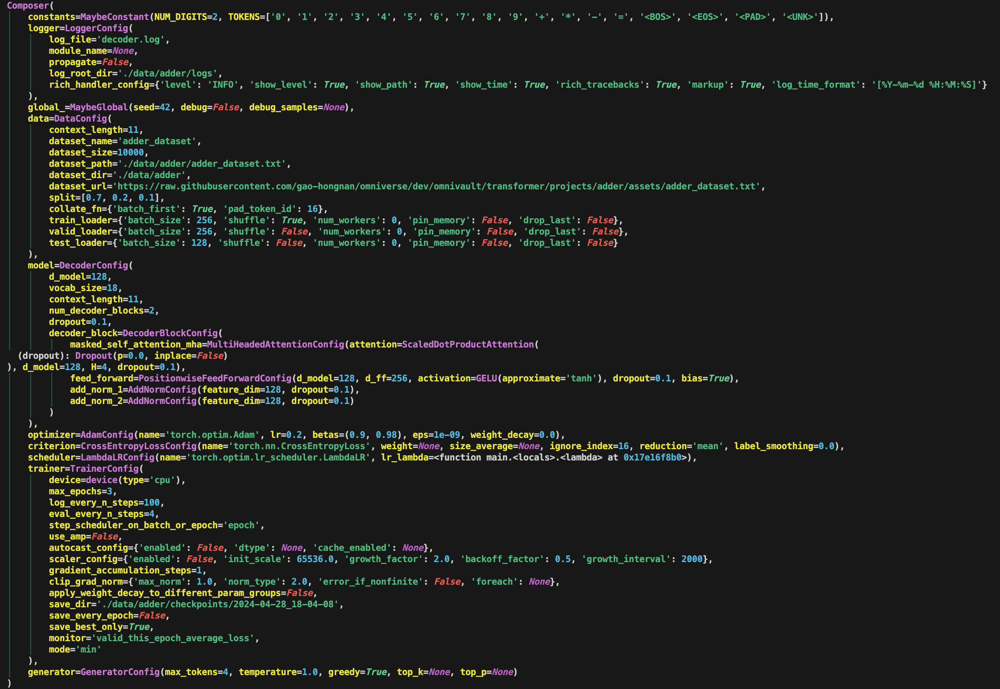

# Decoder

- [Decoder](#decoder)
    - [Overview](#overview)
    - [A Word On Reproducibility](#a-word-on-reproducibility)
    - [Change Log](#change-log)
        - [4th April, 2024: `3d613c0`](#4th-april-2024-3d613c0)
        - [29th March, 2024: `ffd2392`](#29th-march-2024-ffd2392)
        - [14th May, 2024: `ad0fd6a`](#14th-may-2024-ad0fd6a)
            - [Adder Run 1. GPU Bound 15 Epochs with Automatic Mixed Precision and Gradient Scaler](#adder-run-1-gpu-bound-15-epochs-with-automatic-mixed-precision-and-gradient-scaler)
            - [Adder Run 2. GPU Bound 15 Epochs with Automatic Mixed Precision, Gradient Scaler and Gradient Accumulation](#adder-run-2-gpu-bound-15-epochs-with-automatic-mixed-precision-gradient-scaler-and-gradient-accumulation)
            - [Adder Run 3. CPU Bound 3 Epochs (Debug)](#adder-run-3-cpu-bound-3-epochs-debug)
            - [Tiny Shakespeare (Character Token Level) Run 1. GPU Bound 5 Epochs with Automatic Mixed Precision and Gradient Scaler](#tiny-shakespeare-character-token-level-run-1-gpu-bound-5-epochs-with-automatic-mixed-precision-and-gradient-scaler)
            - [SimpleBooks-92 (Word Token Level)](#simplebooks-92-word-token-level)
    - [Setup and Installation](#setup-and-installation)
        - [Step 1: Clone the Repository](#step-1-clone-the-repository)
        - [Step 2: Create Virtual Environment](#step-2-create-virtual-environment)
        - [Step 3: Install Dependencies](#step-3-install-dependencies)
    - [Typed but not Typed](#typed-but-not-typed)
    - [Training Techniques](#training-techniques)
        - [Mixed Precision, Gradient Scaling and Gradient Accumulation](#mixed-precision-gradient-scaling-and-gradient-accumulation)
        - [Improving Performance](#improving-performance)
    - [Adder](#adder)
        - [Commit Hash](#commit-hash)
        - [Composer (Configuration)](#composer-configuration)
        - [State](#state)
        - [Some Quirks of the Adder Project](#some-quirks-of-the-adder-project)
        - [Experiments](#experiments)
            - [Run 1. CPU Bound 3 Epochs (Debug)](#run-1-cpu-bound-3-epochs-debug)
            - [Run 2. CPU Bound 20 Epochs](#run-2-cpu-bound-20-epochs)
            - [Run 3. CPU Bound 20 Epochs with Automatic Mixed Precision](#run-3-cpu-bound-20-epochs-with-automatic-mixed-precision)
            - [Run 4. CPU Bound 20 Epochs with Automatic Mixed Precision and Gradient Scaler](#run-4-cpu-bound-20-epochs-with-automatic-mixed-precision-and-gradient-scaler)
            - [Run 5. GPU Bound 30 Epochs with Automatic Mixed Precision and Gradient Scaler](#run-5-gpu-bound-30-epochs-with-automatic-mixed-precision-and-gradient-scaler)
            - [Run 6: GPU Bound 30 Epochs with Automatic Mixed Precision, Gradient Scaler and Gradient Accumulation](#run-6-gpu-bound-30-epochs-with-automatic-mixed-precision-gradient-scaler-and-gradient-accumulation)
        - [Generalization](#generalization)
    - [Tiny Shakespeare (Character Token Level)](#tiny-shakespeare-character-token-level)
        - [Commit Hash](#commit-hash-1)
        - [Experiments](#experiments-1)
            - [Run 1: CPU Bound 5 Epochs using Debug Mode](#run-1-cpu-bound-5-epochs-using-debug-mode)
            - [Run 2: GPU Bound 5 Epochs with Automatic Mixed Precision and Gradient Scaler](#run-2-gpu-bound-5-epochs-with-automatic-mixed-precision-and-gradient-scaler)
    - [SimpleBooks-92 (Word Token Level)](#simplebooks-92-word-token-level-1)
        - [Commit Hash](#commit-hash-2)
        - [KerasNLP Example](#kerasnlp-example)
        - [Training](#training)
    - [DDP](#ddp)

## Overview

This projects implements a decoder-only transformer model with GPT like
architecture. This project is for educational purposes only and is not intended
to be used for production.

This project is not possible without Andrej Karpathy's
[nanoGPT](https://github.com/karpathy/nanoGPT) implementation, as it provides a
source of truth of how GPT is actually implemented.

## A Word On Reproducibility

While model, optimizer and scheduler's state dict is more or less deterministic,
things like `DataLoader` and `Sampler` are not. Furthermore, the dataloader will
shuffle every epoch if you set `shuffle=True`. This means that when you resume
from a checkpoint, and the spunned up `DataLoader` will shuffle the data in a
different order, which will lead to different results. Even if you set
`shuffle=False`, other parts such as `LayerNorm` and `Dropout` layers will still
behave differently due to the random seed not being set within each epoch.

We can introduce `rng` state at each epoch, this may work until you start
playing with distributed training, where each worker will have its own `rng`
state and it not easily solvable, have a look at MosaicML's Composer for a
possible solution.

Firstly, recognize that the below snippet tells you indeed that each epoch will
have different results due to the shuffling of the data. You can also verify
that each epoch will have the same input if you set `shuffle=False` (no
guarantee that it extends to distributed training).

```python
def _train_one_batch(self, batch: DatasetYield) -> Tuple[float, float, float]:
    self.trigger_callbacks(TrainerEvent.ON_TRAIN_BATCH_START.value)
    inputs, targets, target_padding_masks, future_masks = move_to_device(batch, self.device)
    batch_size = inputs.size(0)
    if self.epoch_index < 5 and self.train_batch_index == 0:
        from rich.pretty import pprint
        pprint(inputs[0])
```

Let's walk through a simple example:

```bash
python omnivault/transformer/projects/adder/main.py \
    omnivault/transformer/projects/adder/config.yaml \
    data.train_loader.batch_size=256 \
    data.train_loader.shuffle=True \
    data.valid_loader.batch_size=256 \
    trainer.max_epochs=10 \
    trainer.use_amp=False \
    trainer.autocast_config.enabled=False \
    trainer.scaler_config.enabled=False \
    trainer.device='cpu'
```

Let's say the above command trains for 10 epochs, and you see the following
output:

```python
{
    "train_this_epoch_average_loss": [
        2.1311146670750207,
        1.2593259513037545,
        0.9856199538367135,
        0.8891705652645656,
        0.7993362490109035,
        0.7111465426172529,
        0.49866415636880057,
        0.38200149631500246,
        0.270275697350502,
        0.23284611753055026,
    ],
    "train_this_epoch_average_perplexity": [
        8.4242525100708,
        3.5230460166931152,
        2.6794724464416504,
        2.4331107139587402,
        2.2240641117095947,
        2.0363247394561768,
        1.6465203762054443,
        1.4652142524719238,
        1.3103256225585938,
        1.2621872425079346,
    ],
    "valid_this_epoch_average_loss": [
        1.4898229427337646,
        1.0477802028656007,
        0.8911682767868042,
        0.8262371664047241,
        0.7179275789260864,
        0.5456617059707641,
        0.337036429643631,
        0.25437658512592315,
        0.1755179933309555,
        0.11549221700429917,
    ],
    "valid_this_epoch_average_perplexity": [
        4.436310291290283,
        2.8513145446777344,
        2.437976360321045,
        2.284705638885498,
        2.050179958343506,
        1.7257499694824219,
        1.4007900953292847,
        1.2896573543548584,
        1.1918634176254272,
        1.1224257946014404,
    ],
}
```

During the training, we saved the rng states in the callback called
`save_state`:

```python
def save_state(trainer: Trainer) -> None:
    # perform other saving operations
    ...

    # save the rng state
    save_rng_state(save_dir=trainer.save_dir, epoch_index=trainer.epoch_index)
```

And furthermore, in the trainer loop below, we set the manual seed to the epoch.
In other words, we set the seed to the epoch number, so that each epoch will
have the same rng state. Now this is a weak form of reproducibility, since you
may miss out on other sources of randomness such as `numpy` and python's
`random` module. For our simple example, we will ignore these sources of
randomness.

```python
def fit(
    self,
    *,
    train_loader: DataLoader[DatasetYield],
    valid_loader: DataLoader[DatasetYield] | None = None,
    test_loader: DataLoader[DatasetYield] | None = None,
) -> State:
    # do some things
    ...

    # start the training loop
    for _ in range(1, self.max_epochs + 1):
        self.epoch_index += 1               # to match range(1, max_epochs + 1) because we start from 1
        torch.manual_seed(self.epoch_index) # TODO: to replace with the full `load_and_set_rng_state` function for even stronger reproducibility
        if torch.cuda.is_available() and torch.cuda.is_initialized(): # type: ignore[no-untyped-call]
            torch.cuda.manual_seed_all(self.epoch_index)
```

Now note some quirks here:

-   `self.epoch_index` starts from `0` if `resume_from_rng_path` is not set in
    the `Trainer` object. I like things to start from `1`, so I add `1` to the
    `epoch_index` in the loop. Consequently, the `torch.manual_seed` will start
    from `1` and not `0`.
-   Seeding manual seeds of torch is not really going to be enough, you may need
    to see cuda deterministic settings. I tried to resume from a checkpoint with
    CUDA and the results were only up to the like 7-8th decimal point.

Now suppose we want to resume from a checkpoint, say epoch 8, then this means
you are loading all the states **_at the end of epoch 8_**. This means that the
first epoch in resumption will actually be the result of epoch 9 in the original
training loop.

We would then define the below to initialize the loaded states for model,
criterion, optimizer and scheduler, these are independent of the `rng` state.
Our next key is to pass `resume_from_rng_state_path` to the `Trainer`'s
constructor, matching the keyword argument `resume_from_rng_path`.

```python
resume_from_state_path = ...
resume_from_rng_state_path = ...
loaded_state = State.load_snapshots(
    filepath=resume_from_state_path,
    device=device,  # type: ignore[arg-type]
    model=model,
    criterion=criterion,
    optimizer=optimizer,
    scheduler=scheduler,
)

# train
trainer = Trainer(
    state=loaded_state,
    composer=composer,
    logger=logger,
    device=device,  # type: ignore[arg-type]
    resume_from_rng_path=resume_from_rng_state_path,
)
```

Two common things happen if you pass an `rng` state path.

Firstly, the `Trainer` object will set the `rng` state globally first, as seen
below.

```python
self.resume_from_rng_path = resume_from_rng_path # resume from rng state
if resume_from_rng_path:
    self.rng_state = load_and_set_rng_state(rng_state_path=resume_from_rng_path) # set RNG globally first
```

Secondly, the `Trainer` object will set the `rng` state at the beginning of each
epoch, as seen below. This will make the `self.epoch_index` start from the
correct epoch number. For example, we resume from epoch 8, then the next epoch
will be epoch 9 and so the `self.epoch_index` will be set to `9`.

```python
self.epoch_index = self.rng_state["epoch_index"] if resume_from_rng_path else 0
for _ in range(1, self.max_epochs + 1):
    # fmt: off
    self.epoch_index += 1               # to match range(1, max_epochs + 1) because we start from 1
    torch.manual_seed(self.epoch_index) # TODO: to replace with the full `load_and_set_rng_state` function for even stronger reproducibility
    if torch.cuda.is_available() and torch.cuda.is_initialized(): # type: ignore[no-untyped-call]
        torch.cuda.manual_seed_all(self.epoch_index)
```

Running the script `resume.py` for three more epochs, loaded from the end of
epoch 8, and the training will start from epoch 9, yields correct results.

```bash
python omnivault/transformer/projects/adder/resume.py \
    omnivault/transformer/projects/adder/config.yaml \
    data.train_loader.batch_size=256 \
    data.train_loader.shuffle=True \
    data.valid_loader.batch_size=256 \
    trainer.max_epochs=3 \
    trainer.use_amp=False \
    trainer.autocast_config.enabled=False \
    trainer.scaler_config.enabled=False \
    trainer.device='cpu'
```

You can see the first two epochs are the same as the last two epochs of the
original training loop for 10 epochs.

```python
{
    "train_this_epoch_average_loss":       [0.270275697350502,  0.23284611753055026, 0.18166282841137477],
    "train_this_epoch_average_perplexity": [1.3103256225585938, 1.2621872425079346,  1.1992098093032837 ],
    "valid_this_epoch_average_loss":       [0.1755179933309555, 0.11549221700429917, 0.12722234988212586],
    "valid_this_epoch_average_perplexity": [1.1918634176254272, 1.1224257946014404,  1.135669469833374  ],
}
```

Note I could combine `resume.py` to `main.py` with some additional flags,
configuration handling, but I decided to keep them separate for clarity.

## Change Log

### 4th April, 2024: `3d613c0`

-   Add seeding to each epoch in the `Trainer` object. So results will change.

### 29th March, 2024: `ffd2392`

-   Fixed a bunch of problems in
    [Issue 72](https://github.com/gao-hongnan/omniverse/issues/72).
-   Commit Hash `ffd2392`

### 14th May, 2024: `ad0fd6a`

-   Breaking changes to callback, considering reverting if things go wrong.

#### Adder Run 1. GPU Bound 15 Epochs with Automatic Mixed Precision and Gradient Scaler

-   Commit Hash `ffd2392`
-   Accuracy @15th epoch -> 0.993

```bash
python omnivault/transformer/projects/adder/main.py \
    omnivault/transformer/projects/adder/config.yaml \
    data.train_loader.batch_size=256 \
    data.valid_loader.batch_size=256 \
    optimizer.lr=0.2 \
    trainer.gradient_accumulation_steps=1 \
    trainer.max_epochs=15 \
    trainer.use_amp=True \
    trainer.autocast_config.enabled=True \
    trainer.autocast_config.dtype=float16 \
    trainer.scaler_config.enabled=True \
    trainer.device='cuda'
```


#### Adder Run 2. GPU Bound 15 Epochs with Automatic Mixed Precision, Gradient Scaler and Gradient Accumulation

-   Commit Hash `ffd2392`
-   Accuracy @15th epoch -> 0.956

```bash
python omnivault/transformer/projects/adder/main.py \
    omnivault/transformer/projects/adder/config.yaml \
    data.train_loader.batch_size=256 \
    data.valid_loader.batch_size=256 \
    optimizer.lr=0.4 \
    trainer.gradient_accumulation_steps=2 \
    trainer.max_epochs=15 \
    trainer.use_amp=True \
    trainer.autocast_config.enabled=True \
    trainer.autocast_config.dtype=float16 \
    trainer.scaler_config.enabled=True \
    trainer.device='cuda'
```


#### Adder Run 3. CPU Bound 3 Epochs (Debug)

-   Commit Hash `ffd2392`

```bash
python omnivault/transformer/projects/adder/main.py \
    omnivault/transformer/projects/adder/config.yaml \
    data.train_loader.batch_size=256 \
    data.valid_loader.batch_size=256 \
    trainer.max_epochs=3 \
    trainer.use_amp=False \
    trainer.autocast_config.enabled=False \
    trainer.scaler_config.enabled=False \
    trainer.device='cpu'
```

| Epoch | Train Avg Loss     | Train Avg Perplexity | Valid Avg Loss     | Valid Avg Perplexity |
| ----- | ------------------ | -------------------- | ------------------ | -------------------- |
| 1     | 2.1339846214566913 | 8.448463439941406    | 1.497946394920349  | 4.472494602203369    |
| 2     | 1.261589478765215  | 3.53102970123291     | 1.0334483652114868 | 2.810741424560547    |
| 3     | 0.9781474182946341 | 2.65952467918396     | 0.9288828363418579 | 2.531679391860962    |

#### Tiny Shakespeare (Character Token Level) Run 1. GPU Bound 5 Epochs with Automatic Mixed Precision and Gradient Scaler

-   Commit Hash `ffd2392`

Note `NPROC` is to know what number to set for `num_workers` in the `DataLoader`
for `train` and `valid` datasets.

The command below is used in a VM training, remove the `nohup` and the logging
pipes if you want to run it in your local machine.

```bash
export PYTHONPATH=$PYTHONPATH:$(pwd)
export NPROC=$(nproc)
nohup python omnivault/transformer/projects/tinyshakespeare_char/main.py \
    omnivault/transformer/projects/tinyshakespeare_char/config.yaml \
    global_.debug=False \
    data.train_loader.batch_size=128 \
    data.train_loader.num_workers=8 \
    data.context_length=256 \
    optimizer.name=torch.optim.AdamW \
    optimizer.lr=0.0005 \
    optimizer.weight_decay=0.01 \
    criterion.name=torch.nn.CrossEntropyLoss \
    criterion.reduction=mean \
    criterion.label_smoothing=0.0 \
    scheduler.name=torch.optim.lr_scheduler.CosineAnnealingLR \
    trainer.device=auto \
    trainer.max_epochs=5 \
    trainer.log_every_n_steps=10000 \
    trainer.eval_every_n_steps=4000 \
    trainer.step_scheduler_on_batch_or_epoch=epoch \
    trainer.use_amp=True \
    trainer.autocast_config.enabled=True \
    trainer.autocast_config.dtype=float16 \
    trainer.scaler_config.enabled=True \
    trainer.scaler_config.init_scale=65536.0 \
    trainer.scaler_config.growth_factor=2.0 \
    trainer.scaler_config.backoff_factor=0.5 \
    trainer.scaler_config.growth_interval=2000 \
    trainer.gradient_accumulation_steps=1 \
    trainer.clip_grad_norm.max_norm=1.0 \
    trainer.clip_grad_norm.norm_type=2.0 \
    trainer.clip_grad_norm.error_if_nonfinite=False \
    trainer.clip_grad_norm.foreach=None \
    trainer.apply_weight_decay_to_different_param_groups=False \
    trainer.save_dir=./data/tinyshakespeare_char/checkpoints \
    trainer.save_every_epoch=False \
    trainer.save_best_only=True \
    trainer.monitor=train_this_epoch_average_loss \
    trainer.mode=min \
    model.context_length=256 \
    model.d_model=128 \
    model.dropout=0.1 \
    model.num_decoder_blocks=5 \
    model.decoder_block.masked_self_attention_mha.H=8 \
    model.decoder_block.masked_self_attention_mha.dropout=0.1 \
    model.decoder_block.feed_forward.dropout=0.1 \
    model.decoder_block.add_norm_1.dropout=0.1 \
    model.decoder_block.add_norm_1.dropout=0.1 \
    model.decoder_block.feed_forward.d_ff=512 \
    generator.max_tokens=1000 \
    generator.temperature=1.0 \
    generator.greedy=False \
    generator.top_k=10 > nohup.log 2>&1 &
```


End of the 5th epoch, pretty decent results for a character level language
model.

```python
O God, O God! then, he spoke to business' tender,
And brought the father, they cannot be curs,
Or blessed by the horn: there that we love at
To take off our course, our good city and pains
To cure or his book: have we mean'd and look for
Boldly force of partical corse,
And not so despair.

PERDITA:
Why, wrange, the lord?

First Officer:
Ay, my good lord, that I spy to take
A claudious intrusting; for in the humour,
And live in all ten feel as traitor.
If this weak world for me, I will part to thee,
The senator of thy child since thou art.
I will hold my bind my sad open,
If a dastard of murderer, or my sovereign,
Thou hast a broken pawn upon thy grave,
Tybalt bosom a sister-pinch, and breward,
My showmanly but a certain strength
Was, by this night and wear and two wonder;
For that my grey must have much;
So many to speak mother within flatter.
To love upon it, for you both the best,
Have all no less for so fall'n of you.

Boy:
And look, good and torture! I have done see
To be more obedient out.
```

#### SimpleBooks-92 (Word Token Level)

-   Commit Hash `ffd2392`
-   [Kaggle Notebook](https://www.kaggle.com/code/reighns/gptdecoder-simplebooks-92?scriptVersionId=169290789)

| Epoch | Train Avg Loss     | Train Avg Perplexity | Valid Avg Loss     | Valid Avg Perplexity |
| ----- | ------------------ | -------------------- | ------------------ | -------------------- |
| 1     | 4.8803375387611165 | 131.6751251220703    | 4.355229377746582  | 77.88468933105469    |
| 2     | 4.43865847368137   | 84.66127014160156    | 4.166375637054443  | 64.4813232421875     |
| 3     | 4.309790557989876  | 74.4249038696289     | 4.079253673553467  | 59.10134506225586    |
| 4     | 4.242468370935819  | 69.57938385009766    | 4.034135341644287  | 56.49405288696289    |
| 5     | 4.19857784984399   | 66.59156036376953    | 3.991755485534668  | 54.149864196777344   |
| 6     | 4.167113543678388  | 64.52893829345703    | 3.9651288986206055 | 52.72706604003906    |
| 7     | 4.1421090829443115 | 62.93540573120117    | 3.9476492404937744 | 51.81342315673828    |
| 8     | 4.12189095486988   | 61.67576217651367    | 3.9435625076293945 | 51.602108001708984   |


-   Epoch 6 Results

    ```python
    TopKSampler search Generated text tf.Tensor([b'[BOS] the two men had taken up
    their horses in the morning , while they were in command of the army , while
    they were advancing behind . the two horses were fired at the enemy , and they
    had been driven to the ground , the infantry were driven into the line of the
    enemy . the british were wounded , and the english were wounded , and , having
    the whole party in the rear , they could not see the battle of conflict , but as
    they did not see themselves in the battle of battle , they were now killed . the
    latter , having not only a moment . the men of the portuguese were driven back
    into the village ,'], shape=(1,), dtype=string)
    ```

## Setup and Installation

We assume a macOS setup for this project. The steps for other operating systems
may vary.

### Step 1: Clone the Repository

Clone the project repository to your local machine using the following command:

```bash
git clone --branch dev https://github.com/gao-hongnan/omniverse.git
cd omniverse
```

### Step 2: Create Virtual Environment

We recommend using a virtual environment to run this project. To create a
virtual environment, run the following command:

```bash
python -m venv venv
source venv/bin/activate
```

### Step 3: Install Dependencies

Install the project dependencies using the following command:

```bash
(venv) $ pip install -r requirements.txt
```

and to develop the project, install the development dependencies using:

```bash
(venv) $ pip install -r requirements-dev.txt
```

Or you can simply do:

```bash
(venv) $ pip install --editable '.[dev]'
```

to install both the project dependencies and the development dependencies.

## Typed but not Typed

The entire project is typed, but at the same time, due to the nature of how
difficult it is to type hint PyTorch's `Tensor` object, I have decided to take
some shortcuts like using `cast` excessively. I also find myself doing `assert`
to handle the union of a certain type `T` and `None`, which is not ideal and can
be handled more elegantly via function overloading.

## Training Techniques

### Mixed Precision, Gradient Scaling and Gradient Accumulation

For Mixed Precision experiments, see the
[the playbook here](https://pytorch.org/docs/stable/notes/amp_examples.html).

### Improving Performance

See
[Improving Performance](https://pytorch-lightning.readthedocs.io/en/0.10.0/performance.html)

## Adder

The Adder project implements a training pipeline for the Adder dataset, inspired
by Andrej Karpathy's
[Adder project](https://github.com/karpathy/minGPT/blob/master/projects/adder/readme.md).
It mainly trains on a dataset of 2-digit addition problems, and the model is
expected to predict the result of the addition problem. It seems trivial, but
note that GPT models are after all, language models, and not well trained on
arithmetic problems. This is why ChatGPT sometimes hallucinates and gives wrong
answers to simple arithmetic problems.

### Commit Hash

The commit to check for this repo is `916aabd`.

### Composer (Configuration)

The core configuration for the project is defined in the
`./projects/adder/config.yaml` file. This YAML file includes various settings
such as constants, logger configurations, data specifications, model parameters,
optimizer details, and more.



Here is a snippet of the configuration file:

```yaml
constants:
    NUM_DIGITS: 2
    TOKENS:
        - "0"
        - "1"
        - "2"
        - "3"
        - "4"
        - "5"
        - "6"
        - "7"
        - "8"
        - "9"
        - "+"
        - "*"
        - "-"
        - "="
        - "<BOS>"
        - "<EOS>"
        - "<PAD>"
        - "<UNK>"
logger:
    log_file: "decoder.log"
    module_name: null
    propagate: false
    log_root_dir: "./data/adder/logs"
    rich_handler_config:
        level: "INFO"
        show_level: true
        show_path: true
        show_time: true
        rich_tracebacks: true
        markup: true
        log_time_format: "[%Y-%m-%d %H:%M:%S]"
global_:
    seed: 42
    debug: false
    debug_samples: null
data:
    context_length: 11
    dataset_name: adder_dataset
    dataset_size: 10000
    dataset_path: ./data/adder/adder_dataset.txt
    dataset_dir: ./data/adder
    dataset_url: https://raw.githubusercontent.com/gao-hongnan/omniverse/dev/omnivault/transformer/projects/adder/assets/adder_dataset.txt
    split:
        - 0.7
        - 0.2
        - 0.1
    collate_fn: # The collate function config.
        batch_first: true
        pad_token_id: 16 # TODO: `pad_token_id` should be interpolated from `MaybeConstant`.
    train_loader:
        batch_size: 32
        shuffle: true
        num_workers: 0
        pin_memory: false
        drop_last: false
    valid_loader:
        batch_size: 32
        shuffle: false
        num_workers: 0
        pin_memory: false
        drop_last: false
    test_loader:
        batch_size: 128
        shuffle: false
        num_workers: 0
        pin_memory: false
        drop_last: false
model:
    d_model: 128
    vocab_size: ??? # MISSING so need fill up later
    context_length: ${data.context_length}
    num_decoder_blocks: 2
    dropout: 0.1
    decoder_block:
        masked_self_attention_mha:
            attention:
                _target_: omnivault.transformer.modules.attention.core.ScaledDotProductAttention
            d_model: ${model.d_model}
            H: 4
            dropout: 0.1
        feed_forward:
            d_model: ${model.d_model}
            d_ff: 256
            activation:
                _target_: torch.nn.GELU
                approximate: "tanh"
            dropout: 0.1
            bias: true
        add_norm_1:
            feature_dim: ${model.d_model}
            dropout: 0.1
        add_norm_2:
            feature_dim: ${model.d_model}
            dropout: 0.1
optimizer:
    name: "torch.optim.Adam"
    lr: 0.2
    betas:
        - 0.9
        - 0.98
    eps: 1e-9
    weight_decay: 0.0
criterion:
    name: "torch.nn.CrossEntropyLoss"
    ignore_index: 16
    reduction: "mean"
scheduler:
    name: "torch.optim.lr_scheduler.LambdaLR"
trainer:
    device: "auto"
    max_epochs: 2
    log_every_n_steps: 100
    eval_every_n_steps: 4
    step_scheduler_on_batch_or_epoch: "epoch"
    use_amp: false
    autocast_config:
        enabled: false
    scaler_config:
        enabled: false
        init_scale: 65536.0
        growth_factor: 2.0
        backoff_factor: 0.5
        growth_interval: 2000
    gradient_accumulation_steps: 1
    clip_grad_norm:
        {
            max_norm: 1.0,
            norm_type: 2.0,
            error_if_nonfinite: false,
            "foreach": null,
        }
    apply_weight_decay_to_different_param_groups: false
    save_dir: ./data/adder/checkpoints
    save_every_epoch: false
    save_best_only: true
    monitor: "valid_this_epoch_average_loss"
    mode: "min"
generator:
    max_tokens: 4
    temperature: 1.0
    greedy: true
    top_k: null
    top_p: null
```

This configuration is used to set up the entire training pipeline, specifying
details such as dataset parameters, model architecture, training
hyperparameters, and more.

The `Composer` object is a dynamic configuration manager that combines various
configurations into a single accessible object. It allows easy access to any
configuration parameter from any part of the codebase by calling
`Composer().<config_name>`. It is not a singleton and is mutable, enabling
runtime modifications for techniques like hyperparameter tuning.

To run the project with the default configuration, use the following command:

```bash
(venv) $ python omnivault/transformer/projects/adder/main.py \
            omnivault/transformer/projects/adder/config.yaml
```

and you should see the following output:

```python
Composer(
│   constants=MaybeConstant(NUM_DIGITS=2, TOKENS=['0', '1', '2', '3', '4', '5', '6', '7', '8', '9', '+', '*', '-', '=', '<BOS>', '<EOS>', '<PAD>', '<UNK>']),
│   logger=LoggerConfig(
│   │   log_file='decoder.log',
│   │   module_name=None,
│   │   propagate=False,
│   │   log_root_dir='./data/adder/logs',
│   │   rich_handler_config={'level': 'INFO', 'show_level': True, 'show_path': True, 'show_time': True, 'rich_tracebacks': True, 'markup': True, 'log_time_format': '[%Y-%m-%d %H:%M:%S]'}
│   ),
│   global_=MaybeGlobal(seed=42, debug=False, debug_samples=None),
│   data=DataConfig(
│   │   context_length=11,
│   │   dataset_name='adder_dataset',
│   │   dataset_size=10000,
│   │   dataset_path='./data/adder/adder_dataset.txt',
│   │   dataset_dir='./data/adder',
│   │   dataset_url='https://raw.githubusercontent.com/gao-hongnan/omniverse/dev/omnivault/transformer/projects/adder/assets/adder_dataset.txt',
│   │   split=[0.7, 0.2, 0.1],
│   │   collate_fn={'batch_first': True, 'pad_token_id': 16},
│   │   train_loader={'batch_size': 32, 'shuffle': True, 'num_workers': 0, 'pin_memory': False, 'drop_last': False},
│   │   valid_loader={'batch_size': 32, 'shuffle': False, 'num_workers': 0, 'pin_memory': False, 'drop_last': False},
│   │   test_loader={'batch_size': 128, 'shuffle': False, 'num_workers': 0, 'pin_memory': False, 'drop_last': False}
│   ),
│   model=DecoderConfig(
│   │   d_model=128,
│   │   vocab_size=18,
│   │   context_length=11,
│   │   num_decoder_blocks=2,
│   │   dropout=0.1,
│   │   decoder_block=DecoderBlockConfig(
│   │   │   masked_self_attention_mha=MultiHeadedAttentionConfig(attention=ScaledDotProductAttention(
  (dropout): Dropout(p=0.0, inplace=False)
), d_model=128, H=4, dropout=0.1),
│   │   │   feed_forward=PositionwiseFeedForwardConfig(d_model=128, d_ff=256, activation=GELU(approximate='tanh'), dropout=0.1, bias=True),
│   │   │   add_norm_1=AddNormConfig(feature_dim=128, dropout=0.1),
│   │   │   add_norm_2=AddNormConfig(feature_dim=128, dropout=0.1)
│   │   )
│   ),
│   optimizer=AdamConfig(name='torch.optim.Adam', lr=0.2, betas=(0.9, 0.98), eps=1e-09, weight_decay=0.0),
│   criterion=CrossEntropyLossConfig(name='torch.nn.CrossEntropyLoss', weight=None, size_average=None, ignore_index=16, reduction='mean', label_smoothing=0.0),
│   scheduler=LambdaLRConfig(name='torch.optim.lr_scheduler.LambdaLR', lr_lambda=<function main.<locals>.<lambda> at 0x1650bb9d0>),
│   trainer=TrainerConfig(
│   │   device=device(type='mps'),
│   │   max_epochs=2,
│   │   log_every_n_steps=100,
│   │   eval_every_n_steps=4,
│   │   step_scheduler_on_batch_or_epoch='epoch',
│   │   use_amp=False,
│   │   autocast_config={'enabled': False},
│   │   scaler_config={'enabled': False, 'init_scale': 65536.0, 'growth_factor': 2.0, 'backoff_factor': 0.5, 'growth_interval': 2000},
│   │   gradient_accumulation_steps=1,
│   │   clip_grad_norm={'max_norm': 1.0, 'norm_type': 2.0, 'error_if_nonfinite': False, 'foreach': None},
│   │   apply_weight_decay_to_different_param_groups=False,
│   │   save_dir='./data/adder/checkpoints/2024-02-01_13-19-05',
│   │   save_every_epoch=False,
│   │   save_best_only=True,
│   │   monitor='valid_this_epoch_average_loss',
│   │   mode='min'
│   ),
│   generator=GeneratorConfig(max_tokens=4, temperature=1.0, greedy=True, top_k=None, top_p=None)
)
```

which is a `Composer` object where I **_compose_** various configurations into a
single object. This allow me to access any configuration from any place by
calling `Composer().<config_name>`.

-   The `Composer` object is **not** a **singleton**, although it is possible to
    make it so.
-   The `Composer` object is **not immutable**. This means that once it is
    created, it can be modified. This is by design, as it allows me to modify
    the configuration at runtime. This is useful for hyperparameter tuning
    techniques.

### State

The `State` object represents the current state of the training process. It
encapsulates key components such as the model, optimizer, criterion, scheduler,
and additional metadata. The inspiration for both `Composer` and `State` comes
from [MosaicML's Composer](https://github.com/mosaicml/composer), a library that
has been beneficial in the context of pretraining Language Models (LLMs) and is
also the library that me and my team adopted for our LLM pretraining project.


Here is a snippet of the `State` object:

```python
State(
│   model=GPTDecoder(
  (tok_embed): Embedding(18, 128)
  (decoder_blocks): ModuleList(
│   (0-1): 2 x GPTDecoderBlock(
│     (masked_self_attention_mha): MultiHeadedAttention(
│   │   (W_Q): Linear(in_features=128, out_features=128, bias=False)
│   │   (W_K): Linear(in_features=128, out_features=128, bias=False)
│   │   (W_V): Linear(in_features=128, out_features=128, bias=False)
│   │   (W_O): Linear(in_features=128, out_features=128, bias=False)
│   │   (attention): ScaledDotProductAttention(
│   │     (dropout): Dropout(p=0.0, inplace=False)
│   │   )
│   │   (dropout): Dropout(p=0.1, inplace=False)
│     )
│     (feed_forward): PositionwiseFeedForward(
│   │   (ffn): ModuleDict(
│   │     (context_fc): Linear(in_features=128, out_features=256, bias=True)
│   │     (activation): GELU(approximate='tanh')
│   │     (context_projection): Linear(in_features=256, out_features=128, bias=True)
│   │     (dropout): Dropout(p=0.1, inplace=False)
│   │   )
│     )
│     (add_norm_1): AddNorm(
│   │   (dropout): Dropout(p=0.1, inplace=False)
│   │   (layer_norm): LayerNorm((128,), eps=1e-05, elementwise_affine=True)
│     )
│     (add_norm_2): AddNorm(
│   │   (dropout): Dropout(p=0.1, inplace=False)
│   │   (layer_norm): LayerNorm((128,), eps=1e-05, elementwise_affine=True)
│     )
│   )
  )
  (dropout): Dropout(p=0.1, inplace=False)
  (layer_norm): LayerNorm((128,), eps=1e-05, elementwise_affine=True)
  (head): Linear(in_features=128, out_features=18, bias=True)
),
│   criterion=CrossEntropyLoss(),
│   optimizer=Adam (
Parameter Group 0
│   amsgrad: False
│   betas: (0.9, 0.98)
│   capturable: False
│   differentiable: False
│   eps: 1e-09
│   foreach: None
│   fused: None
│   initial_lr: 0.2
│   lr: 1.0497284228847895e-06
│   maximize: False
│   weight_decay: 0.0
),
│   scheduler=<torch.optim.lr_scheduler.LambdaLR object at 0x1652552e0>,
│   epoch_index=0,
│   train_batch_index=0,
│   step_index=0,
│   history={},
│   vocabulary=<omnivault.transformer.core.vocabulary.AdderVocabulary object at 0x16522ea00>,
│   tokenizer=<omnivault.transformer.core.tokenizer.AdderTokenizer object at 0x16522ea60>
)
```

Why is `State` useful? It allows me to easily access the model, optimizer,
criterion, scheduler, and other metadata from any part of the codebase. I can
also serialize the `State` object and save it to disk, allowing me to resume
training from a checkpoint.

Perhaps not the best design pattern, but I added a `history` attribute to the
`State` object, which is a dictionary that stores the training history. This is
to mimic what could be a separate `History` object, which is a common component
in many deep learning libraries.

### Some Quirks of the Adder Project

-   Ensure the `dataset_path` in the `config.yaml` matches the location of the
    downloaded dataset file.
-   Ensure the `context_length` in the `config.yaml` matches the context length
    of the dataset. Here it is **hardcoded** and should not be changed for this
    particular dataset. Why? Because we encode each sample as "D1+D2=SUM" where
    D1 and D2 are the two digits and SUM is the sum of the two digits. Then we
    add `<BOS>` and `<EOS>` tokens to the beginning and end of the encoded
    sample respectively. This gives us a total of 11 tokens per sample:
    `<BOS>D1+D2=SUM<EOS>`. Hence, the `context_length` is 11.
-   If you want to try other digit lengths, you can change the `NUM_DIGITS` in
    the `constants` section of the `config.yaml` file. For example, if you want
    to try 3 digits, you can change the `NUM_DIGITS` to 3 and the
    `context_length` to say, 14. But you may need to change quite a fair bit of
    code yourself. Since this is an educational project, we leave this as an
    exercise to the reader.

    ```yaml
    constants:
        NUM_DIGITS: 2
        TOKENS:
            - "0"
            - "1"
            - "2"
            - "3"
            - "4"
            - "5"
            - "6"
            - "7"
            - "8"
            - "9"
            - "+"
            - "*"
            - "-"
            - "="
            - "<BOS>"
            - "<EOS>"
            - "<PAD>"
            - "<UNK>"
    ```

### Experiments

Note that for general CPU bound experiments, I expect my seeding mechanism to
work and is reproducible almost everywhere. But for GPU bound experiments, I
expect my seeding mechanism to work only on the same class of GPU (e.g. A100)
and not across different classes of GPUs (e.g. A100 vs V100) but the difference
is almost negligible.

**_Do not ask me to support Apple Silicon MPS, thank you._**

Note if you want to apply custom weight decay to different param groups, you
should necessarily set `weight_decay` to a non-zero value. Otherwise, it is as
good as not applying custom weight decay to diff param groups.

#### Run 1. CPU Bound 3 Epochs (Debug)

```bash
python omnivault/transformer/projects/adder/main.py \
    omnivault/transformer/projects/adder/config.yaml \
    data.train_loader.batch_size=256 \
    data.valid_loader.batch_size=256 \
    trainer.max_epochs=3 \
    trainer.use_amp=False \
    trainer.autocast_config.enabled=False \
    trainer.scaler_config.enabled=False \
    trainer.device='cpu'
```


| Epoch | Train Avg Loss | Train Avg Perplexity | Valid Avg Loss | Valid Avg Perplexity |
| ----- | -------------- | -------------------- | -------------- | -------------------- |
| 1     | 2.42116560     | 11.25897598          | 1.72266738     | 5.59944439           |
| 2     | 1.38095001     | 3.97867942           | 1.15814416     | 3.18401861           |
| 3     | 1.08565636     | 2.96138310           | 1.00055137     | 2.71978092           |

#### Run 2. CPU Bound 20 Epochs

```bash
python omnivault/transformer/projects/adder/main.py \
    omnivault/transformer/projects/adder/config.yaml \
    data.train_loader.batch_size=256 \
    data.valid_loader.batch_size=256 \
    trainer.max_epochs=20 \
    trainer.gradient_accumulation_steps=1 \
    trainer.use_amp=False \
    trainer.autocast_config.enabled=False \
    trainer.scaler_config.enabled=False \
    trainer.device='cpu'
```


| Epoch | Train Avg Loss | Train Avg Perplexity | Valid Avg Loss | Valid Avg Perplexity |
| ----- | -------------- | -------------------- | -------------- | -------------------- |
| 1     | 2.42116560     | 11.25897598          | 1.72266738     | 5.59944439           |
| 2     | 1.38095001     | 3.97867942           | 1.15814416     | 3.18401861           |
| 3     | 1.08565636     | 2.96138310           | 1.00055137     | 2.71978092           |
| 4     | 0.97149544     | 2.64189243           | 0.90245709     | 2.46565390           |
| 5     | 0.84379837     | 2.32518220           | 0.73687689     | 2.08939981           |
| 6     | 0.70981541     | 2.03361583           | 0.64679867     | 1.90941834           |
| 7     | 0.62240242     | 1.86339939           | 0.50294402     | 1.65358222           |
| 8     | 0.51285011     | 1.67004418           | 0.38060882     | 1.46317518           |
| 9     | 0.38310490     | 1.46683192           | 0.25848040     | 1.29496074           |
| 10    | 0.29655651     | 1.34521854           | 0.20162616     | 1.22339058           |
| 11    | 0.24845436     | 1.28204226           | 0.15636847     | 1.16925693           |
| 12    | 0.21495370     | 1.23980451           | 0.13172702     | 1.14079690           |
| 13    | 0.18957461     | 1.20873535           | 0.13184627     | 1.14093292           |
| 14    | 0.16487235     | 1.17924261           | 0.08768568     | 1.09164488           |
| 15    | 0.14672471     | 1.15803516           | 0.08021968     | 1.08352506           |
| 16    | 0.13451685     | 1.14398396           | 0.06706810     | 1.06936824           |
| 17    | 0.11999019     | 1.12748575           | 0.06959521     | 1.07207417           |
| 18    | 0.11789565     | 1.12512672           | 0.05264705     | 1.05405760           |
| 19    | 0.10456036     | 1.11022246           | 0.04009689     | 1.04091167           |
| 20    | 0.10515899     | 1.11088717           | 0.04866121     | 1.04986465           |

#### Run 3. CPU Bound 20 Epochs with Automatic Mixed Precision

Note from
[PyTorch's Autocasting documentation](https://pytorch.org/docs/stable/amp.html)
you can also use `autocast` with `cpu` devices.

```bash
python omnivault/transformer/projects/adder/main.py \
    omnivault/transformer/projects/adder/config.yaml \
    data.train_loader.batch_size=256 \
    data.valid_loader.batch_size=256 \
    trainer.max_epochs=20 \
    trainer.use_amp=True \
    trainer.autocast_config.enabled=True \
    trainer.autocast_config.dtype=bfloat16 \
    trainer.scaler_config.enabled=False \
    trainer.device='cpu'
```

| Epoch | Train Avg Loss | Train Avg Perplexity | Valid Avg Loss | Valid Avg Perplexity |
| ----- | -------------- | -------------------- | -------------- | -------------------- |
| 1     | 2.42121410     | 11.25952148          | 1.72274739     | 5.59989262           |
| 2     | 1.38103134     | 3.97900343           | 1.15812683     | 3.18396354           |
| 3     | 1.08579203     | 2.96178484           | 1.00137327     | 2.72201729           |
| 4     | 0.96206112     | 2.61708498           | 0.87629939     | 2.40199447           |
| 5     | 0.84047511     | 2.31746769           | 0.73473563     | 2.08493066           |
| 6     | 0.69479896     | 2.00330615           | 0.61569004     | 1.85093343           |
| 7     | 0.62559632     | 1.86936045           | 0.52938478     | 1.69788742           |
| 8     | 0.56361997     | 1.75702143           | 0.50377386     | 1.65495503           |
| 9     | 0.51176658     | 1.66823566           | 0.40421455     | 1.49812531           |
| 10    | 0.41958063     | 1.52132344           | 0.28967084     | 1.33598769           |
| 11    | 0.34217327     | 1.40800428           | 0.22319898     | 1.25006926           |
| 12    | 0.28290846     | 1.32698369           | 0.17602104     | 1.19246316           |
| 13    | 0.24093854     | 1.27244282           | 0.16882722     | 1.18391562           |
| 14    | 0.21423461     | 1.23891330           | 0.12139948     | 1.12907588           |
| 15    | 0.18088057     | 1.19827211           | 0.10155004     | 1.10688531           |
| 16    | 0.15750701     | 1.17058897           | 0.08484399     | 1.08854723           |
| 17    | 0.14483654     | 1.15585065           | 0.07683181     | 1.07986045           |
| 18    | 0.12972381     | 1.13851392           | 0.05752651     | 1.05921340           |
| 19    | 0.11486193     | 1.12171853           | 0.05551502     | 1.05708492           |
| 20    | 0.11150095     | 1.11795485           | 0.04883840     | 1.05005062           |

#### Run 4. CPU Bound 20 Epochs with Automatic Mixed Precision and Gradient Scaler

```bash
python omnivault/transformer/projects/adder/main.py \
    omnivault/transformer/projects/adder/config.yaml \
    data.train_loader.batch_size=256 \
    data.valid_loader.batch_size=256 \
    trainer.max_epochs=20 \
    trainer.use_amp=True \
    trainer.autocast_config.enabled=True \
    trainer.autocast_config.dtype=bfloat16 \
    trainer.scaler_config.enabled=True \
    trainer.device='cpu'
```

| Epoch | Train Avg Loss | Train Avg Perplexity | Valid Avg Loss | Valid Avg Perplexity |
| ----- | -------------- | -------------------- | -------------- | -------------------- |
| 1     | 2.42121410     | 11.25952148          | 1.72274739     | 5.59989262           |
| 2     | 1.38103134     | 3.97900343           | 1.15812683     | 3.18396354           |
| 3     | 1.08579203     | 2.96178484           | 1.00137327     | 2.72201729           |
| 4     | 0.96206112     | 2.61708498           | 0.87629939     | 2.40199447           |
| 5     | 0.84047511     | 2.31746769           | 0.73473563     | 2.08493066           |
| 6     | 0.69479896     | 2.00330615           | 0.61569004     | 1.85093343           |
| 7     | 0.62559632     | 1.86936045           | 0.52938478     | 1.69788742           |
| 8     | 0.56361997     | 1.75702143           | 0.50377386     | 1.65495503           |
| 9     | 0.51176658     | 1.66823566           | 0.40421455     | 1.49812531           |
| 10    | 0.41958063     | 1.52132344           | 0.28967084     | 1.33598769           |
| 11    | 0.34217327     | 1.40800428           | 0.22319898     | 1.25006926           |
| 12    | 0.28290846     | 1.32698369           | 0.17602104     | 1.19246316           |
| 13    | 0.24093854     | 1.27244282           | 0.16882722     | 1.18391562           |
| 14    | 0.21423461     | 1.23891330           | 0.12139948     | 1.12907588           |
| 15    | 0.18088057     | 1.19827211           | 0.10155004     | 1.10688531           |
| 16    | 0.15750701     | 1.17058897           | 0.08484399     | 1.08854723           |
| 17    | 0.14483654     | 1.15585065           | 0.07683181     | 1.07986045           |
| 18    | 0.12972381     | 1.13851392           | 0.05752651     | 1.05921340           |
| 19    | 0.11486193     | 1.12171853           | 0.05551502     | 1.05708492           |
| 20    | 0.11150095     | 1.11795485           | 0.04883840     | 1.05005062           |

#### Run 5. GPU Bound 30 Epochs with Automatic Mixed Precision and Gradient Scaler

```bash
python omnivault/transformer/projects/adder/main.py \
    omnivault/transformer/projects/adder/config.yaml \
    data.train_loader.batch_size=256 \
    data.valid_loader.batch_size=256 \
    optimizer.lr=0.2 \
    trainer.gradient_accumulation_steps=1 \
    trainer.max_epochs=30 \
    trainer.use_amp=True \
    trainer.autocast_config.enabled=True \
    trainer.autocast_config.dtype=float16 \
    trainer.scaler_config.enabled=True \
    trainer.device='cuda'
```


| Epoch | Train Avg Loss      | Train Avg Perplexity | Valid Avg Loss       | Valid Avg Perplexity |
| ----- | ------------------- | -------------------- | -------------------- | -------------------- |
| 1     | 2.4205463861737933  | 11.252004623413086   | 1.7220775003433229   | 5.596142292022705    |
| 2     | 1.3822783376148768  | 3.9839680194854736   | 1.1654533338546753   | 3.207376480102539    |
| 3     | 1.0814607895442419  | 2.948984384536743    | 0.9842177104949951   | 2.675717830657959    |
| 4     | 0.9172215381349836  | 2.5023281574249268   | 0.7790358891487121   | 2.1793699264526367   |
| 5     | 0.7389345506940569  | 2.0937037467956543   | 0.6358415827751159   | 1.8886109590530396   |
| 6     | 0.6459926735333034  | 1.9078800678253174   | 0.5705439281463623   | 1.7692291736602783   |
| 7     | 0.5700406039101736  | 1.7683387994766235   | 0.4737829902172089   | 1.6060583591461182   |
| 8     | 0.488430374281747   | 1.6297560930252075   | 0.39063337588310243  | 1.4779165983200073   |
| 9     | 0.3975865887914385  | 1.488228678703308    | 0.2763254823684692   | 1.3182768821716309   |
| 10    | 0.3222395454474858  | 1.3802154064178467   | 0.2022288761138916   | 1.2241281270980835   |
| 11    | 0.27756402710505895 | 1.3199106454849243   | 0.18840807104110718  | 1.207326054573059    |
| 12    | 0.2501879845006125  | 1.2842668294906616   | 0.14431464183330536  | 1.1552475690841675   |
| 13    | 0.22080045122759684 | 1.2470746040344238   | 0.1279940801858902   | 1.13654625415802     |
| 14    | 0.19562238442897797 | 1.2160676717758179   | 0.1331817568540573   | 1.1424576044082642   |
| 15    | 0.19062137067317964 | 1.2100012302398682   | 0.10771303254365922  | 1.1137280464172363   |
| 16    | 0.170298394543784   | 1.185658574104309    | 0.0777923778295517   | 1.0808981657028198   |
| 17    | 0.15150105144296375 | 1.1635794639587402   | 0.07896659177541733  | 1.0821682214736938   |
| 18    | 0.14518806508609228 | 1.1562570333480835   | 0.06658702969551086  | 1.0688539743423462   |
| 19    | 0.13887893537964138 | 1.1489850282669067   | 0.057920669734478    | 1.0596309900283813   |
| 20    | 0.12203447794914246 | 1.1297930479049683   | 0.06693465009331703  | 1.069225549697876    |
| 21    | 0.12170132402011326 | 1.1294167041778564   | 0.046890605032444    | 1.0480073690414429   |
| 22    | 0.10425075640848705 | 1.1098787784576416   | 0.04094955199956894  | 1.041799545288086    |
| 23    | 0.09799357587099075 | 1.10295569896698     | 0.062494068026542664 | 1.064488172531128    |
| 24    | 0.09356430084364754 | 1.0980812311172485   | 0.04235508406162262  | 1.0432648658752441   |
| 25    | 0.08931139294590269 | 1.0934211015701294   | 0.038514321237802504 | 1.0392656326293945   |
| 26    | 0.08283097755057471 | 1.0863581895828247   | 0.024198424577713012 | 1.0244935750961304   |
| 27    | 0.07462547768013818 | 1.0774805545806885   | 0.03351028007268906  | 1.0340781211853027   |
| 28    | 0.07607423887934003 | 1.079042673110962    | 0.020321845144033433 | 1.0205297470092773   |
| 29    | 0.06420282458407538 | 1.066308617591858    | 0.016270793125033378 | 1.0164039134979248   |
| 30    | 0.06009533877457891 | 1.0619378089904785   | 0.02372451899945736  | 1.0240081548690796   |

Logs for the last epoch:

```log
2024-02-01 09:09:29 [INFO] omnivault/transformer/core/callbacks.py log_on_train_epoch_start L68: ====================================================== Starting Train Epoch: 30/30 ======================================================
2024-02-01 09:09:31 [INFO] omnivault/transformer/core/callbacks.py log_on_epoch_end L109: Total Samples:                   7000
2024-02-01 09:09:31 [INFO] omnivault/transformer/core/callbacks.py log_on_epoch_end L110: Total Batches:                   28
2024-02-01 09:09:31 [INFO] omnivault/transformer/core/callbacks.py log_on_epoch_end L111: Average Epoch Train Loss:        0.06010
2024-02-01 09:09:31 [INFO] omnivault/transformer/core/callbacks.py log_on_epoch_end L112: Average Epoch Train Perplexity:  1.06194
2024-02-01 09:09:31 [INFO] omnivault/transformer/core/callbacks.py log_on_epoch_end L113:

2024-02-01 09:09:31 [INFO] omnivault/transformer/core/callbacks.py log_on_train_epoch_start L68: ====================================================== Starting Valid Epoch: 30/30 ======================================================
2024-02-01 09:09:31 [INFO] omnivault/transformer/core/callbacks.py log_on_epoch_end L109: Total Samples:                   2000
2024-02-01 09:09:31 [INFO] omnivault/transformer/core/callbacks.py log_on_epoch_end L110: Total Batches:                   8
2024-02-01 09:09:31 [INFO] omnivault/transformer/core/callbacks.py log_on_epoch_end L111: Average Epoch Valid Loss:        0.02372
2024-02-01 09:09:31 [INFO] omnivault/transformer/core/callbacks.py log_on_epoch_end L112: Average Epoch Valid Perplexity:  1.02401

2024-02-01 09:09:32 [INFO] omnivault/transformer/projects/adder/main.py evaluate_and_generate_on_valid_epoch_end L153: Correct/Total Samples:           981/1000
2024-02-01 09:09:32 [INFO] omnivault/transformer/projects/adder/main.py evaluate_and_generate_on_valid_epoch_end L154: Eval Accuracy:                   0.981
```

Some examples of correct vs incorrect equations:

| Epoch | Batch Index | Sample Index | Correct Equation | Generated Equation | Correct |
| ----- | ----------- | ------------ | ---------------- | ------------------ | ------- |
| 30    | 1           | 0            | 13+48=061        | 13+48=061          | True    |
| 30    | 1           | 1            | 16+55=071        | 16+55=071          | True    |
| 30    | 1           | 2            | 79+34=113        | 79+34=113          | True    |
| 30    | 1           | 3            | 35+44=079        | 35+44=079          | True    |
| 30    | 1           | 4            | 16+50=066        | 16+50=066          | True    |
| 30    | 1           | 5            | 28+47=075        | 28+47=075          | True    |
| 30    | 1           | 6            | 00+74=074        | 00+74=074          | True    |
| 30    | 1           | 7            | 15+20=035        | 15+20=035          | True    |
| 30    | 1           | 8            | 72+60=132        | 72+60=132          | True    |
| 30    | 1           | 9            | 63+68=131        | 63+68=131          | True    |
| 30    | 1           | 28           | 64+35=099        | 64+35=109          | False   |
| 30    | 1           | 55           | 92+98=190        | 92+98=180          | False   |
| 30    | 1           | 90           | 66+83=149        | 66+83=159          | False   |

#### Run 6: GPU Bound 30 Epochs with Automatic Mixed Precision, Gradient Scaler and Gradient Accumulation

```bash
python omnivault/transformer/projects/adder/main.py \
    omnivault/transformer/projects/adder/config.yaml \
    data.train_loader.batch_size=256 \
    data.valid_loader.batch_size=256 \
    optimizer.lr=0.4 \
    trainer.gradient_accumulation_steps=2 \
    trainer.max_epochs=30 \
    trainer.use_amp=True \
    trainer.autocast_config.enabled=True \
    trainer.autocast_config.dtype=float16 \
    trainer.scaler_config.enabled=True \
    trainer.device='cuda'
```


| Epoch | Train Avg Loss      | Train Avg Perplexity | Valid Avg Loss       | Valid Avg Perplexity |
| ----- | ------------------- | -------------------- | -------------------- | -------------------- |
| 1     | 2.4318635952813286  | 11.380069732666016   | 1.7653614196777343   | 5.843684196472168    |
| 2     | 1.4408967218399047  | 4.224482536315918    | 1.193289556503296    | 3.2979118824005127   |
| 3     | 1.1387266654968262  | 3.1227896213531494   | 1.0484863605499268   | 2.8533289432525635   |
| 4     | 1.029097037587847   | 2.7985377311706543   | 0.9990581040382385   | 2.7157227993011475   |
| 5     | 0.9682547931671143  | 2.6333446502685547   | 0.8754204921722412   | 2.3998842239379883   |
| 6     | 0.8344538113049098  | 2.303555488586426    | 0.7312048926353455   | 2.077582359313965    |
| 7     | 0.7015626596042088  | 2.016901969909668    | 0.6150715584754944   | 1.8497889041900635   |
| 8     | 0.5969008883748735  | 1.8164806365966797   | 0.49807923364639284  | 1.6455575227737427   |
| 9     | 0.5126662705285209  | 1.6697372198104858   | 0.376993186712265    | 1.4578943252563477   |
| 10    | 0.41251833319664    | 1.5106172561645508   | 0.34465864443778993  | 1.4115079641342163   |
| 11    | 0.34393849887166705 | 1.410491943359375    | 0.2340719712972641   | 1.2637354135513306   |
| 12    | 0.2928104042666299  | 1.3401886224746704   | 0.21054481720924378  | 1.2343504428863525   |
| 13    | 0.25660878079278127 | 1.292539358139038    | 0.16008147013187407  | 1.173606514930725    |
| 14    | 0.23267976432187218 | 1.2619773149490356   | 0.15284175133705138  | 1.1651406288146973   |
| 15    | 0.21082194033690863 | 1.2346924543380737   | 0.13727097880840303  | 1.1471389532089233   |
| 16    | 0.20176170025553022 | 1.223556399345398    | 0.11552185052633286  | 1.122459053993225    |
| 17    | 0.17442297523362296 | 1.1905590295791626   | 0.09641009265184403  | 1.101210594177246    |
| 18    | 0.15738939934117455 | 1.170451283454895    | 0.08620927721261978  | 1.0900344848632812   |
| 19    | 0.15821981023039136 | 1.1714236736297607   | 0.10135115367174148  | 1.1066651344299316   |
| 20    | 0.14823428785800935 | 1.1597845554351807   | 0.07494744938611984  | 1.0778274536132812   |
| 21    | 0.13223713103362492 | 1.1413789987564087   | 0.06551820451021194  | 1.0677121877670288   |
| 22    | 0.12099365475348065 | 1.128617763519287    | 0.05293664732575416  | 1.0543628931045532   |
| 23    | 0.10733613501276289 | 1.1133084297180176   | 0.05442997631430626  | 1.055938482284546    |
| 24    | 0.10904766264132092 | 1.115215539932251    | 0.05351081794500351  | 1.0549683570861816   |
| 25    | 0.1035381441116333  | 1.1090880632400513   | 0.050284194588661194 | 1.051569938659668    |
| 26    | 0.0952657037121909  | 1.0999510288238525   | 0.03763015529513359  | 1.0383471250534058   |
| 27    | 0.08493163916894368 | 1.0886425971984863   | 0.03343319427967072  | 1.0339983701705933   |
| 28    | 0.07756305646896362 | 1.0806503295898438   | 0.030568335026502608 | 1.0310403108596802   |
| 29    | 0.07016685660396303 | 1.0726871490478516   | 0.026176551282405855 | 1.026522159576416    |
| 30    | 0.06965843281575612 | 1.0721418857574463   | 0.024125553995370867 | 1.0244189500808716   |

Logs for the last epoch:

```log
2024-02-01 09:13:52 [INFO] omnivault/transformer/core/callbacks.py log_on_train_epoch_start L68: ====================================================== Starting Train Epoch: 30/30 ======================================================
2024-02-01 09:13:54 [INFO] omnivault/transformer/core/callbacks.py log_on_epoch_end L109: Total Samples:                   7000
2024-02-01 09:13:54 [INFO] omnivault/transformer/core/callbacks.py log_on_epoch_end L110: Total Batches:                   28
2024-02-01 09:13:54 [INFO] omnivault/transformer/core/callbacks.py log_on_epoch_end L111: Average Epoch Train Loss:        0.06966
2024-02-01 09:13:54 [INFO] omnivault/transformer/core/callbacks.py log_on_epoch_end L112: Average Epoch Train Perplexity:  1.07214
2024-02-01 09:13:54 [INFO] omnivault/transformer/core/callbacks.py log_on_epoch_end L113:

2024-02-01 09:13:54 [INFO] omnivault/transformer/core/callbacks.py log_on_train_epoch_start L68: ====================================================== Starting Valid Epoch: 30/30 ======================================================
2024-02-01 09:13:54 [INFO] omnivault/transformer/core/callbacks.py save_state L53: Saved checkpoint at epoch 30 to ./data/adder/checkpoints/2024-02-01_09-11-54/model_checkpoint_epoch_30.pt
2024-02-01 09:13:54 [INFO] omnivault/transformer/core/callbacks.py log_on_epoch_end L109: Total Samples:                   2000
2024-02-01 09:13:54 [INFO] omnivault/transformer/core/callbacks.py log_on_epoch_end L110: Total Batches:                   8
2024-02-01 09:13:54 [INFO] omnivault/transformer/core/callbacks.py log_on_epoch_end L111: Average Epoch Valid Loss:        0.02413
2024-02-01 09:13:54 [INFO] omnivault/transformer/core/callbacks.py log_on_epoch_end L112: Average Epoch Valid Perplexity:  1.02442

2024-02-01 09:13:55 [INFO] omnivault/transformer/projects/adder/main.py evaluate_and_generate_on_valid_epoch_end L153: Correct/Total Samples:           972/1000
2024-02-01 09:13:55 [INFO] omnivault/transformer/projects/adder/main.py evaluate_and_generate_on_valid_epoch_end L154: Eval Accuracy:                   0.972
```

### Generalization

To test the "generalization", we can ask some questions that are not in the
training set:

```bash
97+98=195
96+96=192
95+95=190
```

but we do not really need to do this since we split into `train-valid-test`
already, and in a sense, the `valid` and `test` sets are "unseen" by the model,
acting as a _rough_ holdout. Note this is very rough because there are leakage,
the split does not guarantee that equations in the `train` set do not appear in
the `valid` or `test` sets.

> Important, we must use greedy generation and not top-k or top-p (nuclues)
> sampling here because we really just want the model to output the exact
> answer, and not some other answer that is close to the correct answer in the
> distribution of the model's vocabulary.

This also yields an validation accuracy of about 97.4% over 1000 samples
(974/1000).

## Tiny Shakespeare (Character Token Level)

### Commit Hash

The commit to check for this repo is `916aabd`.

### Experiments

#### Run 1: CPU Bound 5 Epochs using Debug Mode

```bash
python omnivault/transformer/projects/tinyshakespeare_char/main.py \
    omnivault/transformer/projects/tinyshakespeare_char/config.yaml \
    global_.debug=true \
    trainer.max_epochs=5 \
    generator.max_tokens=100 \
    trainer.device=cpu
```

#### Run 2: GPU Bound 5 Epochs with Automatic Mixed Precision and Gradient Scaler

Note `NPROC` is to know what number to set for `num_workers` in the `DataLoader`
for `train` and `valid` datasets.

The command below is used in a VM training, remove the `nohup` and the logging
pipes if you want to run it in your local machine.

```bash
export PYTHONPATH=$PYTHONPATH:$(pwd)
export NPROC=$(nproc)
nohup python omnivault/transformer/projects/tinyshakespeare_char/main.py \
    omnivault/transformer/projects/tinyshakespeare_char/config.yaml \
    global_.debug=False \
    data.train_loader.batch_size=128 \
    data.train_loader.num_workers=8 \
    data.context_length=256 \
    optimizer.name=torch.optim.AdamW \
    optimizer.lr=0.0005 \
    optimizer.weight_decay=0.01 \
    criterion.name=torch.nn.CrossEntropyLoss \
    criterion.reduction=mean \
    criterion.label_smoothing=0.0 \
    scheduler.name=torch.optim.lr_scheduler.CosineAnnealingLR \
    trainer.device=auto \
    trainer.max_epochs=5 \
    trainer.log_every_n_steps=10000 \
    trainer.eval_every_n_steps=4000 \
    trainer.step_scheduler_on_batch_or_epoch=epoch \
    trainer.use_amp=True \
    trainer.autocast_config.enabled=True \
    trainer.autocast_config.dtype=float16 \
    trainer.scaler_config.enabled=True \
    trainer.scaler_config.init_scale=65536.0 \
    trainer.scaler_config.growth_factor=2.0 \
    trainer.scaler_config.backoff_factor=0.5 \
    trainer.scaler_config.growth_interval=2000 \
    trainer.gradient_accumulation_steps=1 \
    trainer.clip_grad_norm.max_norm=1.0 \
    trainer.clip_grad_norm.norm_type=2.0 \
    trainer.clip_grad_norm.error_if_nonfinite=False \
    trainer.clip_grad_norm.foreach=None \
    trainer.apply_weight_decay_to_different_param_groups=False \
    trainer.save_dir=./data/tinyshakespeare_char/checkpoints \
    trainer.save_every_epoch=False \
    trainer.save_best_only=True \
    trainer.monitor=train_this_epoch_average_loss \
    trainer.mode=min \
    model.context_length=256 \
    model.d_model=128 \
    model.dropout=0.1 \
    model.num_decoder_blocks=5 \
    model.decoder_block.masked_self_attention_mha.H=8 \
    model.decoder_block.masked_self_attention_mha.dropout=0.1 \
    model.decoder_block.feed_forward.dropout=0.1 \
    model.decoder_block.add_norm_1.dropout=0.1 \
    model.decoder_block.add_norm_1.dropout=0.1 \
    model.decoder_block.feed_forward.d_ff=512 \
    generator.max_tokens=1000 \
    generator.temperature=1.0 \
    generator.greedy=False \
    generator.top_k=10 > nohup.log 2>&1 &
```


Some generated text towards the end of the 5th epoch, I cannot expect super
coherence since it is a character level model, but it is still quite impressive:

```log
PAULINA:
Some commonwealth men,
When he shall not be censured, how that is,
They was strike to be this prepared brother
Should be things and condemn'd, forth other's life,
She lies as she may be for our loves fly.

Lord, if you will not, you shall share, say I
There certainly to you find one or time
To the sea with me; for I'll give the wear:
On who should not less awth a sheart than your good father?

DUKE VINCENTIO:
I may sure these were a my heart:
To cheer than the profings of your children's meant;
Why, and, if you be a contruct hateful,
If you not so, both, that you like a matter,
For this days, therefore lay, be pleased
A scamed that these may be not she is a coward.

DERBY:
Tell him, my lords,
Throughly, bastard the matter-shapen that hath swear'd,
And seems war a who too black and living firmls,
Am I dash'd it stamp'd to dwell for my feast,
For I wash the sight's duke of words to her son.

HISTRENS OVERDONE:
O capol! he is his head, and as he says he should.
```

For a more detailed logs, you can check the
[`nohup.log`](./projects/tinyshakespeare_char/assets/history_gpu_amp_5_epochs_nohup.log)
file.

## SimpleBooks-92 (Word Token Level)

### Commit Hash

The commit to check for this repo is `b828879`.

### KerasNLP Example

This project is inspired by the
[GPT text generation tutorial using KerasNLP](https://keras.io/examples/generative/text_generation_gpt/),
focusing on generating text from scratch.

We utilize a dataset comprising 92 books from Project Gutenberg for this
project. To standardize the process, the
[WordPiece vocabulary](https://keras.io/api/keras_nlp/tokenizers/compute_word_piece_vocabulary/)
and
[WordPiece tokenizer](https://keras.io/api/keras_nlp/tokenizers/word_piece_tokenizer/)
provided by `keras_nlp` are used as is. I just need to convert the dataset from
tensorflow to pytorch and use my framework for training later.

Some notes from the original KerasNLP example:

-   The `raw_train_ds` is shuffled after batch calls. Shuffling the dataset
    after batching means that the order of batches will be shuffled, but the
    data within each batch will remain in the same order. This is "less random"
    than shuffling the entire dataset before batching, where both the order of
    batches and the order of data within each batch would be randomized.
-   They use the [simplebooks-92](https://arxiv.org/abs/1911.12391) corpus from
    Project Gutenberg. The dataset is a collection of 92 books from Project
    Gutenberg.
-   In the tutorial, it was mentioned that this corpus is a good dataset for a
    miniature GPT since it has a small vocabulary and high word frequency, which
    is beneficial when training a model with few parameters. But why?

    -   A **small vocabulary** means fewer unique words or tokens for the model
        to learn. This simplification is especially advantageous when working
        with models that have fewer parameters, as it reduces the complexity of
        the model. Fewer parameters mean the model requires less data to learn
        the relationships between different tokens effectively.
    -   **High word frequency** implies that the most common words in the
        dataset appear many times. This repetition allows the model to learn the
        context and usage of these words more effectively because it encounters
        them in various contexts and sentence structures throughout the training
        process.

        Datasets with high word frequency tend to be less sparse in terms of
        token distribution. In other words, the model is less likely to
        encounter rare words that it has little information about, which can
        help improve its overall performance and generalization capability.

-   Keras team limit the vocabulary size to 5000.
-   They use a context window of 128 tokens.

### Training

Conversion to PyTorch and adaptation to my training framework have been done,
yielding results that align closely with those from the original KerasNLP
example.

| Epoch | Train Avg Loss     | Train Avg Perplexity | Valid Avg Loss     | Valid Avg Perplexity |
| ----- | ------------------ | -------------------- | ------------------ | -------------------- |
| 1     | 4.828623116686925  | 125.03870391845703   | 4.33138370513916   | 76.04944610595703    |
| 2     | 4.396682687077841  | 81.18112182617188    | 4.156103134155273  | 63.822330474853516   |
| 3     | 4.278761493791513  | 72.15101623535156    | 4.082364082336426  | 59.28546142578125    |
| 4     | 4.215755564885091  | 67.74532318115234    | 4.042989730834961  | 56.99649429321289    |
| 5     | 4.17392971352776   | 64.97026062011719    | 4.01589822769165   | 55.47309875488281    |
| 6     | 4.142873145998024  | 62.9835319519043     | 3.9787371158599854 | 53.44948959350586    |
| 7     | 4.119305330128435  | 61.516483306884766   | 3.9686098098754883 | 52.91092300415039    |
| 8     | 4.1006666644264715 | 60.38051986694336    | 3.9432594776153564 | 51.58647155761719    |


A selected example of generated text (Epoch 7 in the
[notebook](./projects/simplebooks92/gptdecoder-simplebooks-92.ipynb), crafted
using `keras_nlp.samplers.TopKSampler(k=10, temperature=1.0)`, showcases the
model's learning:

```log
the three girls were waiting to watch for the dance . the lads were waiting for
the new school . a half - holiday party , one of the party were waiting for the
girls . the following morning the boys entered the dining room . it was the
scene , and when the two girls entered the room , they began to show themselves
what they had made up their minds . the boys went to school , and to the little
girl , and the girls in a very good way . the two girls were ready to start .
they were not tired of the schoolroom . the chatterer , however , and the first
mate had gone , but
```

This text exhibits some degree of coherence and a logical narrative structure,
demonstrating the model's capacity to generate meaningful content.

If you want to reproduce the example, please use the
[notebook](./projects/simplebooks92/gptdecoder-simplebooks-92.ipynb). This is
because we shuffled before batching earlier, causing deviations from the
original KerasNLP example. Therefore, please rerun the training on the
vocabulary and tokenizer as shown in the notebook.

## DDP

My code is so overly bloated and poorly designed that I find it very difficult
to add ddp logic without modifying many components.

For one I need to ensure the below:

-   Single GPU training and resuming works fine with new DDP logic added. This
    is confirmed!
