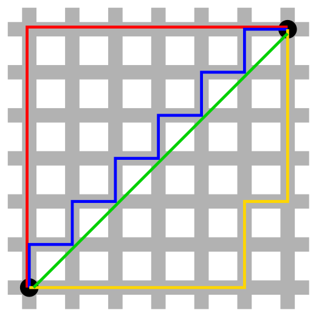

---
jupytext:
    cell_metadata_filter: -all
    formats: md:myst
    text_representation:
        extension: .md
        format_name: myst
        format_version: 0.13
        jupytext_version: 1.11.5
mystnb:
    number_source_lines: true
kernelspec:
    display_name: Python 3
    language: python
    name: python3
---

# Vector Norm and Distance

```{contents}
:local:
```

```{code-cell} ipython3
:tags: [remove-cell]

%config InlineBackend.figure_format = 'svg'

from __future__ import annotations

import math
from IPython.display import display
from typing import Sequence, TypeVar, Optional
import matplotlib.pyplot as plt
import numpy as np
import rich

import sys
from pathlib import Path

def find_root_dir(current_path: Path = Path.cwd(), marker: str = '.git') -> Optional[Path]:
    """
    Find the root directory by searching for a directory or file that serves as a
    marker.

    Parameters
    ----------
    current_path : Path
        The starting path to search from.
    marker : str
        The name of the file or directory that signifies the root.

    Returns
    -------
    Path or None
        The path to the root directory. Returns None if the marker is not found.
    """
    current_path = current_path.resolve()
    for parent in current_path.parents:
        if (parent / marker).exists():
            return parent
    return None

root_dir = find_root_dir(marker='omnivault')

if root_dir is not None:
    sys.path.append(str(root_dir))
    from omnivault.utils.visualization.style import use_svg_display
    from omnivault.linear_algebra.plotter import (
        VectorPlotter2D,
        Vector2D,
        add_vectors_to_plotter,
        add_text_annotations,
    )
else:
    raise ImportError("Root directory not found.")

use_svg_display()
```

We first start off by mentioning that we will revisit this section later in the
series in a more rigorous manner. For now, we will have a first look on the
naive interpretation of vector norms and distances.

Understanding the **norm** of a vector is fundamental in various fields,
including
**[machine learning](https://en.wikipedia.org/wiki/Machine_learning)**, where it
is crucial for tasks like
**[normalizing data](https://en.wikipedia.org/wiki/Feature_scaling)**,
**[measuring similarity](https://en.wikipedia.org/wiki/Cosine_similarity)**, and
**[regularization](<https://en.wikipedia.org/wiki/Regularization_(mathematics)>)**.
In the context of
**[generative AI](https://en.wikipedia.org/wiki/Generative_adversarial_network)**
and **[embedding spaces](https://en.wikipedia.org/wiki/Word_embedding)**, norms
play a pivotal role in quantifying the magnitude and distance of vectors, which
represent complex entities like features, words, or even images.

## Norm

```{prf:definition} Norm on a Vector Space
:label: 03-vector-norm-norm-on-a-vector-space

A norm on a vector space $\mathcal{V}$ over a field $\mathbb{F}$ (typically
$\mathbb{R}$ or $\mathbb{C}$), is a function

$$
\begin{aligned}
\|\cdot\|: V & \rightarrow \mathbb{R}, \\
\mathbf{u} & \mapsto\|\mathbf{u}\|,
\end{aligned}
$$

which assigns each vector $\mathbf{u} \in \mathcal{V}$ a real number
$\|\mathbf{u}\|$, representing the **length** of $\mathbf{u}$
{cite}`deisenroth2020mathematics`.

This function must satisfy the following properties for all scalars $\lambda$
and vectors $\mathbf{u}, \mathbf{v} \in \mathcal{V}$:

1. **Absolute Homogeneity (or Positive Scaling):**

    $$
    \|\lambda \mathbf{u}\| =
    |\lambda| \|\mathbf{u}\|
    $$

    This means the norm is scale-invariant and respects scalar multiplication.

2. **Triangle Inequality:**

    $$
    \|\mathbf{u} + \mathbf{v}\| \leq \|\mathbf{u}\| +
    \|\mathbf{v}\|
    $$

    The sum of the norms of two vectors is always greater than or equal to the
    norm of their sum.

3. **Positive Definiteness:**

    $$
    \|\mathbf{u}\| \geq 0 \text{ and }
    \|\mathbf{u}\| = 0 \iff \mathbf{u} = \mathbf{0}
    $$

    The norm of any vector is non-negative and is zero if and only if the vector
    itself is the zero vector.
```

We are being ahead of ourselves because we did not define what is a vector
space. We will revisit this later in the series. For now, treat a vector space
as a set of vectors in the $D$-dimensional space $\mathbb{R}^D$.

### $L^{p}$ Norm

With the norm well defined, we can now define the $L^p$ norm, which is a
specific case of the norm function. The $L^p$ is a generalization of the concept
of "length" for vectors in the **_vector space_** $\mathcal{V}$.

```{prf:definition} $L^p$ Norm
:label: 03-vector-norm-lp-norm

For a vector space $\mathcal{V} = \mathbb{R}^D$ over the field
$\mathbb{F} =
\mathbb{R}$, the $L^p$ norm is a function defined as:

$$
\begin{aligned}
\|\cdot\|_p : \mathcal{V} & \rightarrow \mathbb{R}, \\
\mathbf{v} & \mapsto \left( \sum_{i=1}^D |v_i|^p \right)^{\frac{1}{p}},
\end{aligned}
$$

where each vector $\mathbf{v} \in \mathcal{V}$ is assigned a real number
$\|\mathbf{v}\|_p$, representing the $L^p$ norm of $\mathbf{v}$.
```

In other words, for a vector $\mathbf{v} \in \mathbb{R}^D$, the $L^p$ norm of
$\mathbf{v}$, denoted as $\|\mathbf{v}\|_p$, is defined as:

$$\|\mathbf{v}\|_p = \left( \sum_{i=1}^{D} |v_i|^p \right)^{\frac{1}{p}},$$

where $v_1, v_2, \ldots, v_D$ are the components of the vector $\mathbf{v}$, and
$p$ is a real number greater than or equal to 1.

As we shall see later, the choice of $p$ determines the metric's sensitivity to
differences in vector components, influencing its application in various
algorithms.

### L1 Norm (Manhattan Norm)

The **L1 norm**, also known as the **Manhattan norm** or **Taxicab norm**, is a
specific case of the $L^p$ norm where $p = 1$.

```{prf:definition} L1 Norm
:label: 03-vector-norm-l1-norm

For the same vector space $\mathcal{V} = \mathbb{R}^D$, the $L^1$ norm is
defined by:

$$
\begin{aligned}
\|\cdot\|_1 : \mathcal{V} & \rightarrow \mathbb{R}, \\
\mathbf{v} & \mapsto \sum_{i=1}^D |u_i|,
\end{aligned}
$$

assigning to each vector $\mathbf{v}$ the sum of the absolute values of its
components, $\|\mathbf{v}\|_1$.

In other words, for a vector $\mathbf{v} \in \mathbb{R}^D$, the $L^1$ norm of
$\mathbf{v}$, denoted as $\|\mathbf{v}\|_1$, is defined as:

$$\|\mathbf{v}\|_1 = \sum_{i=1}^{D} |v_i|.$$
```

It sums the absolute values of the vector components. Geometrically, it measures
the distance a taxicab would travel in a grid-like path in $\mathbb{R}^D$. In
machine learning, the L1 norm is used for **regularization**, encouraging
sparsity in the model parameters.



### L2 Norm (Euclidean Norm)

The **L2 norm**, or **Euclidean norm**, obtained by setting $p = 2$, is the most
familiar norm in machine learning.

```{prf:definition} L2 Norm
:label: 03-vector-norm-l2-norm

Similarly, for $\mathcal{V} = \mathbb{R}^D$, the $L^2$ norm is given by:

$$
\begin{aligned}
\|\cdot\|_2 : \mathcal{V} & \rightarrow \mathbb{R}, \\
\mathbf{v} & \mapsto \left( \sum_{i=1}^D |u_i|^2 \right)^{\frac{1}{2}},
\end{aligned}
$$

where $\|\mathbf{v}\|_2$ is the Euclidean length of the vector $\mathbf{v}$.

Each of these norm functions adheres to the definition of a norm, applying
specific operations to vectors in $\mathbb{R}^D$ and mapping them to real
numbers that represent different concepts of length or magnitude. The $L^p$ norm
offers a generalized way to define these lengths, with $L^1$ and $L^2
$ being
special cases for specific values of $p$.

In other words, for a vector $\mathbf{v} \in \mathbb{R}^D$, the $L^2$ norm of
$\mathbf{v}$, denoted as $\|\mathbf{v}\|_2$, is defined as:

$$\|\mathbf{v}\|_2 = \sqrt{\sum_{i=1}^{D} |v_i|^2}.$$
```

It measures the "straight-line" distance from the origin to the point in
$\mathbb{R}^D$ represented by $\mathbf{v}$. This norm is extensively used in
machine learning to measure the magnitude of vectors, in optimization algorithms
(like gradient descent), and in computing distances between points in feature
space.

Let's see how the L2 norm looks like in a 2D space.

```{code-cell} ipython3
:tags: [hide-input]

fig, ax = plt.subplots(figsize=(9, 9))

plotter = VectorPlotter2D(
    fig=fig,
    ax=ax,
    ax_kwargs={
        "set_xlim": {"left": 0, "right": 10},
        "set_ylim": {"bottom": 0, "top": 10},
        "set_xlabel": {"xlabel": "x-axis", "fontsize": 16},
        "set_ylabel": {"ylabel": "y-axis", "fontsize": 16},
        "set_title": {"label": "Vector Magnitude Demonstration", "size": 18},
    },
)

v = Vector2D(origin=(0, 0), direction=(3, 4), color="r", label="$\|\mathbf{v}\|_2 = \sqrt{3^2 + 4^2} = 5$")
horizontal_component_v = Vector2D(origin=(0, 0), direction=(3, 0), color="b", label="$v_1 = 3$")
vertical_component_v = Vector2D(origin=(3, 0), direction=(0, 4), color="g", label="$v_2 = 4$")
add_vectors_to_plotter(plotter, [v, horizontal_component_v, vertical_component_v])
add_text_annotations(plotter, [v])

plotter.plot()
```

Notice that the calculation is equivalent to the Pythagorean theorem, where the
length of the hypotenuse is the square root of the sum of the squares of the
other two sides.

We can easily calculate the L2 norm of a vector using NumPy:

```{code-cell} ipython3
u = np.array([3, 4])
rich.print(f"Norm of u: {np.linalg.norm(u)}")
```

## Motivation: Understanding Similarity in High-Dimensional Spaces

In machine learning, particularly in fields like **natural language processing
(NLP)** and **computer vision**, a fundamental challenge is to understand and
quantify the notion of similarity. Consider the task of image recognition or
word meaning interpretation. How do we determine that two images are similar, or
that two words have similar meanings?

### Representing Images and Words as Vectors

In high-dimensional spaces like $\mathbb{R}^D$, complex entities like images and
words can be represented as vectors. For instance:

-   **Images**: Each image can be represented as a vector, where each dimension
    corresponds to a pixel or a feature extracted from the image.
-   **Words**: In NLP, words are represented as vectors in a space where
    distances between vectors are related to semantic similarities between
    words. This is achieved through techniques like **word embeddings**.

### The Need for Similarity Measures

Once we have these vector representations, we need a way to quantify how 'close'
or 'similar' they are. This is where the concept of **similarity** comes in.
Similarity measures in vector spaces enable us to:

-   **Compare Images**: Determine how similar two images are based on their
    vector representations. This has applications in image search, face
    recognition, and more.
-   **Understand Word Semantics**: In NLP, measure the closeness of words in the
    embedding space to capture semantic relationships (like synonyms,
    analogies).
-   **Cluster and Categorize**: Group similar items together, whether they're
    images in a photo library or words in a document.

### Role of Norms and Distance Metrics

To quantify similarity, we often use norms and distance metrics like the
Euclidean norm (L2 norm) or the Manhattan norm (L1 norm). These mathematical
tools give us a way to compute distances in high-dimensional spaces, translating
into measures of similarity or dissimilarity:

-   **Closer Vectors**: Indicate more similarity (e.g., images with similar
    features, words with related meanings).
-   **Further Apart Vectors**: Suggest less similarity or greater dissimilarity.

### Limitations of L1 and L2 Norms in Measuring Similarity

The L1 and L2 norms focus on the magnitude of vectors, which can be a limitation
in certain scenarios:

-   **Dominance of Magnitude**: In high-dimensional spaces, especially with
    sparse vectors (common in NLP), the magnitude of vectors can dominate the
    similarity measure. Two vectors might be pointing in the same direction
    (hence, similar in orientation) but can be deemed dissimilar due to
    differences in magnitude.
-   **Insensitive to Distribution of Components**: These norms don't
    differentiate how vector components contribute to the overall direction. Two
    vectors with similar orientations but different distributions of values
    across components can have the same L1 or L2 norm.

Consequently,
**[Cosine similarity](https://en.wikipedia.org/wiki/Cosine_similarity)** emerges
as a critical concept, especially in NLP and document classification. Unlike
Euclidean or Manhattan norms that focus on magnitude, cosine similarity
concentrates on the angle between vectors, making it exceptionally suited for
comparing the orientation (and thus the semantic direction) of word embeddings
in high-dimensional space. We will explore cosine similarity in detail in later
sections.

```{code-cell} ipython3
import numpy as np

def calculate_norms_and_cosine_similarity(vec_a, vec_b):
    l1_norm = np.sum(np.abs(vec_a - vec_b))
    l2_norm = np.sqrt(np.sum((vec_a - vec_b) ** 2))
    cosine_similarity = np.dot(vec_a, vec_b) / (np.linalg.norm(vec_a) * np.linalg.norm(vec_b))
    return l1_norm, l2_norm, cosine_similarity

vec_a = np.array([1, 1, 1, 1, 0, 0, 0, 0, 0, 0])
vec_b = np.array([1, 1, 1, 0, 0, 0, 0, 0, 0, 1])

l1_norm, l2_norm, cosine_similarity = calculate_norms_and_cosine_similarity(vec_a, vec_b)
print("L1 Norm:", l1_norm)
print("L2 Norm:", l2_norm)
print("Cosine Similarity:", cosine_similarity)

vec_c = np.array([1, 2, 3])
vec_d = np.array([2, 4, 6])

l1_norm, l2_norm, cosine_similarity = calculate_norms_and_cosine_similarity(vec_c, vec_d)
print("L1 Norm:", l1_norm)
print("L2 Norm:", l2_norm)
print("Cosine Similarity:", cosine_similarity)
```

## References and Further Readings

-   Deisenroth, M. P., Faisal, A. A., & Ong, C. S. (2020). _Mathematics for
    Machine Learning_. Cambridge University Press. (Chapter 3.1, Norms).
