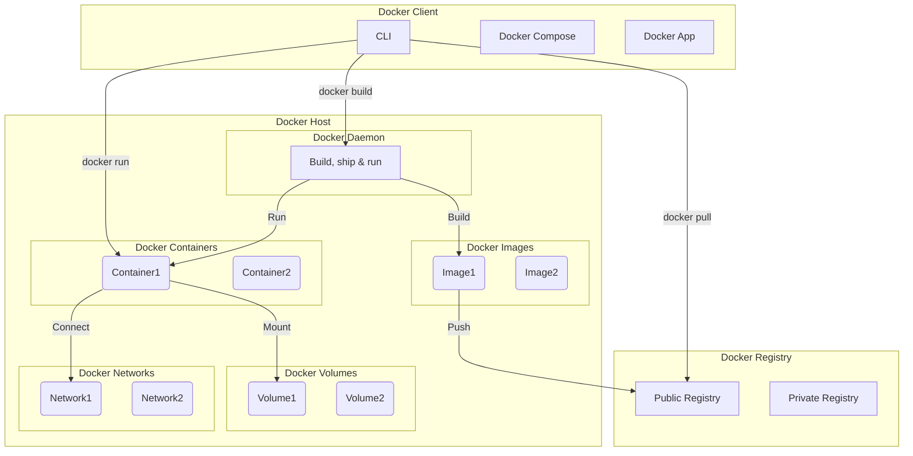

# Docker

## Learning Objectives

1. Understand the significance and advantages of Docker. This involves
   comprehending the following aspects:

    - Grasp the benefits of employing containers, which include:
        - The capability to package and deliver applications more efficiently
        - The facility to execute applications in various environments
        - The power to segregate applications from each other

2. Familiarize yourself with the fundamental concepts of Docker like images,
   containers, and repositories. This includes learning to:

    - Use the Docker CLI for building, running, and managing containers

3. Learn to craft Dockerfiles, which are essentially files comprising
   instructions for constructing Docker images. This will entail:

    - Understanding how to leverage Dockerfiles to automate the process of
      building and deploying applications

4. Understand the concept of
   **[containerization](https://en.wikipedia.org/wiki/OS-level_virtualization)**
   and how **[Docker](https://www.docker.com/what-docker)** facilitates this:

    - Comprehend the difference between
      **[virtualization](https://en.wikipedia.org/wiki/Virtualization)** and
      **[containerization](https://en.wikipedia.org/wiki/OS-level_virtualization)**
    - Understand the architecture of Docker including
      **[Docker Engine](https://docs.docker.com/engine/)**,
      **[Docker Images](https://docs.docker.com/engine/reference/commandline/images/)**,
      **[Docker Containers](https://docs.docker.com/get-started/overview/#docker-objects)**,
      and **[Dockerfile](https://docs.docker.com/engine/reference/builder/)**

5. Familiarize with Docker's
   **[Command Line Interface (CLI)](https://docs.docker.com/engine/reference/commandline/cli/)**
   and its common commands:

    - Learn to pull images from
      **[Docker Hub](https://docs.docker.com/docker-hub/)**
    - Understand how to create, start, stop, and remove containers
    - Learn to inspect containers and monitor their resource usage

6. Get hands-on with
   **[Dockerfile](https://docs.docker.com/engine/reference/builder/)**:

    - Understand the structure and syntax of a Dockerfile
    - Learn how to create a Dockerfile to build a custom Docker image
    - Learn to use Dockerfile instructions such as `FROM`, `RUN`, `COPY`, `ADD`,
      `CMD`, `ENTRYPOINT`, `EXPOSE`, `ENV`, `WORKDIR`, `USER`, `VOLUME` etc.

7. Understand **[Docker Networking](https://docs.docker.com/network/)**:

    - Learn about Docker's networking capabilities and different types of
      network drivers
    - Understand how to link containers and expose container ports

8. Learn about
   **[Docker Volumes and Data Management](https://docs.docker.com/storage/volumes/)**:

    - Understand the concept of Docker volumes
    - Learn how to create and manage Docker volumes for persistent data storage

9. Grasp the concept of **[Docker Compose](https://docs.docker.com/compose/)**
   for multi-container applications:

    - Understand the Docker Compose file structure
    - Learn how to define and run multi-container Docker applications with
      Docker Compose

10. Understand
    **[Docker Security best practices](https://docs.docker.com/engine/security/)**:
    - Learn about Docker's security features and best practices for securing
      Docker containers

## What is Docker?

**[Docker](https://www.docker.com/what-docker)** is an open-source platform
designed to automate deploying, scaling, and managing applications. It uses
containerization technology to bundle an application and its associated
dependencies into a single object. This container allows developers to ensure
consistency across multiple development and deployment settings.

### Intuition

Imagine that you're a data scientist working on a complex machine learning
project. Over time, you've installed various Python packages in your local
environment, including different versions of libraries like NumPy, Pandas, and
Scikit-Learn, not to mention TensorFlow, PyTorch, etc. Everything works fine on
your local machine, but problems arise when you try to share your work or deploy
your model.

Your colleague, who is working on a different project, may have different
versions of these libraries installed. When they try to run your code, they run
into compatibility issues because of the version mismatch. Similarly, when you
try to deploy your model in production, you realize that the production
environment doesn't have all the necessary libraries installed.

This is where Docker comes in. Docker allows you to package your application -
in this case, your machine learning model and all its dependencies - into a
self-sufficient unit, called a container.

A Docker container includes everything needed to run your model: the Python
runtime, the exact versions of the libraries you used, your code, and even the
trained model itself. This container can run on any system that has Docker
installed, regardless of the underlying setup. In this way, Docker ensures that
your application will run the same, no matter where it is.

This isolation is somewhat like Python's virtual environments but on a whole
different level. While a virtual environment can isolate Python dependencies, a
Docker container isolates the entire runtime environment: libraries, code, file
system, system libraries, shell, and more.

Hence, the intuition behind Docker is to provide a fully self-contained and
isolated environment for running applications, which ensures consistency,
reproducibility, and ease of deployment across various platforms and systems.

### Key Concepts

**Docker** is a platform leveraging OS-level virtualization for software
packaging and delivery in units called
**[containers](https://www.docker.com/resources/what-container)**.

1. **[Containers](https://docs.docker.com/get-started/overview/#containers)**:
   Docker containers package all dependencies for a software application,
   ensuring consistency across different environments.

    They are isolated, executable packages containing all the dependencies
    needed to run an application. They're created from **Docker images** and can
    run on any Docker-enabled platform. Containers achieve isolation using Linux
    **[namespaces](https://man7.org/linux/man-pages/man7/namespaces.7.html)**
    and resource usage control with
    **[cgroups](https://man7.org/linux/man-pages/man7/cgroups.7.html)**.

    This is crucial in ML, where dependencies may vary widely for different
    models.

    Dependencies are software components required for an application to
    function. For example, to serve a deep learning model that predicts house
    prices, the application may require the following:

    - Code: Python, PyTorch, TensorFlow, etc.
    - Data: Trained model that is pulled from a artifact repository.
    - Configuration: Environment variables, hyperparameters, etc.
    - OS: Linux, Windows, etc.
    - Database: MySQL, PostgreSQL, etc.
    - Drivers: GPU drivers, etc.

2. **[Images](https://docs.docker.com/engine/reference/commandline/images/)**:
   An image is a blueprint for a Docker container. It is a lightweight,
   stand-alone, and executable package of software that includes everything
   needed to run a piece of software. An image is built from a set of
   instructions, called a Dockerfile, which specifies the base image, the
   application code, and any additional dependencies.

3. **[Dockerfiles](https://docs.docker.com/engine/reference/builder/)**: A
   Dockerfile is a script that contains instructions for building a Docker
   image. It specifies the base image, the application code, and any additional
   dependencies that are required to run the application. Dockerfiles are used
   to automate the process of building images, so developers can easily create
   and modify images as needed.

4. **[Docker Hub](https://docs.docker.com/docker-hub/)** and other Docker
   Registries
   ([**Google Container Registry**](https://cloud.google.com/artifact-registry)):
   Docker Hub is a public registry for storing and sharing Docker images. It
   provides a centralized place for developers to publish and manage images,
   making it easier to find and use images created by others.

5. **[Volumes](https://docs.docker.com/storage/volumes/)**: Volumes are a way to
   persist data outside of a Docker container. Volumes can be used to store data
   that is generated by a container, or to share data between containers.
   Volumes are stored on the host file system and are managed by Docker.

6. [**Networking**](https://docs.docker.com/network/): Docker provides a
   networking layer that allows containers to communicate with each other and
   the host system. Docker allows containers to be connected together in a
   virtual network, which enables them to communicate with each other using
   their hostnames.

7. **[Docker Compose](https://docs.docker.com/compose/)**: Docker Compose is a
   tool for defining and running multi-container applications. It provides a way
   to define an entire application stack, including the containers, their
   configurations, and the relationships between them, in a single file called a
   docker-compose.yml file.

8. [**Orchestration**](https://docs.docker.com/get-started/orchestration/):
   Docker can integrate with orchestration tools like
   **[Kubernetes](https://kubernetes.io/)** or
   **[Docker Swarm](https://docs.docker.com/engine/swarm/)** for managing and
   scaling container deployments.

We dive into the two most important concepts, **containers** and **images** in
the next section.

#### Containers

A [**container**](<https://en.wikipedia.org/wiki/Containerization_(computing)>)
is a standalone, executable package that includes everything needed to run a
piece of software, including the code, a
[**runtime environment**](https://docs.docker.com/develop/develop-images/baseimages/),
libraries, environment variables, and config files. It's created from an image
and can be run on any platform that supports Docker.

Docker achieves this using several features of the
[**Linux kernel**](https://en.wikipedia.org/wiki/Linux_kernel):

-   **Namespaces**: Docker uses namespaces to provide the isolated workspace
    called a container. Each aspect of a container runs in its own namespace,
    thereby isolating it from the rest of the system.

-   **Control Groups**: Docker uses a feature of the Linux kernel called cgroups
    or control groups. This is used to limit and isolate the resource usage
    (CPU, memory, disk I/O, network) of each container.

-   **Union File Systems**: Docker can use Union File Systems, which are file
    systems that operate by creating layers. This feature makes Docker images
    very lightweight and fast.

#### Images

A [**Docker image**](https://docs.docker.com/glossary/?term=image) is a
lightweight, standalone, executable package that includes everything needed to
run a piece of software. Images are created from a Dockerfile, a text file that
contains a list of commands to assemble an image. Images are the blueprint for
containers, and they become containers when they run on Docker Engine.

Each instruction in a Dockerfile creates a layer in the image. When you change
the Dockerfile and rebuild the image, only those layers that have been changed
are rebuilt. This is part of what makes Docker images so lightweight, small, and
fast when compared to other virtualization technologies.

#### Docker Containers

A
[**Docker container**](https://docs.docker.com/get-started/overview/#docker-containers)
is a running instance of a Docker image. When you run a Docker container from an
image, Docker adds a new, thin, writable layer on top of the existing layers of
the image. Any changes made to the running container, such as writing new files,
modifying existing files, and deleting files, are stored in this thin writable
container layer.

Docker's magic lies in the way it uses and manages these layers. Because each
container has its own layer, and all the underlying image layers are read-only,
Docker can share these underlying layers between multiple containers. This makes
starting a new container extremely fast and requires very little extra disk
space.

### Docker Architecture

Before we install Docker, let's take a look at how the container engine works on
top our operating system, which can be our local hardware or something managed
on the cloud.

<figure markdown>
  { width="1000" }
  <figcaption>Docker Architecture. Image Credit: [Madewithml](https://madewithml.com/courses/mlops/docker/)</figcaption>
</figure>

The image can be further broken down:

-   **Infrastructure**: This is the underlying hardware where everything runs.
    It could be on a local machine or a server in a data center, or in the cloud
    with a provider like AWS, GCP, or Azure.

-   **Operating System**: This is the software that runs directly on the
    infrastructure and provides services to other software. Examples are Linux,
    Windows, and MacOS.

-   **Docker Engine**: This is the runtime that builds, runs, and manages Docker
    containers. It installs on top of the operating system and communicates
    directly with it.

-   **Dependencies**: These are libraries, binaries, or other resources that
    your application needs to run. These dependencies are packaged inside Docker
    containers, along with your application.

-   **Apps**: These are the applications that are packaged inside Docker
    containers. The application and its dependencies are isolated from the rest
    of the system, which ensures that the application runs the same way
    regardless of where the Docker container is run.

### Docker Flow

In this diagram:

-   The Docker Client can interact with the Docker Daemon to build, pull, and
    run Docker containers.
-   The Docker Daemon builds Docker images and runs Docker containers.
-   Docker images can be pushed to a Docker Registry and pulled from there.
-   Docker containers can mount Docker volumes and connect to Docker networks.



### Sample Workflow

Let's go through the building of a prediction service for classifying images as
a cat or a dog using deep learning. We'll use Docker to ensure this service can
be easily deployed anywhere. In this example, we'll be considering four Docker
containers:

#### Model Training Container

The **Model Training Container** is responsible for running machine learning
training scripts. It contains all necessary dependencies including machine
learning libraries (like TensorFlow or PyTorch) and any other required packages.

To create this container, start with a base Python image. Use the
`RUN pip install` command in your Dockerfile to add required machine learning
libraries and other packages.

Once the container is created, use it to run training scripts. Mount volumes to
the container to store training data and output (like the trained model file),
ensuring data persists after the container stops.

You can also use NVIDIA Docker to run training on GPUs if need be.

#### MLFlow Container

The **MLFlow Container** is responsible for running the MLFlow server. This
provides a platform for tracking and managing machine learning experiments and
should include all necessary dependencies, including the MLFlow library.

To create this container, start with a base Python image. Use the
`RUN pip install` command in your Dockerfile to add MLFlow and other necessary
dependencies.

Once the container is created, run the MLFlow server on it. Mount volumes to the
container to store the MLFlow artifacts and logs.

#### Database Container

The **Database Container** runs the database that your application uses. It
contains the database software (like PostgreSQL or MySQL) and any necessary
configuration files.

To create this container, start with a base image that includes the database
software (e.g., PostgreSQL or MySQL image). If additional packages or
configurations are needed, add them using the `RUN` and `COPY` commands in your
Dockerfile.

Once the database container is created, use it to store and manage your
application's data. Mount volumes to the container to ensure that database data
persists even when the container is stopped.

#### Model Serving Container

The **Model Serving Container** is responsible for serving predictions from the
trained model. It should include all necessary dependencies to load and run the
model, typically the same machine learning library used for training (like
TensorFlow or PyTorch), a web server (like Flask or FastAPI), and other required
packages.

To create a model serving container, start with a base Python image. Use the
`RUN pip install` command in your Dockerfile to add your machine learning
library, web server, and other necessary dependencies. Also, copy the server
script (usually a Python file) into the Docker image.

Once the model serving container is created, it can load the trained model
(often from a shared volume or cloud storage) and start the web server. The
server listens for incoming requests, processes the image input to the format
expected by the model, performs inference, and sends back the prediction.

This containerized approach allows the model serving component to scale
independently based on request load. You can also update the model or the
serving code without affecting the other components of your application.

#### Putting it all together = CI/CD Pipeline

The communication between these three containers can be handled via Docker
Compose or Kubernetes.

The resulting Docker image can be run on any system that has Docker installed,
regardless of other software configurations, making it easy to share and deploy
your application. You'd also configure a Docker Compose file to manage the
interactions and networking between these containers.

1. **Continuous Integration (CI)**: Developers push changes to the model code,
   feature engineering code, or data to a version control system like Git.

2. **Build**: An automated build system, such as Jenkins or GitLab CI/CD,
   detects the changes and triggers a build of the Docker containers:

    - The **Model Training Container** is built with the new code and data. It
      runs the updated model training script, trains the model, and the trained
      model is saved to a shared volume or cloud storage.

    - The **MLFlow Container** is updated with the new code, if any, and the
      MLFlow tracking server is started.

    - Docker ensures that these containers are built consistently, with the same
      dependencies and environment, regardless of where they are run.

3. **Test**: Automated tests are run on the containers to validate the newly
   trained model and the application's functionality. Docker allows these tests
   to be run in an environment identical to the production environment.

4. **Continuous Delivery (CD)**: If the tests pass, the updated **Model Serving
   Container** is built using Docker, incorporating the new model. This
   container is then pushed to a Docker registry, from where it can be pulled
   and deployed to the production environment.

5. **Prediction**: In the production environment, when a new image is sent to
   the model serving container's API:

    - The model serving container preprocesses the image and uses the updated
      model to make a prediction.

    - The prediction (cat or dog) is returned in the API response.

    - Docker ensures that the model serving container runs in the same way in
      the production environment as it did in the test environment.

6. **Logging**: The model serving container logs the image, prediction, and
   timestamp to the **Database Container**. The MLFlow container continues to
   track the performance and usage metrics of the model.

7. **Monitoring and Retraining**: The database and MLFlow containers allow you
   to monitor the model's performance and the data it is processing. If the
   model's performance degrades, or if there are significant changes in the
   data, the CI/CD pipeline can be triggered again to retrain the model using
   Docker to rebuild the necessary containers.

In this way, Docker forms the backbone of the CI/CD pipeline in an MLOps
context, ensuring consistency between the development, test, and production
environments, and allowing for easy scaling and deployment of the application.

### Benefits of Docker in Machine Learning Operations (MLOps)

Docker provides a myriad of advantages when applied in
[**Machine Learning**](https://en.wikipedia.org/wiki/Machine_learning)
scenarios, often grouped under the term
[**MLOps**](https://en.wikipedia.org/wiki/MLOps).

1. **[Reproducibility](https://www.docker.com/what-docker)**: Docker containers
   encapsulate an entire runtime environment: an application, plus all its
   dependencies, libraries and system settings. This allows consistent execution
   of ML models, eliminating the "works on my machine" problem.

2. **[Isolation](https://docs.docker.com/get-started/overview/#docker-objects)**:
   Docker provides isolated environments for ML models, ensuring that
   potentially conflicting dependencies of different models do not interfere
   with each other. This aspect brings numerous benefits, including:

    - **Resource Management**: Resource allocation and quota can be set for
      individual containers.
    - **Versioning**: Parallel execution of different versions of an application
      or models is possible.
    - **Security**: Containers add a level of security by isolating
      applications.
    - **Stability**: Application failure remains isolated, not impacting others.
    - **Portability**: Containers can be easily moved between various
      environments and cloud platforms.

3. **[Collaboration](https://www.docker.com/resources/what-container)**: Docker
   facilitates smoother collaboration between data scientists and DevOps,
   enabling them to focus on their respective roles: model development and model
   deployment.

4. **[Scalability](https://docs.docker.com/get-started/overview/#scaling-out-with-swarm-and-kubernetes)**:
   Docker, when coupled with orchestration tools like
   [**Kubernetes**](https://kubernetes.io/), , allows seamless scaling of ML
   models, adjusting to the varying demand in real-time.

### Summary

#### Understanding Docker: How it Works and its Advantages

Docker is a platform that utilizes operating-system-level virtualization to
develop and deliver software in packages called containers. These containers can
be thought of as lightweight virtual machines, but unlike traditional virtual
machines, they share the kernel with other containers and do not require a full
operating system per application. This makes them faster, less
resource-intensive, and more flexible.

#### What is a Docker Container?

Docker containers are a form of operating-system-level virtualization. Instead
of emulating a whole new machine, they allow multiple isolated user spaces to
coexist on the same operating system kernel.

This means that a Docker container includes the application and all of its
dependencies, but it shares the kernel with other containers. It runs as an
isolated process in user space on the host operating system. Docker containers
are not tied to any specific infrastructure – they run on any computer, on any
infrastructure, and in any cloud.

#### The Role of the Kernel in Docker Architecture

The kernel is the core of an operating system. It manages the system's
resources, such as memory and CPU time, and it mediates access to these
resources by various applications. It also provides various services and
abstractions to user space applications, such as file systems, networking,
process management, and hardware device drivers.

In contrast to the kernel, user space refers to all the code that runs outside
the operating system's kernel. User space applications use system libraries and
system calls to interact with the kernel and request services.

#### Comparing Docker Containers and Virtual Machines

Docker containers are significantly more lightweight than VMs: they start up
quickly, require less computing resources, and their performance is closer to
bare-metal applications because there's no hypervisor layer as in VMs. They also
ensure that applications run uniformly across different computing environments.

However, Docker containers, by default, don't offer the same level of isolation
as VMs, because they share the host's kernel. This is usually addressed by using
various isolation mechanisms provided by the kernel, like namespaces and
cgroups. But even with these mechanisms, a container might still be more exposed
to the host system and other containers compared to a VM, which runs its own
separate kernel.

## Docker CLI

The Docker CLI is a command-line interface that allows you to interact with
Docker directly from your terminal. It supports numerous commands to build, run,
and manage Docker containers.

### Docker Build

The `docker build` command is used to build a new Docker image from a
Dockerfile.

#### Base Command

The base command follows the syntax below:

```bash title="Base Docker Build Command"
❯ docker build \
   -t <IMAGE_NAME>:<IMAGE_TAG> \
   -f <DOCKERFILE_NAME> \
   <PATH_TO_DOCKERFILE>
```

where:

1. `-t` is used to tag the image with a name and optional tag in the
   `IMAGE_NAME:IMAGE_TAG` format. If no tag is specified, the default tag
   `latest` is used.
2. `-f` defines the name of the Dockerfile. There is no need to specify this
   argument if the Dockerfile is named `Dockerfile` and is in the current
   directory.
3. `<PATH_TO_DOCKERFILE>` is the path to the directory containing the
   Dockerfile. If the Dockerfile is in the current directory, this argument can
   be `.`.

#### Other Useful Flags

Some other useful commands include:

| Flag                        | Description                                                                                                                                                                                                 |
| --------------------------- | ----------------------------------------------------------------------------------------------------------------------------------------------------------------------------------------------------------- |
| `--build-arg <arg>=<value>` | Specify build-time variables. Example: if Dockerfile contains `ARG version`, use `--build-arg version=1.0.0` to set `version` to `1.0.0`.                                                                   |
| `--no-cache`                | Disable the Docker build cache. Without this flag, Docker will reuse intermediate images from previous builds to speed up the build.                                                                        |
| `--rm=true` or `--rm=false` | Determine whether Docker should automatically remove intermediate containers after a successful build. Default is `true`.                                                                                   |
| `--platform`                | Specify the platform for which the image is built. Example: `--platform linux/arm64` to build an image for Linux on ARM. This is immensely useful when building multi-architecture images[^platform]. |

!!! info "More Flags"
      For a full list of available flags, you can refer to the
      [Docker documentation](https://docs.docker.com/engine/reference/commandline/build/).

      Alternatively, simple run:

      ```bash
      ❯ docker build --help
      ```

#### Exercise (Printing Hello World)

Let's use this
[example](https://github.com/gao-hongnan/common-utils/tree/main/examples/containerization/docker/hello_world)
from my repository to illustrate how to build a Docker image.

For example, let's say you have a python fille `hello_world.py` in the current
directory.

```python title="hello_world.py" linenums="1"
# hello_world.py
import logging

from rich.console import Console
from rich.logging import RichHandler

console = Console(force_terminal=True)

# Setup logging
logging.basicConfig(
    level="INFO", format="%(message)s", datefmt="[%X]", handlers=[RichHandler()]
)

logger = logging.getLogger("rich")

logger.info("Hello world!")
```

and correspondingly a `requirements.txt` file

```text title="requirements.txt"
rich
```

You can create a Dockerfile to build a Docker image that runs this script.

```Dockerfile title="Dockerfile" linenums="1"
FROM ubuntu:22.04

# Set the working directory to /app
WORKDIR /app

# Update and install Python3
RUN apt-get update -y && \
    apt-get install -y python3 \
    python3-pip \
    tree

# Copy requirements.txt to the container
COPY requirements.txt /app
COPY hello_world.py /app

# Run pip to install dependencies
RUN python3 -m pip install -r requirements.txt --no-cache-dir

CMD ["python3", "hello_world.py"]
```

-   <span style="color:orange">**Line 1**</span>: This line specifies the base
    image that Docker will use to build your new image. Here, we are using the
    [**Ubuntu 22.04**](https://hub.docker.com/_/ubuntu) image available on
    Docker Hub.

-   <span style="color:orange">**Line 4**</span>: This line sets the working
    directory for the Docker image. This is the directory where any subsequent
    commands will be executed. Here, we are setting the working directory to
    `/app`.

-   <span style="color:orange">**Lines 7-10**</span>: This is a `RUN` command,
    which Docker executes during the build process to create a new layer in the
    image. This command updates the package lists for upgrades and new package
    installations, and then installs `Python3` and `pip`.

-   <span style="color:orange">**Line 13-14**</span>: The `COPY` command copies
    the `requirements.txt` and `hello_world.py` file from your local directory
    (where you run the Docker build command) into the Docker image. The `.`
    signifies the current working directory in the Docker image (which is set to
    the root / directory by default).

-   <span style="color:orange">**Lines 17**</span>: This `RUN` command tells
    Docker to execute a shell command in the image during the build process.
    This command uses pip to install the Python packages listed in the
    `requirements.txt` file. The `--no-cache-dir` flag tells pip not to store
    the downloaded package files in the cache to **reduce** the image size.

-   <span style="color:orange">**Line 19**</span>: The `CMD` command specifies
    the default command to run when a container is started from the image. In
    this case, it's telling Docker to run the `hello_world.py` script using
    `Python3`. This doesn't execute during the build process, but when a
    container is run from the resulting Docker image.

Now, you can build the Docker image using the following command:

```bash title="Build Docker Image" linenums="1"
❯ docker build \
   -t hello_world:v1 \
   -f Dockerfile \
   .
```

where we are tagging the image with the name `hello_world` and the tag `v1`.

Upon successful build, you should see the following image in your local Docker
image repository:

<figure markdown>
  { width="1000" }
  <figcaption>Hello World Docker Image</figcaption>
</figure>

### Docker Run

After building an image, you can use `docker run` to **create** a new container
from that image and **start** it.

#### Base Command

The base command follows the syntax below:

```bash title="Base Docker Run Command"
❯ docker run \
   --rm \
   -d \
   -p <HOST_PORT>:<CONTAINER_PORT> \
   --name <CONTAINER_NAME> \
   <IMAGE_NAME>:<IMAGE_TAG>
```

where:

1. `--rm` instructs Docker to automatically clean up the container and remove
   the file system when the container exits. It is useful for temporary
   containers.
2. `-d` stands for detached (daemon) mode. It means that Docker will run your
   container in the background. You will not be attached to the standard
   input/output of the container.
3. `-p` maps the host port to the container port (port forwarding). It is
   specified as `-p <HOST_PORT>:<CONTAINER_PORT>`.
4. `--name` lets you specify a name for the container. If no name is given,
   Docker will generate a random name.
5. `<IMAGE_NAME>:<IMAGE_TAG>` specifies the image to use for creating the
   container. If the tag is not specified, Docker will use the `latest` tag by
   default.

#### Other Useful Flags

| Flag               | Description                                                                                                                             |
| ------------------ | --------------------------------------------------------------------------------------------------------------------------------------- |
| `-e` or `--env`    | Set environment variables in the container. Example: `-e ENV_VAR=VALUE` sets `ENV_VAR` to `VALUE`.                                      |
| `-it`              | Run the container in interactive mode, equivalent to `-i -t`.                                                                           |
| `-v` or `--volume` | Mount a volume from the host machine into the container. Example: `-v /path/to/host/dir:/path/to/container/dir`.                        |
| `-u` or `--user`   | Specify the user the container should run as. Example: `-u <user>`, where `<user>` is the username or UID.                              |
| `--network`        | Specify the network mode for the container. Example: `--network host` runs the container in the host network mode.                      |
| `--restart`        | Specify the restart policy for the container. Example: `--restart always` restarts the container if it exits with a non-zero exit code. |
| `--platform`       | Specify the platform for which the image is built. Example: `--platform linux/arm64` builds the image for Linux on ARM.                 |

#### Port Forwarding

When you run a Docker container, it has its own isolated network environment. By
default, the software inside the container cannot be accessed from your host
machine or from other machines in your network because the container's ports
aren't exposed.

However, sometimes you'll want to access the services running inside the Docker
container from outside the container. One way to do this is by mapping a port on
your host machine to a port on the Docker container. This process is known as
"port forwarding" or "port mapping".

The `-p` option in the `docker run` command allows you to map a port from your
host machine to a port in the Docker container. The syntax is
`-p <host_port>:<container_port>`.

So, if you have a web server inside your Docker container that is listening on
port 80, you can map this to port 80 on your host machine with `-p 80:80`.

```bash title="Port Forwarding"
❯ docker run \
   --rm \
   -d \
   -p 80:80 \
   --name hello_world \
   hello_world:v1
```

Once you do this, any traffic that hits port 80 on your host machine will be
forwarded to port 80 inside the Docker container. That means you can access the
web server inside the Docker container by navigating to `localhost:80` on your
host machine. The `localhost:80` request will be forwarded to the web server
inside your Docker container as if you were accessing the server directly.

However, the example above is moot because the `hello_world.py` script does not
start a web server. Instead, it simply prints "Hello World!" to the console.

We will see this in action in later sections.

#### Nvidia Runtime - `docker run --gpus=all`

Nvidia provides a Docker utility named `nvidia-docker` that allows the Docker
container to access the GPU on the host machine.

The `docker run --gpus=all` command is used to provide the Docker container with
access to all the GPUs available on the host machine.

For example, the command

```bash title="Nvidia Docker"
❯ docker run --gpus=all --rm nvidia/cuda:11.4.2-base-ubuntu20.04 nvidia-smi
```

runs a Docker container with access to all available GPUs on the host, uses the
Nvidia CUDA base image tagged 11.4.2 for Ubuntu 20.04, and then runs the
`nvidia-smi` command. `nvidia-smi` is a utility by Nvidia that reports the
system's status and the GPUs' status. This helps verify whether Docker can
correctly access the GPUs.

The above command will directly pull the image from Docker Hub. If you want to
write your own Dockerfile, you can do something like this:

```Dockerfile title="Dockerfile" linenums="1"
# Use Nvidia CUDA base image
FROM nvidia/cuda:11.4.2-base-ubuntu20.04

# Install additional software as needed
RUN apt-get update && apt-get install -y \
  software1 \
  software2 \
  etc.
```

You can refer to the below resources for more information:

-   [Nvidia Docker](https://github.com/NVIDIA/nvidia-docker)

#### Exercise (Running Hello World)

```bash title="Run Hello World"
❯ docker run \
   --rm \
   -t hello_world:v1
```

with output

```bash
[06:12:39] INFO     Hello world!
```

You can also run the container in interactive mode with the `-it` flag.

```bash title="Interactive Mode"
❯ docker run \
   --rm \
   -it hello_world:v1 \
   bash
```

If you run `tree .` in the container, you should see the following output:

```bash title="tree ."
root@6d898c6cb4da:/app# tree .
```

you would see the following output:

```bash title="tree ."
.
|-- hello_world.py
`-- requirements.txt

0 directories, 2 files
```

To go to root folder, you do:

```bash title="cd /"
root@6d898c6cb4da:/app# cd /
```

and you will see a lot of default folders in the container.

### Docker PS

The `docker ps` command is used to list the currently running Docker containers.
It displays information about the containers such as their IDs, the image
they're based on, the command they're running, when they were created, their
status (up or exited), and the ports they're using.

| Command                              | Description                                                                      |
| ------------------------------------ | -------------------------------------------------------------------------------- |
| `docker ps`                          | Lists all currently running Docker containers.                                   |
| `docker ps -a`                       | Lists all Docker containers, regardless of their status (running, exited, etc.). |
| `docker ps --filter "status=exited"` | Lists only Docker containers that have exited (finished running).                |

#### Exercise (List Running Containers)

First, run the following command to start a container:

```bash title="Run Container"
docker run --name hello_world  -t hello_world:v1
```

where the `--rm` is not specified, so the container will not be removed after it
exits.

Then you can try the commands listed above to list the running containers.

```bash
❯ docker ps
CONTAINER ID   IMAGE     COMMAND   CREATED   STATUS    PORTS     NAMES

❯ docker ps -a
CONTAINER ID   IMAGE                   COMMAND                  CREATED              STATUS                          PORTS     NAMES
1ba3473a65e5   hello_world:v1          "python3 hello_world…"   About a minute ago   Exited (0) About a minute ago             hello_world

❯ docker ps --filter "status=exited"
CONTAINER ID   IMAGE                   COMMAND                  CREATED              STATUS                          PORTS     NAMES
1ba3473a65e5   hello_world:v1          "python3 hello_world…"   About a minute ago   Exited (0) About a minute ago             hello_world
```

### Docker Stop/RM

The `docker stop <CONTAINER_NAME>` command is used to stop a running Docker
container. It sends a SIGTERM signal to the container, which tells it to stop
gracefully. If the container doesn't stop within 10 seconds, Docker will send a
SIGKILL signal to force it to stop.

On the other hand, the `docker rm <CONTAINER_NAME>` command is used to remove a
Docker container. It can be used to remove a container that is stopped or
running.

#### Exercise (Stop and Remove Containers)

Since we did not use `--rm` just now, the container is still there. You can now
try the following commands to stop and remove the container.

```bash title="Stop Container"
❯ docker rm hello_world
```

and if you run `docker ps -a` again, you should see that the container is no
longer there.

To test out the `docker stop` command, you can run the following command to
create a running container.

```bash title="Run Container"
❯ docker run \
   -d \
   --name hello_world \
   -t hello_world:v1 \
   sleep infinity
```

where the `sleep infinity` command is used to keep the container running.

Running `docker ps` should show you the running container.

```bash title="List Running Containers"
❯ docker ps
CONTAINER ID   IMAGE            COMMAND            CREATED          STATUS          PORTS     NAMES
3348d7861da1   hello_world:v1   "sleep infinity"   27 seconds ago   Up 26 seconds             hello_world
```

Now to stop the container, you can run the following command:

```bash title="Stop Container"
❯ docker stop hello_world && docker ps -a && docker rm hello_world
```

where the `&&` operator is used to chain multiple commands together.

### Docker Tag

The `docker tag` command is used to tag an existing Docker image with a new tag.
We can see it in action in the next section.

### Docker Push (Google Container Registry)

Let's push our docker image to
[**Google Container Registry**](https://cloud.google.com/artifact-registry).

Pushing your Docker image to Google Container Registry (GCR) involves several
steps. Assuming you've already installed and set up Google Cloud SDK (gcloud).
Here are the steps:

1. Authenticate Docker to the GCR:

    ```bash title="Authenticate Docker to GCR"
    ❯ gcloud auth configure-docker
    ```

2. Tag the Docker image with the GCR URL:

    ```bash title="Tag Docker Image"
    ❯ docker tag hello_world:v1 gcr.io/<PROJECT_ID>/hello_world:v1
    ```

    where `<PROJECT_ID>` is your Google Cloud project ID.

3. Push the Docker image to GCR:

    ```bash title="Push Docker Image"
    ❯ docker push gcr.io/<PROJECT_ID>/hello_world:v1
    The push refers to repository [gcr.io/<PROJECT_ID>/hello_world]
    f2058ff6ef68: Pushed
    a0d7639eb3ec: Pushed
    211b750de5f2: Pushed
    40cffc20e075: Pushed
    1d05e421c9f7: Pushed
    b49483f6a0e6: Layer already exists
    v1: digest: sha256:xxx size: 1573
    ```

    where `<PROJECT_ID>` is your Google Cloud project ID.

4. List the Docker images in GCR:

    ```bash title="List Docker Images"
    ❯ gcloud container images list --repository=gcr.io/<PROJECT_ID>

    NAME
    gcr.io/<PROJECT_ID>/hello_world
    ```

    where `<PROJECT_ID>` is your Google Cloud project ID.

5. You can pull the Docker image from GCR:

    ```bash title="Pull Docker Image"
    ❯ docker pull gcr.io/<PROJECT_ID>/hello_world:v1
    ```

    where `<PROJECT_ID>` is your Google Cloud project ID.

#### Google Artifacts Registry

As of May 2023, Google Container Registry (GCR) will be replaced by
[**Google Artifacts Registry**](https://cloud.google.com/artifact-registry) and
phased out slowly. Setting up Google Artifacts Registry is similar to setting up
Google Container Registry.

See my instructions in
[scripts/cloud/gcp/gar_docker_setup.sh](https://github.com/gao-hongnan/common-utils/blob/main/scripts/cloud/gcp/gcloud_functions.sh).

<figure markdown>
  { width="1000" }
  <figcaption>Setting up Google Artifacts Registry.</figcaption>
</figure>

## Dockerfile

### Dockerfile Instructions (Commands)

| Instruction  | Description                                                                                                                                                               | Example                                                                                                                                                                                 |
| ------------ | ------------------------------------------------------------------------------------------------------------------------------------------------------------------------- | --------------------------------------------------------------------------------------------------------------------------------------------------------------------------------------- |
| `FROM`       | Specifies the base image to use as the starting point for the new image.                                                                                                  | `FROM python:3.8` would use the Python 3.8 image as the starting point. Note however, the image Python 3.8 is likely built on top of a more fundamental image, such as an ubuntu image. |
| `WORKDIR`    | Sets the working directory for subsequent instructions.                                                                                                                   | For example, `WORKDIR /app` sets the working directory to `/app`.                                                                                                                       |
| `COPY`       | Copies files from the host file system into the image.                                                                                                                    | For example, `COPY . /app` would copy all files in the current directory to the `/app` directory in the image.                                                                          |
| `RUN`        | Executes a command within the image.                                                                                                                                      | For example, `RUN pip install -r requirements.txt` would run the pip command to install the packages listed in the `requirements.txt` file.                                             |
| `ENV`        | Sets an environment variable in the image.                                                                                                                                | For example, `ENV PYTHONPATH=/app` sets the `PYTHONPATH` environment variable to `/app`.                                                                                                |
| `EXPOSE`     | Informs Docker that the container listens on the specified network ports at runtime.                                                                                      | For example, EXPOSE 8000 would make port 8000 accessible from the host.                                                                                                                 |
| `CMD`        | Provides defaults for an executing container, this can include an executable or they can omit the executable, in which case you must provide an `ENTRYPOINT` instruction. | For example, `CMD [ "python", "./app.py" ]` would run the `app.py` script using the Python interpreter.                                                                                 |
| `ADD`        | Copies new files, directories or remote file URLs from `<src>` and adds them to the filesystem of the image at the path `<dest>`.                                         | `ADD https://example.com/big.tar.xz /usr/src/things/` downloads the file and extracts it to the path.                                                                                   |
| `VOLUME`     | Creates a mount point with the specified name and marks it as holding externally mounted volumes from native host or other containers.                                    | `VOLUME /var/lib/mysql` creates a mount point at `/var/lib/mysql`.                                                                                                                      |
| `ENTRYPOINT` | Allows you to configure a container that will run as an executable.                                                                                                       | `ENTRYPOINT ["python", "app.py"]` runs `app.py` when the container starts.                                                                                                              |

!!! tip "Dockerfile Commands"
      You can find more information about Dockerfile
      commands in the
      [Dockerfile Reference](https://docs.docker.com/engine/reference/builder/).

### CMD vs ENTRYPOINT

Consider the "entrypoint" script below.

```python title="main.py" linenums="1"
# main.py
import typer
from typing import Dict, Any

app = typer.Typer()

@app.command()
def train(config: Dict[str, Any], in_file: str) -> None:
    # insert training code here
    print(f"Training with config: {config}, input file: {in_file}")

@app.command()
def predict(config: Dict[str, Any], in_file: str) -> None:
    # insert prediction code here
    print(f"Predicting with config: {config}, input file: {in_file}")

if __name__ == "__main__":
    app()
```

Locally, you could run:

```bash title="Run Locally"
❯ python main.py train --config '{"epochs": 10, "lr": 0.1}' --in-file "data.csv"
```

or if you wish to change the learning rate, you could run:

```bash title="Run Locally"
❯ python main.py train --config '{"epochs": 10, "lr": 0.001}' --in-file "data.csv"
```

Now, let's say you want to containerize this script. You could write a
Dockerfile like this:

```Dockerfile title="Dockerfile" linenums="1"
FROM python:3.9-slim

WORKDIR /app

COPY . /app

RUN pip install -r requirements.txt

CMD ["python", "main.py", "train", "--config", '{"epochs": 10, "lr": 0.1}', "--in-file" "data.csv"]
```

Here we used `CMD` to specify the default command to run when a container is
started from the image. In this case, it's telling Docker to run the command:

```bash title="CMD"
python main.py train --config '{"epochs": 10, "lr": 0.1}' --in-file data.csv
```

Consequently, when you run docker as such:

```bash title="Run Docker"
❯ docker run -t <IMAGE_NAME>:<IMAGE_TAG>
```

you will execute the default command specified in `CMD`.

However, since you are using `CMD`, you can easily override the default command
by specifying a new command when running the container.

```bash title="Override CMD"
❯ docker run -t <IMAGE_NAME>:<IMAGE_TAG> \
   python main.py train --config '{"epochs": 10, "lr": 0.001}' --in-file data.csv
```

!!! note "Override with other commands"
      You can also override the default
      command with other functions such as `predict` in the script. For example, you
      can run:

      ```bash title="Override CMD"
      ❯ docker run -t <IMAGE_NAME>:<IMAGE_TAG> \
         python main.py predict --config '{"text": "the dark knight"}' --in-file data.csv
      ```

However, if you define an `ENTRYPOINT` in your Dockerfile, you can no longer
override the default command. For example, if you change the Dockerfile to:

```Dockerfile title="Dockerfile" linenums="1" hl_lines="9"
FROM python:3.9-slim

WORKDIR /app

COPY . /app

RUN pip install -r requirements.txt

ENTRYPOINT ["python", "main.py", "train"]
```

Then, when you run docker as such:

```bash title="Run Docker"
❯ docker run -t <IMAGE_NAME>:<IMAGE_TAG> --config '{"epochs": 10, "lr": 0.1}' --in-file data.csv
```

where `ENTRYPOINT` provided a fixed entrypoint command `python main.py train`,
in which you appended the arguments
`--config '{"epochs": 10, "lr": 0.1}' --in-file data.csv`. You are also unable
to override the default command with other functions such as `predict` in the
script.

It is more useful when your docker container is intended to be used as an
executable (i.e. it always runs the same process.) And use `CMD` when you want
to provide default arguments that can be overridden, like in training.

### ADD vs COPY

`ADD` and `COPY` are both Dockerfile instructions for copying files from the
host machine into the Docker image, but they serve different purposes:

`COPY` is a straightforward directive that copies local files from your host to
the Docker image.

For instance, in a Machine Learning project, you might have a Dockerfile that
looks like this:

```Dockerfile title="Dockerfile" linenums="1"
# Use an official Python runtime as a parent image
FROM python:3.7-slim

# Set the working directory to /app
WORKDIR /app

# Copy the current directory contents into the container at /app
COPY . /app

# Install any needed packages specified in requirements.txt
RUN pip install --no-cache-dir -r requirements.txt

# Run model.py when the container launches
CMD ["python", "model.py"]
```

In this case, the `COPY` instruction copies the contents of the current
directory on your host machine to the `/app` directory in the Docker image.

`ADD` is a more complex directive that does everything `COPY` does, plus a few
other things:

-   If the source is a URL, `ADD` will download the file from the URL and copy
    it into the Docker image.
-   If the source is a tar file, `ADD` will automatically extract the tar file
    into the Docker image.

Suppose you have a large dataset stored in a tar archive at a certain URL. You
could use `ADD` in your Dockerfile to download and extract it:

```Dockerfile title="Dockerfile" linenums="1"
# Use an official Python runtime as a parent image
FROM python:3.7-slim

# Set the working directory to /app
WORKDIR /app

# Copy the current directory contents into the container at /app
COPY . /app

# Download and extract a dataset
ADD https://example.com/my_dataset.tar.gz /app/dataset

# Install any needed packages specified in requirements.txt
RUN pip install --no-cache-dir -r requirements.txt

# Run model.py when the container launches
CMD ["python", "model.py"]
```

In this case, the `ADD` instruction downloads the dataset from the URL and
extracts it into the `/app/dataset` directory in the Docker image.

### ARG vs ENV

`ARG` and `ENV` are both Dockerfile instructions that allow you to define
variables, but they serve different purposes and have different scopes.

Arguments are defined in a Dockerfile using the `ARG` instruction, and can be
set to different values when you build the Docker image using the docker build
command with the `--build-arg <varname>=<value>` option. `ARG` variables are not
available after the image is built. This means that they don't persist into the
containers that are created from the image. `ARG` is useful for passing in
build-time information, such as version numbers, file paths for `COPY` commands,
etc.

```Dockerfile
ARG VERSION=latest
FROM base:${VERSION}

ARG MY_FILE_PATH=./somefile.txt
COPY ${MY_FILE_PATH} /app/

CMD ["echo", "Image built with base version: ${VERSION}"]
```

In this Dockerfile, two `ARG` variables are defined: `VERSION` and
`MY_FILE_PATH`. The `VERSION` argument is used to specify the version of the
base image, and the `MY_FILE_PATH` argument is used to specify the file to be
copied into the image.

You can override these `ARG` variables when building the image:

```bash title="Override ARG"
❯ docker build --build-arg VERSION=1.0.1 --build-arg MY_FILE_PATH=./otherfile.txt -t myimage .
```

This command will build the image using `base:1.0.1` as the base image and copy
the file `otherfile.txt` into the image, instead of `somefile.txt`.

Please note that the `ARG` variables (`VERSION` and `MY_FILE_PATH`) are not
available in the running containers created from this image. If you run
`docker run -it myimage` and then `echo $VERSION` or `echo $MY_FILE_PATH`, you
will not see any output, because these `ARG` variables do not persist into the
running containers.

On the other hand, environment variables are defined in a Dockerfile using the
`ENV` instruction, and persist into the containers that are created from the
image. Once the image is built, `ENV` variables can't be changed for that image,
but they can be overridden when you create a new container from the image using
the `docker run -e <varname>=<value>` option. `ENV` is useful for setting
variables that are used by the software inside the image, such as configuration
settings.

```Dockerfile
# Dockerfile
FROM python:3.9-slim

ENV VERSION=latest
ENV MY_FILE_PATH=/app/somefile.txt

COPY . ${MY_FILE_PATH}

CMD ["echo", "Container running with VERSION: ${VERSION} and file at: ${MY_FILE_PATH}"]
```

In this Dockerfile, the ENV variables VERSION and MY_FILE_PATH are defined.
These variables are available in the containers created from this image.

You can override these ENV variables when creating a new container:

```bash title="Override ENV"
docker run -e VERSION=1.0.1 -e MY_FILE_PATH=/app/otherfile.txt -t myimage
```

This command will create a container where `VERSION` is set to `1.0.1` and
`MY_FILE_PATH` is set to `/app/otherfile.txt`. These variables are available in
the running container. If you run `docker exec -it <container_id> bash` and then
`echo $VERSION` or `echo $MY_FILE_PATH`, you will see `1.0.1` and
`/app/otherfile.txt`, respectively.

In summary, use `ARG` when you need to define variables that are only needed at
build-time, and use `ENV` when you need to define variables that are needed at
run-time.

### FROM and ARG

In multi-stage builds, you may want to use `ARG` variables in the `FROM` clause.
So, can we define `ARG` before `FROM`? The answer is yes. But there are some
intrincacies to be aware of. See
[understand how ARG and FROM interact](https://docs.docker.com/engine/reference/builder/#understand-how-arg-and-from-interact)
which tells us how `ARG` works if declared before `FROM` and after `FROM`.

## Docker Best Practices

Just like writing production ready code for your application, there are also
best practices for writing Dockerfiles.

-   [Docker Best Practices](https://docs.docker.com/develop/develop-images/dockerfile_best-practices/)
-   [🔥🔥🔥 Docker Best Practices for Python Developers](https://testdriven.io/blog/docker-best-practices/)
-   [Stackoverflow Example](https://stackoverflow.com/questions/68673221/warning-running-pip-as-the-root-user)

## References and Further Readings

-   [Docker Documentation](https://docs.docker.com/)
-   [Dockerfile Reference](https://docs.docker.com/engine/reference/builder/)
-   [Docker Best Practices](https://docs.docker.com/develop/develop-images/dockerfile_best-practices/)
-   [Madewithml: Docker](https://madewithml.com/courses/mlops/docker/)

[^platform]:
    For Apple Silicon users, some images may not be available for the `arm64`
    platform. In this case, you can use the `--platform linux/amd64` flag to
    build the image for the `amd64` platform instead.
