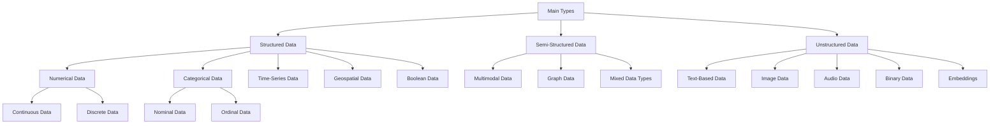

# Stage 3. Data Pipeline (Data Engineering and DataOps)

[TOC]

As we transition from the [**project scoping phase**](./02_project_scoping.md),
where we framed the problem and identified **key metrics and components**, we
step into the world of **data**, the backbone of any **AI** or **machine
learning** solution. **Stage 3**, focusing on **Data Pipeline (Data Engineering
and DataOps)**, delves into the intricate processes of **collecting**,
**integrating**, **transforming**, and **managing data**. Here, we identify the
**data sources**, ensure their **quality**, **preprocess** them for **downstream
tasks such as machine learning**, and set up the **operations** needed for
efficient handling. The **orchestration** of these elements enables the
**seamless flow of data**, laying the foundation for **model training and
validation**. In what follows, we explore each of these aspects, providing a
**roadmap** for transforming **raw data** into a **valuable asset**, aligning
with the **objectives** and **constraints** identified in the previous stages,
and paving the way for the next stage: **model development**.

## Introduction

### Overview of Data Engineering

**Data Engineering** is a vital field that focuses on the practical application
of data collection and data transformation. It encompasses the **rigorous**
processes of gathering, cleaning, and organizing data from various
**[sources](https://en.wikipedia.org/wiki/Data_source)**, preparing it for
analytical or operational uses. Data Engineers are responsible for constructing
**[data architectures](https://en.wikipedia.org/wiki/Data_architecture)**,
**[databases](https://en.wikipedia.org/wiki/Database)**, and
**[processing systems](https://en.wikipedia.org/wiki/Data_processing)**,
enabling the **seamless flow** of information through the organization.

This field serves as the backbone of modern
**[business intelligence](https://en.wikipedia.org/wiki/Business_intelligence)**,
providing the raw material for insights and decision-making. It integrates data
from various domains and ensures that it is accurate, consistent, and available
to data analysts, data scientists, and other stakeholders.

### Importance in Machine Learning

In the context of
**[machine learning](https://en.wikipedia.org/wiki/Machine_learning)**, data
engineering plays a pivotal role. **Machine learning models** require
**high-quality data** that reflects the complexity and variability of the real
world. This necessitates careful
**[data collection](https://en.wikipedia.org/wiki/Data_collection)**,
**[data preprocessing](https://en.wikipedia.org/wiki/Data_pre-processing)**,
**[feature engineering](https://en.wikipedia.org/wiki/Feature_engineering)**,
and
**[data transformation](<https://en.wikipedia.org/wiki/Data_transformation_(computing)>)**,
processes all falling under the purview of data engineering.

**Data Engineers** work closely with
**[Data Scientists](https://en.wikipedia.org/wiki/Data_science)** and
**[Machine Learning Engineers](https://en.wikipedia.org/wiki/Machine_learning_engineering)**
to ensure that the data used for model training and validation is relevant,
clean, and properly formatted. They establish
**[data pipelines](https://en.wikipedia.org/wiki/Data_pipeline)** that automate
the flow of data from source to destination, allowing for continuous integration
and real-time processing. Without the foundational work of data engineering, the
development and deployment of machine learning models would be hindered,
impacting the overall efficiency, accuracy, and effectiveness of the system.

In summary, data engineering acts as the bridge between raw data, whether
structured or unstructured, and the refined data necessary for
**[data analysis](https://en.wikipedia.org/wiki/Data_analysis)**,
**[model training](https://en.wikipedia.org/wiki/Training,_validation,_and_test_sets)**,
and **[model deployment](https://en.wikipedia.org/wiki/Model_deployment)**. It
ensures that data is accessible, usable, and valuable, driving the
**[data-driven decisions](https://en.wikipedia.org/wiki/Data-driven_decision_management)**
that underpin modern businesses and technological innovations. While structured
data often plays a significant role, unstructured data is also vital in contexts
such as natural language processing and LLMs. Data engineering is not just a
supporting function; it's a critical enabler of machine learning, artificial
intelligence, and the broader landscape of
**[data science](https://en.wikipedia.org/wiki/Data_science)**.

## Workflow

### Overview

Data engineering is a critical process in the data lifecycle that plays a
foundational role in transforming raw data into valuable insights. This
iterative process consists of several stages:

1. **[Data Collection](https://en.wikipedia.org/wiki/Data_collection)**:
   Identifying the relevant data sources and collecting the data, which serves
   as the starting point of the data journey.

2. **Data Ingestion/Integration**: This stage consists of two major parts:

    - **[Data Extraction](https://en.wikipedia.org/wiki/Data_extraction)**:
      Extracting the collected data from various sources.
    - **[Data Loading](https://en.wikipedia.org/wiki/Data_loading)**: Loading
      the extracted data into a centralized storage such as a data warehouse,
      data lake, or lakehouse.

3. **[Data Transformation](https://en.wikipedia.org/wiki/Data_transformation)**:
   Transforming the data into a format suitable for downstream tasks. This stage
   may include cleaning, aggregating, or restructuring the data.

4. **Data Validation**: A crucial step to ensure the accuracy and quality of the
   data. Validation techniques can be applied in parallel with the data
   transformation stage or immediately after loading the raw data. By performing
   this step, one guarantees that the data adheres to the defined standards and
   is suitable for further processing and analysis. The validation process can
   involve checks for completeness, consistency, and accuracy, thus ensuring
   that the data is both valid and usable.

5. **CI/CD Integration**: Implementing
   [Continuous Integration/Continuous Deployment (CI/CD)](https://en.wikipedia.org/wiki/CI/CD)
   to automate and streamline the data workflow for the aforementioned stages.

These stages can be organized into a
**[data pipeline](<https://en.wikipedia.org/wiki/Pipeline_(computing)>)**. A
data pipeline is a set of data processing elements connected in series, where
the output of one element becomes the input of the next. Elements may be
executed in parallel or series, and the pipeline ensures that data transitions
smoothly through the stages, maintaining consistency, efficiency, and
scalability.

In conclusion, the data engineering workflow is a multifaceted process essential
for handling and preparing data for analysis and machine learning. By including
processes such as extraction, loading, validation, and integration with CI/CD,
this workflow transforms raw data into actionable insights, forming the backbone
of intelligent decision-making in today's data-driven world.

### Architecture

Here's a high-level overview of the data engineering workflow, in the form of a
diagram:

<figure markdown style="text-align:center;">
  { width="500" }
  <figcaption>The iterative process of ML systems. Image Credit: <a href="https://www.linkedin.com/in/mr-deepak-bhardwaj">Deepak Bhardwaj</a>.</figcaption>
</figure>

## Sample Workflow (TODO: Add a diagram corresponding to this)

We will give a grossly simplified example of a data engineering workflow. This
by no means represent the actual (and often much more complex) workflow in the
industry, however, it should give you a good idea of the general process.

### Staging/Experiment/Development

**Legends**:

-   Staging: The staging environment is where the code is deployed for testing
    purposes. It is a replica of the production environment where the code is
    tested before it is deployed to production.
-   Production: The production environment is where the code is deployed for
    production use. It is the environment where the code is used by the end
    users.

#### Step 1. **Data Extraction**

-   Source data is identified and extracted from various internal and external
    databases and APIs.
-   Data is extracted using either full or incremental refreshes, depending on
    the source system.
-   The data can be extracted via pure code level such as using Python, or using
    modern tech stacks such as Airbyte, FiveTran or orchestration tools such as
    Airflow.

A sample python DAG for this step is as follows:

```python
class Extract:
    def __init__(
        self, cfg: Config, logger: Logger, connection: Connection, metadata: Metadata
    ) -> None:
        self.cfg = cfg
        self.logger = logger
        self.connection = connection
        self.metadata = metadata

    def extract_from_connection(self) -> None:
        """Extract data from data warehouse."""
        self.logger.info(f"Extracting data from {self.connection.name}...")

    def run(self) -> None:
        """Run the extract process."""
        self.extract_from_connection()
```

where

-   `cfg`, `logger` and `metadata` are the configuration, logger and metadata
    objects respectively.
-   `connection` is the connection object that represents the data source. It
    can be API, database, etc.

#### Step 2. **Data Loading to Staging Lake**

Let's assume that we want to extract our data from a remote API and load it to a
staging layer in Google Cloud Storage (GCS), where the GCS serves as the staging
data lake.

Let's have a look a templated DAG for this step.

First, we define a base class for the load process.

```python
class Load(ABC):
    def __init__(
        self,
        cfg: Config,
        logger: Logger,
        metadata: Metadata,
        dvc: Optional[DVC] = None,
        validator: Optional[Validator] = None,
    ) -> None:
        self.cfg = cfg
        self.logger = logger
        self.metadata = metadata
        self.dvc = dvc
        self.validator = validator

    @abstractmethod
    def load_to_staging(self) -> None:
        """Load data to staging."""

    @abstractmethod
    def load_to_production(self) -> None:
        """Load data to production."""

    def run(self, is_staging: bool = True) -> None:
        """Run the load stage."""
        self.logger.info("Running load stage")
        self.load_to_staging() if is_staging else self.load_to_production()
        self.logger.info("Load stage complete")
```

Then, we define a class that inherits from the base class.

```python
class LoadToLake(Load):
    def load_to_staging(self) -> None:
        """Load data to staging."""
        self.logger.info(f"Loading data to staging {self.cfg.staging_lake}")

    def load_to_production(self) -> None:
        """Load data to production."""
        self.logger.info(f"Loading data to production {self.cfg.production_lake}")
```

-   Extracted data from step 1 is loaded into a dedicated **staging** area
    within [Google Cloud Storage (GCS)](https://cloud.google.com/storage). This
    process serves as the initial raw data checkpoint, providing an
    **immutable** storage layer for unprocessed data. This approach to storing
    raw data helps maintain data integrity throughout the pipeline.
-   The data is stored in a structured format, for instance, in the form of:

    ```text
    staging/raw_{table_name}/created_at={YYYY-MM-DD:HH:MM:SS:MS}`
    ```

    where

    -   `staging` is the staging layer in GCS.
    -   `raw_table_name` is the name of the table that you intend to store
        later. Simply put, it is the name of the dataset.

    This structure allows for easy tracking of the data's origin and timestamp,
    adhering to the common
    **[partitioning scheme](https://cloud.google.com/bigquery/docs/partitioned-tables)**
    used in data storage.

-   Even though the data is stored such that we can easily reference the data's
    origin and timestamp, there is a need to maintain a detailed record of the
    data's **lineage**. This is where the **metadata** comes in. The metadata
    contains information such as the data's origin, timestamp, and other
    essential details such as the data's schema.

    Furthermore, modern data versioning tools such as
    [DVC (Data Version Control)](https://dvc.org) can be used to maintain a
    detailed record of the data's lineage, ensuring that changes to the data can
    be tracked and managed in a reproducible manner.

What is the rationale in storing the data in GCS?

-   **Raw Data Checkpoint**: GCS serves as a storage layer for raw, unprocessed
    data. This creates a checkpoint where the data is unaltered and can be
    reverted to if needed.

-   **Flexibility**: Storing data in GCS provides flexibility in data formats
    and allows for decoupling of storage and compute. It can serve various
    downstream applications that might require raw data.

-   **Cost-Effective**: GCS typically provides a more cost-effective solution
    for storing large volumes of data, especially when long-term storage is
    needed.

-   **Immutable Storage Layer**: By providing an immutable storage layer, GCS
    ensures that the original raw data remains unaltered, maintaining data
    integrity.

-   **Interoperability**: GCS can serve multiple environments and tools, not
    just BigQuery, so it's a general-purpose storage solution.

#### Step 3. **Loading Data to Staging Warehouse**

Now, once we have the data in the staging GCS, we can load it to staging
BigQuery. This is done using the following DAG.

```python
class LoadToWarehouse(Load):
    def load_to_staging(self) -> None:
        """Load data to staging."""
        self.logger.info(f"Loading data to staging {self.cfg.staging_warehouse}")

    def load_to_production(self) -> None:
        """Load data to production."""
        self.logger.info(f"Loading data to production {self.cfg.production_warehouse}")
```

-   The data in the staging GCS is loaded into Google BigQuery for more advanced
    processing and analysis.
-   Data can be loaded using both write and append modes, allowing for
    incremental refreshes.
-   Metadata such as `created_at` and `updated_at` timestamps are added to
    maintain a detailed record of the data's lineage.
-   As BigQuery's primary key system may have limitations, one needs to be
    careful to ensure that there are no **duplicate** records in the data.
-   The path name of the data in GCS is used as the table name in BigQuery. For
    instance, if the data is stored in the following path:

    ```text
    staging/raw_{table_name}/created_at={YYYY-MM-DD:HH:MM:SS:MS}`
    ```

    then the table name in BigQuery will be `staging/raw_{table_name}`.

What is the rationale in storing the data in BigQuery, the staging analytics
layer?

-   **Advanced Processing & Analysis**: BigQuery is designed for performing
    complex queries and analytics. Loading data into BigQuery allows you to
    leverage its full analytical capabilities.

-   **Optimized Query Performance**: BigQuery provides optimized query
    performance, making it suitable for interactive and ad-hoc queries,
    dashboards, and reports.

-   **Integration with Other GCP Services**: BigQuery integrates well with other
    Google Cloud Platform services, allowing for more complex workflows and
    automation.

-   **Access Control & Security**: BigQuery offers granular access controls and
    strong security measures, suitable for sensitive or regulated data.

-   **Real-time Analysis**: If required, BigQuery can support real-time
    analytics and streaming data, adding another layer of capability that might
    not be as efficient in GCS.

#### Step 4. **Data Validation After Extraction and Load**

-   Once the data is extracted and loaded into the staging area in GCS or
    BigQuery, a preliminary data validation process is conducted.
-   This may include checking for the presence and correctness of key fields,
    ensuring the right data types, checking data ranges, verifying data
    integrity, and so on.
-   If the data fails the validation, appropriate error handling procedures
    should be implemented. This may include logging the error, sending an alert,
    or even stopping the pipeline based on the severity of the issue.

Recall earlier in our `Load` base class, there is a `validator` in the
constructor? This is where we can specify the validator to use for the data
validation process.

We can define a validation interface (an abstract class in Python) that will
enforce the structure of all validators.

```python
class Validator(ABC):
    @abstractmethod
    def validate(self, data: Any) -> bool:
        """Validates the data. Returns True if valid, False otherwise."""
```

Then we implement our own validator by inheriting from the `Validator`
interface.

```python
class MySpecificValidator(Validator):
    def validate(self, data: Any) -> bool:
        # Add logic here to check data's correctness, data types, etc.
        return is_valid
```

Within the `Load` class, you can call the `validate` method of the provided
`validator` instance at the appropriate stage of loading. Here's an example that
adds a validation step after loading to staging:

```python
class Load(ABC):
    # ... Constructor remains the same ...

    def load_to_staging(self) -> None:
        """Load data to staging."""
        # Loading logic here...
        self.logger.info(f"Loading data to staging {self.cfg.staging_dir}")

        # Validate the data
        if self.validator:
            is_valid = self.validator.validate(data) # assuming data is what you want to validate
            if not is_valid:
                self.logger.error("Validation failed for staging data")
                # Additional error handling logic...
                return

        self.logger.info("Load stage to staging complete")

    # ... Other methods remain the same ...
```

It's common in the industry to see a hybrid approach where basic validation is
performed at the staging lake layer (GCS), followed by more intricate validation
once the data is loaded into staging warehouse layer (BigQuery). This approach
takes advantage of both layers, ensuring early detection and robust validation
without over-complicating the process. It also aligns well with the principle of
incrementally increasing complexity in data validation as data moves through the
pipeline.

#### Step 5. **Data Transformation**

-   In this step, the raw data from the staging area undergoes a series of
    transformation processes to be refined into a format suitable for downstream
    use cases, including analysis and machine learning model training. These
    transformations might involve operations such as:

    -   **Data Cleaning**: Identifying and correcting (or removing) errors and
        inconsistencies in the data. This might include handling missing values,
        eliminating duplicates, and dealing with outliers.

    -   **Joining Data**: Combining related data from different sources or
        tables to create a cohesive, unified dataset.

    -   **Aggregating Data**: Grouping data by certain variables and calculating
        aggregate measures (such as sums, averages, maximum or minimum values)
        over each group.

    -   **Structuring Data**: Formatting and organizing the data in a way that's
        appropriate for the intended use cases. This might involve creating
        certain derived variables, transforming data types, or reshaping the
        data structure.

-   It's important to note that the transformed data at this stage is intended
    to be a high-quality, flexible data resource that can be leveraged across a
    range of downstream use cases - not just for machine learning model training
    and inference. For example, it might also be used for business reporting,
    exploratory data analysis, or statistical studies.

-   By maintaining a general-purpose transformed data layer, the pipeline
    ensures that a broad array of users and applications can benefit from the
    data cleaning and transformation efforts, enhancing overall data usability
    and efficiency within the organization.

```python
class Transformation:
    def __init__(
        self,
        cfg: Config,
        logger: Logger,
        metadata: Metadata,
        validator: Validator,
    ) -> None:
        self.cfg = cfg
        self.logger = logger
        self.metadata = metadata
        self.validator = validator

    def clean_data(self, data: Any) -> Any:
        """Identify and correct errors and inconsistencies in the data."""
        # Logic for handling missing values, duplicates, outliers, etc.
        # Modify data as needed
        return data

    def join_data(self, data1: Any, data2: Any) -> Any:
        """Combine related data from different sources or tables."""
        # Logic to join data1 and data2
        # Modify joined_data as needed
        return joined_data

    def aggregate_data(
        self, data: Any, grouping_variables: list, aggregation_functions: dict
    ) -> Any:
        """Group data and calculate aggregate measures."""
        # Logic for grouping data by grouping_variables and applying aggregation_functions
        # Modify aggregated_data as needed
        return aggregated_data

    def structure_data(self, data: Any) -> Any:
        """Format and organize the data for intended use cases."""
        # Logic for creating derived variables, transforming data types, reshaping structure, etc.
        # Modify structured_data as needed
        return structured_data

    def transform(self, data: Any) -> Any:
        """Execute the entire transformation process."""
        self.logger.info("Starting data transformation")

        data = self.clean_data(data)
        # If more than one data source needs to be joined
        # data = self.join_data(data1, data2)
        data = self.aggregate_data(data, grouping_variables, aggregation_functions)
        data = self.structure_data(data)

        self.logger.info("Data transformation complete")

        if self.validator:
            is_valid = self.validator.validate(data)
            if not is_valid:
                self.logger.error("Validation failed for transformed data")
                # Additional error handling logic...
                return

        return data
```

#### Step 6. **Data Validation After Transformation**

In step 5, we have another `validator` instance that validates the transformed
data. The `validator` instance is passed to the `Transformation` class in the
constructor.

```python
if self.validator:
    is_valid = self.validator.validate(data)
    if not is_valid:
        self.logger.error("Validation failed for transformed data")
        # Additional error handling logic...
        return
```

-   After the data transformation process, another round of validation is
    carried out on the transformed data.
-   This may involve checking the output of the transformation against expected
    results, ensuring the data structure conforms to the target schema, and
    performing statistical checks (e.g., distributions, correlations, etc.).
-   If the transformed data fails the validation, appropriate steps are taken
    just like after extraction.

By now, we should already be able to tell that the data validation process is an
integral part of the data pipeline. It's not just a one-time check at the
beginning of the pipeline, but rather a continuous process that occurs at
multiple stages throughout the pipeline.

#### Step 7. **Load Transformed Data to Staging GCS and BigQuery**

-   After the data transformation and validation, the resulting data is loaded
    back into the staging environment. This involves both Google Cloud Storage
    (GCS) and BigQuery.

    -   **Staging GCS**: The transformed data is saved back into a specific
        location in the staging GCS. This provides a backup of the transformed
        data and serves as an intermediate checkpoint before moving the data to
        the production layer.

    -   **Staging BigQuery**: The transformed data is also loaded into a
        specific table in the staging area in BigQuery. Loading the transformed
        data into BigQuery allows for quick and easy analysis and validation of
        the transformed data, thanks to BigQuery's capabilities for handling
        large-scale data and performing fast SQL-like queries.

-   This step of loading the transformed data back into the staging GCS and
    BigQuery is very similar to the earlier loading step. The `Load` class can
    be reused for this step as well.

#### Step 8. (Optional) Writing a DAG to Automate the Pipeline

-   The whole step from 1 to 7 can be wrapped in a DAG.
-   This means you can use things like Airflow to orchestrate the whole process.

We can automate the code without a DAG as well, so why DAG? Here's some reasons.

1. **Scheduling and Automation**: Airflow provides built-in scheduling options.
   You can define complex schedules in a standard way, allowing tasks to be run
   at regular intervals, on specific dates, or in response to specific triggers.
   Managing scheduling in a custom Python script can be more labor-intensive and
   error-prone.

2. **Parallel Execution and Resource Management**: Airflow allows for parallel
   execution of tasks that don't depend on each other. It can efficiently manage
   resources and distribute tasks across different workers, something that can
   be complex and time-consuming to implement in a custom Python pipeline.

3. **Monitoring and Logging**: Airflow provides a user-friendly web interface
   that includes detailed logs, visualizations of DAG runs, task status
   information, and more. Building such comprehensive monitoring and logging
   capabilities into a custom Python pipeline would require significant
   development effort.

4. **Error Handling and Retries**: Airflow offers standard mechanisms for
   handling task failures, including retries with backoff, notifications, etc.
   Implementing similar robust error handling in a custom Python pipeline might
   require substantial work.

5. **Maintainability and Collaboration**: A DAG-based approach promotes
   modularity and reusability. Tasks are often written as independent units,
   making the codebase easier to understand, maintain, and collaborate on.
   Custom Python pipelines might become monolithic and harder to maintain over
   time.

6. **Dynamic Workflow Creation**: Airflow allows for dynamically creating
   workflows using conditional operators. Implementing similar dynamic behavior
   in a custom Python pipeline could be more complex.

7. **Integration with Various Tools**: Airflow has a rich ecosystem of operators
   that facilitate integration with various data sources, platforms, and tools.
   Implementing such integrations manually in a custom Python script can be
   time-consuming and less flexible.

8. **Scalability**: Airflow is designed to run on distributed systems, making it
   easier to scale up as data and processing requirements grow. Building
   scalability into a custom Python pipeline might require extensive
   architectural changes.

In summary, while building a custom Python pipeline provides full control and
customization, it also means reinventing many wheels that workflow orchestration
tools like Airflow have already addressed. Adopting a DAG-based approach
leverages existing solutions for scheduling, monitoring, error handling,
scalability, and more, which can lead to a more robust, maintainable, and
efficient pipeline.

#### Step 9. **Containerize the DAG**

Once your DAG or python code is ready, we can containerize it and deploy it.

A templated Dockerfile can look like this:

```dockerfile
ARG PYTHON_VERSION=3.9
ARG CONTEXT_DIR=.
ARG HOME_DIR=/pipeline-dataops
ARG VENV_DIR=/opt
ARG VENV_NAME=venv

# Base image
FROM python:${PYTHON_VERSION}-slim-buster as builder

ARG CONTEXT_DIR
ARG HOME_DIR
ARG VENV_DIR
ARG VENV_NAME

# Set work directory to /pipeline-dataops
WORKDIR ${HOME_DIR}

# Install system dependencies
RUN apt-get update && \
    apt-get install -y --no-install-recommends \
    build-essential \
    python3-dev && \
    rm -rf /var/lib/apt/lists/*

RUN python -m venv ${VENV_DIR}/${VENV_NAME}
ENV PATH="${VENV_DIR}/${VENV_NAME}/bin:$PATH"

# Copy only requirements, to cache them in docker layer
ARG REQUIREMENTS=requirements.txt
ARG REQUIREMENTS_DEV=requirements_dev.txt
COPY ./${CONTEXT_DIR}/${REQUIREMENTS} .
COPY ./${CONTEXT_DIR}/${REQUIREMENTS_DEV} .

RUN python3 -m pip install --upgrade pip && \
    python3 -m pip install --no-cache-dir -r ${REQUIREMENTS} && \
    python3 -m pip install --no-cache-dir -r ${REQUIREMENTS_DEV} && \
    pip install -U gaohn-common-utils && \
    pip install pydantic==2.0b3

# This is the real runner for my app
FROM python:${PYTHON_VERSION}-slim-buster as runner

ARG CONTEXT_DIR
ARG HOME_DIR
ARG VENV_DIR
ARG VENV_NAME

# Copy from builder image
COPY --from=builder ${VENV_DIR}/${VENV_NAME} ${VENV_DIR}/${VENV_NAME}
COPY --from=builder ${HOME_DIR} ${HOME_DIR}

# Set work dir again to the pipeline_training subdirectory
# Set the working directory inside the Docker container
WORKDIR ${HOME_DIR}

# Install jq
RUN apt-get update && \
    apt-get install -y --no-install-recommends jq && \
    rm -rf /var/lib/apt/lists/*

ENV PATH="${VENV_DIR}/${VENV_NAME}/bin:$PATH"

# set git commit env
ARG GIT_COMMIT_HASH
ENV GIT_COMMIT_HASH=${GIT_COMMIT_HASH}

# Copy the rest of the application's code
COPY ${CONTEXT_DIR}/conf ${HOME_DIR}/conf
COPY ${CONTEXT_DIR}/metadata ${HOME_DIR}/metadata
COPY ${CONTEXT_DIR}/schema ${HOME_DIR}/schema
COPY ${CONTEXT_DIR}/pipeline_dataops ${HOME_DIR}/pipeline_dataops
COPY ${CONTEXT_DIR}/pipeline.py ${HOME_DIR}/pipeline.py
COPY ${CONTEXT_DIR}/scripts/docker/entrypoint.sh ${HOME_DIR}/scripts/docker/entrypoint.sh

RUN chmod -R +x ${HOME_DIR}/scripts/docker

CMD ["scripts/docker/entrypoint.sh"]
```

#### Step 10. **Deploy the DAG** (Staging Environment)

After containerizing the DAG, we can deploy it. For instance, we can deploy it
to a Kubernetes cluster on a `CronJob` resource.

We will not go into the details of how to deploy a DAG to a Kubernetes cluster
here.

#### Step 11. **Trigger the DAG as part of a CI/CD pipeline**

Suppose our data pipeline, hosted within a repository, needs modifications to
its transformation logic. These alterations are initiated by the development
team. Here's a thorough breakdown of the subsequent steps and their rationale:

1. **Version Control**: All code related to data extraction, transformation, and
   loading (ETL), as well as any related testing code and configuration files,
   is stored in a version control system like DVC and Git. Any changes to the
   code are tracked in this system.

    - **Action**: The developer makes and commits the necessary code changes to
      the version control system, such as Git.
    - **Rationale**: Facilitates collaboration, versioning, and tracking
      changes. Ensures that modifications are properly recorded and accessible
      to other team members.

2. **Trigger CI/CD Pipeline for Development**:

    - **Action**: The commit automatically triggers the development Continuous
      Integration/Continuous Deployment (CI/CD) pipeline.
    - **Rationale**: Enables automated building and testing, ensuring that
      changes are immediately evaluated for compatibility and correctness.

3. **Continuous Integration**:

    - **Action**: When changes are pushed to the version control system, this
      triggers the Continuous Integration process. Tools such as GitHub Actions
      can be used to automate this process.
    - **Rationale**: The new code is merged with the main code base and
      automated tests are run to ensure that the changes do not break existing
      functionality.

4. **Continuous Integration: Unit and Integration Tests**:

    - **Action**: The code changes are subjected to unit tests (testing
      individual components) and integration tests (testing interactions between
      components).
    - **Rationale**: Ensures that the code performs as expected at both the
      component and system levels, minimizing the risk of introducing new bugs.

5. **Continuous Integration: Build Image of the DAG**:

    - **Action**: Once the code level changes passed the unit and integration
      tests. An image of the updated DAG, containing all necessary dependencies
      and configurations, is built.
    - **Rationale**: The image will simplifies deployment and scaling by
      encapsulating the entire application into a single deployable unit. But at
      this stage, we want to test run the image to ensure that it works as
      expected.

6. **Continuous Integration: System Tests**:

    - **Action**: The whole Directed Acyclic Graph (DAG), packaged into an
      image, is tested to ensure that the entire pipeline, with the updated
      transformation logic, provides the correct output.
    - **Rationale**: Validates that the entire system functions correctly,
      confirming that changes did not inadvertently disrupt other parts of the
      pipeline.

7. **Continuous Deployment: Push Image to (Staging) Artifacts Registry**:

    - **Action**: The built image is pushed to a designated artifacts registry,
      such as Docker Hub or a private registry.
    - **Rationale**: Stores the deployable image in a centralized location,
      making it easily accessible for subsequent deployment stages. Allows for
      version control and rollback capabilities of deployed images.

8. **Continuous Deployment: Deploy Image to Staging Environment**:

    - **Action**: The image is deployed to the staging environment, where it is
      tested to ensure that it functions as expected.
    - **Rationale**: Validates that the image is deployable and performs as
      expected in a production-like environment.

9. **Continuous Deployment: Performance Tests**:

    - **Action**: In this stage, the data pipelines are tested under simulated
      production load.
    - **Rationale**: The purpose of this testing is to identify any performance
      bottlenecks or issues that could affect the data pipeline's performance in
      production.

10. **Trigger Message to Pub/Sub**

    - Once the previous steps passed, and the DAG potentially built and
      pushed/deployed to the staging area, a message is sent to Pub/Sub. This
      message triggers the next step in the pipeline, which is moving the data
      to the production layer.
    - Next in the pipeline, once the transformed and validated data in the
      staging layer has been confirmed to be accurate and ready for use, it
      would then be moved to the production layer.

### Production Layer

#### 1. **Triggering the Production Deployment Pipeline**

-   **Action**:
    -   A success message from the development pipeline is sent to Pub/Sub,
        triggering the CI/CD pipeline.
    -   The production deployment pipeline is initiated.
    -   A manual approval process typically confirms the deployment to
        production.
-   **Rationale**:
    -   Enables automatic transition from development to production stages.
    -   Ensures human oversight and control over what gets deployed.

#### 2. **CI/CD: Deploy Image to Production Environment**

Basically, the same steps as in the staging environment, but this time the image
is deployed to the production environment.

We can however have some additional steps such as monitoring and feedback loops.

#### Monitoring and Alerting

This step will not be covered in details, as we will have a dedicated section at
stage 11/12/13 later.

Once deployed, the data pipelines are continuously monitored to ensure they are
functioning correctly. This can involve tracking metrics such as data quality,
pipeline performance, and resource usage. Any issues that arise can trigger
alerts for immediate response.

**Action**:

-   Implement ongoing monitoring for data quality and data drift.

**Rationale**:

-   Ensures continued adherence to quality standards.
-   Quickly detects and alerts to any changes in the data distribution, which
    could impact model performance or other downstream applications.

#### Feedback Loop

**Feedback loop** refers to insights from monitoring and any errors encountered
in production are fed back into the development process, leading to new
iterations of development, testing, and deployment.

### Summary

Typically, the movement of data from the staging layer to the production layer
happens once the data has been cleaned, transformed, validated, and is deemed
ready for use in downstream applications such as machine learning model
training, analytics, reporting, etc. The transformed data is first validated to
ensure that it meets the required quality standards. If the validation is
successful, the data is moved to the production layer. The goal is to only
expose clean, validated, and reliable data to end users or downstream
applications.

Once the data has passed both rounds of validation, it can be loaded into the
production layer in both GCS and BigQuery. At this point, the data is ready for
downstream use in tasks such as model training and inference.

In the context of ML, these steps form the beginning part of our pipeline, where
data is extracted, cleaned, and made ready for use in our ML models. Each step
is designed to ensure the integrity and usability of the data, from extraction
to querying for model training and inference.

## The Evolution of Data Engineering

With the basic understanding of **Data Engineering** and its essential role in
**Machine Learning**, it's important to recognize the evolution of data handling
practices. Traditional **ETL (Extract, Transform, Load)** methodologies have
long been the backbone of data pipeline design. They set the stage for
collecting, processing, and storing data in a structured manner.

However, the modern era of data-driven applications demands a more agile and
responsive approach. This is where **DataOps**, encompassing principles of
**Continuous Integration/Continuous Deployment (CI/CD)**, comes into play. The
process builds on the ETL framework but enriches it with automation,
collaboration, monitoring, and quality assurance, forming a more holistic and
dynamic system.

In traditional ETL or ELT processes, the main focus is on extracting data from
various sources, transforming it into the required format, and then loading it
into a target system. These processes are typically batch-oriented and can be
run on schedules.

In a CI/CD DataOps pipeline, the focus expands to encompass the entire data
lifecycle and emphasizes automation, continuous integration, and continuous
deployment. This means that the process not only includes the basic ETL or ELT
steps but also involves:

-   **Continuous Integration**: Automating the process of integrating code
    changes from multiple contributors into a shared repository, often followed
    by automated building and testing.
-   **Continuous Deployment**: Automating the process of deploying the
    integrated and tested code to production environments, ensuring that the
    data pipeline remains stable and updated.
-   **Monitoring and Alerting**: Keeping track of the performance and health of
    the data pipeline, triggering alerts if anomalies or issues are detected.
-   **Testing and Quality Assurance**: Embedding rigorous testing within the
    pipeline to ensure data quality, integrity, and compliance with business
    rules.
-   **Collaboration and Version Control**: Encouraging collaboration between
    different roles such as data scientists, engineers, and analysts, and using
    version control to manage changes.

The integration of these additional steps turns the data handling process into a
more agile, responsive, and reliable system. It aligns more closely with modern
development practices and the dynamic nature of data-driven applications. Thus,
a CI/CD DataOps pipeline represents a more holistic approach to data management
and can be viewed as an ETL or ELT process enriched with contemporary practices
to cater to today's complex and fast-paced data environments.

## The ETL/ELT Framework

### ETL (Extract, Transform, Load)

**ETL** is a process in data handling that involves three main stages:

1. **Extract**: Gathering data from various sources.
2. **Transform**: Processing this data to fit the desired format, usually
   outside the target system. This might include cleaning, aggregating,
   filtering, etc.
3. **Load**: Finally, loading the transformed data into the destination data
   warehouse or database.

### ELT (Extract, Load, Transform)

**ELT** is a variant of ETL, but with a different order of operations:

1. **Extract**: Gathering data from various sources.
2. **Load**: Loading the raw data into the destination system.
3. **Transform**: Performing transformations within the target system itself,
   utilizing the processing capabilities of modern data warehouses.

### ELTL (Extract, Load, Transform, Load)

This combination could represent a two-step process:

1. **Extract**: Gathering data from various sources.
2. **Load**: Loading the raw data into a staging area or temporary storage.
3. **Transform**: Performing transformations within this temporary storage.
4. **Load**: Loading the transformed data into the final destination, such as a
   data warehouse or database.

This approach might be beneficial when working with massive datasets, allowing
for an initial raw data consolidation, followed by transformation and final
loading into the target system.

### Intuition on When to Use ETL vs ELT

In certain scenarios, companies opt for the ELT (Extract, Load, Transform)
process, particularly when dealing with complex and unstructured data. During
the **extraction** phase, data is collected from various sources and then
immediately **loaded** or dumped into a **data lake**, which is a storage
repository that holds a vast amount of raw data in its native format.

This approach has the advantage of quickly making the data available, preserving
its raw state for future use. However, this raw, unstructured data can become
unwieldy, particularly when dealing with large volumes.

When it's time to analyze or utilize the data, it must be **extracted** again
from the data lake. This is followed by the **transformation** phase, where the
data is processed and converted into a structured format suitable for analysis.

While the ELT paradigm allows for greater flexibility and the ability to
accommodate diverse data types, it can lead to inefficiencies when searching
through large and unstructured data sets within the data lake. The process of
extracting and transforming data from the data lake can be time-consuming and
resource-intensive, particularly if the data needs to be combed through
extensively.

In essence, the ELT approach with a data lake can be both a boon and a
challenge. It enables faster data ingestion and provides a flexible repository
for raw data, but the subsequent handling and processing of that data might
require significant effort, especially when dealing with large quantities of
unstructured information.

### ETL versus ELT

Here's a table that breaks down the comparison, advantages, and disadvantages of
both ETL and ELT.

| Criteria                | ETL                                                                                      | ELT                                                                                              |
| ----------------------- | ---------------------------------------------------------------------------------------- | ------------------------------------------------------------------------------------------------ |
| **Basic Process**       | Extract, Transform, Load                                                                 | Extract, Load, Transform                                                                         |
| **Data Latency**        | May introduce delays, affecting real-time analysis; near-real-time possible with tooling | Often reduces delays between data collection and availability                                    |
| **Scalability**         | Can be scalable with proper architecture and parallel processing                         | Typically leverages modern data warehouses for scalability                                       |
| **Flexibility**         | Less adaptable to changing requirements; can be mitigated with design                    | More adaptable to changes in data structure or requirements                                      |
| **Pipeline Complexity** | May involve complex transformations, increasing development and maintenance efforts      | Might simplify some aspects of the pipeline, depending on tools and requirements                 |
| **Accessibility**       | May require specialized skills, limiting accessibility                                   | Might allow more team participation, especially with common languages like SQL                   |
| **Advantages**          | Suitable for complex transformations with structured data; control over transformation   | Flexibility, scalability, and potentially reduced latency; useful for unstructured data handling |
| **Disadvantages**       | Potential bottlenecks; complexity; potential rigidity                                    | Might lead to inefficiencies in processing unstructured data; simplicity is context-dependent    |
| **Use Case**            | When precise control over transformations and structured data processing is needed       | When handling diverse or unstructured data, or when flexibility and scalability are priorities   |

### Sample ELTL Pipeline

#### Extract

In the extraction phase, data is pulled from various sources which could be
structured, semi-structured or unstructured, and could be located in databases,
data lakes, data warehouses, or external APIs. The key is to capture the
necessary data without losing or modifying any of the original data during the
process.

#### Data Analysis

Post extraction, data analysis provides insights into the nature and quality of
the data. This stage involves examining the distribution of the data,
identifying potential anomalies or outliers, and assessing the overall data
quality. Techniques such as descriptive statistics and data visualization are
commonly used.

It is important to note that this process is generally applicable and not
specific to machine learning. The outcome of this stage guides the
decision-making process for subsequent data cleaning and transformation tasks,
thereby setting up a solid foundation for downstream tasks such as reporting,
analytics, or model training.

#### Validate Raw

Validation of raw data ensures that the extracted data meets the requirements
and constraints for the subsequent stages. It involves checking for data
completeness, consistency, and accuracy. This stage might include checking if
all expected data has been extracted, if there are any unexpected null or
missing values, and if the data aligns with known constraints (like a field that
should always be positive).

#### Load

The load stage involves transferring the extracted data into a target system for
storage. The target system can be a data warehouse, a data lake, or a specific
database depending on the use case. The focus during this phase is on efficiency
and reliability, ensuring that all data is accurately loaded without disrupting
existing data or processes.

#### Transform

The transformation phase involves changing the raw data into a format that is
suitable for downstream tasks. This may include cleaning operations (like
handling missing values or outliers), integrating data from different sources,
aggregating or summarizing data, and converting data types. Additionally,
feature engineering for machine learning tasks often takes place in this stage.

#### Validate Transformed

After transformation, the data needs to be validated again to ensure it meets
the specific requirements for downstream tasks. This might involve checking the
data against predefined rules or statistical properties (like a specific
distribution), checking for unexpected null or missing values after
transformation, or comparing a sample of the transformed data against the
expected output.

#### Load Transformed

After the transformed data has been validated, it can be loaded into the target
system for storage. This might be a data warehouse, a data lake, or a specific
database depending on the use case.

### Summary

The choice between ETL and ELT depends on various factors like data volume,
real-time requirements, team skills, technology stack, and the nature of the
transformations. ETL might be more suitable for complex transformations with
structured data, while ELT might be preferred for more flexible, scalable
handling of diverse or unstructured data.

It's crucial to acknowledge that both ETL and ELT can be implemented effectively
or poorly, depending on the specific context, tools, and design principles
applied. Neither approach is universally superior, and the decision should be
based on a comprehensive understanding of the project's unique requirements and
constraints.

## Identify and Scope the Data Source

### Intuition (What comes before Data Extraction?)

As we have seen in the pipeline and subsequently, the ELT/ETL framework, the
first step is data extraction. However, before we can extract data, we need to
first identify the data source and scope it. This is a critical step in the
pipeline, as it lays the foundation for the rest of the pipeline. If the data
source is not correctly identified and scoped, it could lead to a lot of wasted
time and effort down the line.

In what follows, we will discuss the steps involved in identifying and scoping
the data source, as well as the tools and methods for extracting data from the
source.

Consequently, the correct identification and meticulous scoping of the data
source form the bedrock of the entire pipeline.

In what follows, we will discuss the steps involved in identifying and scoping
the data source.

### Steps to Identify and Scope the Data Source

#### A. Define the Type of Data

-   **Action**: Determine whether the data is numerical, categorical,
    time-series, text-based, images, or audio.
-   **Rationale**: Facilitates the formulation of the appropriate strategy for
    data collection.

#### B. Locate the Data

-   **Action**: Identify the location, such as databases (SQL or NoSQL), APIs,
    log files, Excel or CSV files, etc.
-   **Rationale**: Enables the selection of the suitable tools and methods for
    extraction.

#### C. Assess Accessibility and Compliance

-   **Action**: Understand permissions, authentication, privacy concerns, and
    restrictions on data extraction.
-   **Rationale**: Ensures adherence to legal and organizational policies.

#### D. Gauge the Data Volume

-   **Action**: Determine the size of the dataset.
-   **Rationale**: Influences the choice of tools for extraction and impacts the
    entire ML model design process.

#### E. Understand Data Characteristics

-   **Action**: Recognize and address special characteristics, including
    potential malformatting, privacy regulations, etc.
-   **Rationale**: Facilitates proper processing, validation, and utilization of
    the data.

### Data Types in Machine Learning Systems

Before we scope the data source, a logical question to first ask is, what
_types_ of data are we dealing with? Knowing the data types will help us
**understand the nature and structure of information that we need to obtain.**
This understanding, in turn, informs our choice of **data sources** that are
best suited to provide this specific type of data.

For example, if we are working with time-series data, our data sources might be
sensors, logs, or financial market feeds. If we are dealing with textual data,
the sources might be documents, websites, or social media platforms. By first
defining the data types, we align our subsequent exploration and selection of
data sources with the inherent characteristics of the data we aim to analyze.
This helps in ensuring compatibility and efficiency in the entire data
acquisition and preparation process, forming a cohesive link between what type
of data we need (data types) and where we can find it (data source).

Here's a brief overview of the different types of data in the form of a
graph/tree diagram:



and the corresponding table:

| Main Type                | Subtype          | Specific Types       | Description                                                                    |
| ------------------------ | ---------------- | -------------------- | ------------------------------------------------------------------------------ |
| **Structured Data**      | Numerical        | Continuous, Discrete | Continuous data can take any value, while Discrete data takes specific values. |
|                          | Categorical      | Nominal, Ordinal     | Nominal data has no inherent order; Ordinal data has a meaningful order.       |
|                          | Time-Series Data |                      | Data collected at specific time intervals.                                     |
|                          | Geospatial Data  |                      | Information that includes geographical attributes.                             |
|                          | Boolean Data     |                      | True/false or yes/no values.                                                   |
| **Semi-Structured Data** | Multimodal       |                      | Combines data from multiple sources or types.                                  |
|                          | Graph Data       |                      | Represents relationships using nodes and edges.                                |
|                          | Mixed Data Types |                      | A combination of various data types.                                           |
| **Unstructured Data**    | Text-Based Data  |                      | Unstructured textual information.                                              |
|                          | Image Data       |                      | Visual information in a grid of pixels.                                        |
|                          | Audio Data       |                      | Sound or speech data.                                                          |
|                          | Binary Data      |                      | Data represented in a binary format.                                           |
|                          | Embeddings       |                      | Representations of categorical, text, or complex data as continuous vectors    |

### Data Sources in Machine Learning Systems

Having identified the _types_ of data that our machine learning system will
handle, we now turn our attention to the various **sources** from which this
data can be obtained. Different data types require specific sources, both in
terms of format compatibility and functional alignment. Here's an overview of
various data sources, categorized by their characteristics and aligned with the
types of data they typically provide:

| **Category**                     | **Type**                    | **Examples/Details**                                                                                                                     |
| -------------------------------- | --------------------------- | ---------------------------------------------------------------------------------------------------------------------------------------- |
| **Databases**                    | Relational Databases (SQL)  | [MySQL](https://www.mysql.com/), [PostgreSQL](https://www.postgresql.org/), [MS SQL Server](https://www.microsoft.com/en-us/sql-server/) |
|                                  | NoSQL Databases             | [MongoDB](https://www.mongodb.com/), [Cassandra](https://cassandra.apache.org/), [Redis](https://redis.io/)                              |
| **File-Based Sources**           | Flat Files                  | CSV, Excel, TSV                                                                                                                          |
|                                  | Binary Files                | Parquet, Avro                                                                                                                            |
|                                  | Image and Video Files       | JPEG, PNG, MP4                                                                                                                           |
|                                  | Text Files                  | TXT, PDF, DOC                                                                                                                            |
| **Web Sources**                  | Web APIs                    | RESTful APIs, SOAP, [GraphQL](https://graphql.org/)                                                                                      |
|                                  | Web Scraping                | HTML, XML                                                                                                                                |
|                                  | Social Media                | Twitter, Facebook, Reddit                                                                                                                |
| **Streaming Data Sources**       | Message Brokers             | [Kafka](https://kafka.apache.org/), [RabbitMQ](https://www.rabbitmq.com/)                                                                |
|                                  | Real-Time Feeds             | Stock prices, sensor data                                                                                                                |
| **Sensor Data**                  | IoT Devices                 | Smart devices, wearable tech                                                                                                             |
|                                  | Industrial Sensors          | Temperature, pressure, humidity sensors                                                                                                  |
| **Scientific Sources**           | Genomic Data                | DNA sequences, proteomics                                                                                                                |
|                                  | Meteorological Data         | Weather stations, satellites                                                                                                             |
| **Financial Data Sources**       | Stock Market Data           | Exchanges, trading platforms                                                                                                             |
|                                  | Banking Transactions        | Credit card swipes, ATM transactions                                                                                                     |
| **Healthcare Data Sources**      | Electronic Health Records   | Patient medical records                                                                                                                  |
|                                  | Medical Imaging             | MRI, CT scans, X-rays                                                                                                                    |
| **Government and Public Data**   | Census Data                 | Demographics, economics                                                                                                                  |
|                                  | Legislation and Regulations | Law documents, policy papers                                                                                                             |
| **Educational Data Sources**     | Academic Databases          | Research papers, thesis documents                                                                                                        |
|                                  | Learning Management Systems | Student grades, course content                                                                                                           |
| **Human-Generated Data Sources** | Surveys and Questionnaires  | Market research, feedback forms                                                                                                          |
|                                  | Crowdsourcing Platforms     | [Amazon Mechanical Turk](https://www.mturk.com/)                                                                                         |
| **Third-Party Data Providers**   | Commercial Data Providers   | Market trends, consumer habits                                                                                                           |
|                                  | Open Data Repositories      | [Kaggle](https://www.kaggle.com/), [UCI Machine Learning Repository](https://archive.ics.uci.edu/ml/index.php)                           |

This categorization of data sources resonates with our prior discussion on data
types. By recognizing the intricate relationships between **databases**,
**file-based sources**, **web sources**, **streaming data sources**, and others,
with the data types we're interested in, we are better positioned to select the
optimal sources for our machine learning system. Whether it's time-series data
from real-time feeds, textual data from web scraping, or image data from
specific file formats, our data source selection now aligns with the strategic
goals and technical requirements of the system.

## Data Formats in Machine Learning Systems

### Intuition

After understanding the various data types within the machine learning system,
we arrive at the crucial aspect of data formats. Data formats play a vital role
in determining how data is stored, processed, and communicated within the
system. They also influence the efficiency of data retrieval and the ease of
interoperability between different parts of the pipeline. Depending on the
nature of the data, the chosen format can have a substantial impact on the
performance and scalability of data-driven applications. In the following
section, we'll delve into various data formats and their relevance to machine
learning systems, highlighting the importance of selecting appropriate formats
in alignment with specific requirements and constraints.

In other words, once you scope the data source and data types, and manage to
extract them, you need to store it in a format that is easy to work with.
Storing data isn't straightforward because data can be of different types.

Some questions to ask when choosing a data format:

-   Where do you store the data? In a database? In a file system? In a key-value
    store? We want it to be ideally cheap and fast to retrieve the data.
-   How to store complex models so they can be loaded and run on different
    devices (e.g. mobile phones, web browsers, etc.). In ML, it can be GPU, CPU,
    etc.

### Example: Sharding in Hugging Face

**Sharding** refers to dividing a large dataset into smaller, more manageable
parts or "shards." Each shard can be processed independently, allowing for
parallelism and more efficient utilization of resources. Sharding is
particularly relevant when working with large-scale models that require
extensive training data.

For instance, if you were to train a model using Hugging Face's Transformers
library on a vast corpus of text data, you might encounter challenges in loading
and processing the entire dataset at once. By employing sharding, you could
break down the corpus into smaller shards, each stored in a specific data format
like TensorFlow's TFRecord or PyTorch's data loader format.

Here's how sharding might be implemented in this scenario:

1. **Divide the Data**: Split the entire corpus into smaller parts, each
   representing a shard. The division could be based on logical segments like
   chapters, documents, or fixed-size chunks.

2. **Choose a Data Format**: Select an appropriate data format for the shards.
   TFRecord is a common choice for TensorFlow, while PyTorch users might prefer
   its native data handling.

3. **Process Shards Independently**: Each shard can be loaded and processed
   independently, allowing for parallel processing. This enables efficient data
   handling, especially when using distributed computing resources.

4. **Assemble Results**: After processing the individual shards, the results can
   be assembled to form the complete dataset or model parameters.

This approach leverages data sharding and specific data formats to provide a
scalable and flexible method for working with extensive datasets in Hugging
Face. It's an illustrative example of how data formats, coupled with effective
data engineering practices, can profoundly impact the efficiency and scalability
of machine learning workflows.

Moral of the story is, you cannot just store data in any format. You need to
think you multiple aspects of the data and the system before choosing a data
format. Most of the times, we want **efficient** and **scalable** data formats.

Certainly! While the initial example provided is a straightforward way to store
multimodal data (images and text), it may lack some rigor and scalability. In a
real-world setting, particularly for large-scale e-commerce platforms, a more
robust approach would be necessary.

### Example: Multimodal Data Storage for E-Commerce

In e-commerce platforms, product pages often contain rich multimedia
information, including images and corresponding textual descriptions. Storing
and retrieving this information efficiently requires careful design.

One robust approach might involve:

1. **Storing Images in a Binary Format**: Rather than embedding the raw image
   tensor within a data structure, it's often more efficient to store the image
   in a binary format (e.g., JPEG, PNG) and keep a reference to its location
   (e.g., file path or URL).

2. **Utilizing a Database for Textual Information**: The textual information,
   including descriptions and metadata, can be stored in a relational database.
   This approach provides scalable storage and efficient query capabilities.

3. **Creating a Unified Schema**: A unified schema or data model could
   encapsulate both the image references and the corresponding textual data.
   This schema acts as a bridge between the two data types, allowing them to be
   treated as a cohesive unit.

Here's an example code snippet that reflects this design:

```python title="Sample Data Schema Encoding Image and Text"
sample_data_schema = {
    "product_id": 123,
    "image_url": "https://path/to/image.jpg",
    "description": "This is a picture of a cat.",
    "additional_metadata": { ... }  # Additional textual or numerical information.
}
```

and in tabular form:

| Field Name            | Data Type       | Description                                                                               |
| --------------------- | --------------- | ----------------------------------------------------------------------------------------- |
| `product_id`          | Integer         | A unique identifier for the product.                                                      |
| `image_url`           | String (URL)    | The URL or file path to the product's image.                                              |
| `description`         | String (Text)   | The textual description of the product.                                                   |
| `additional_metadata` | Dictionary/JSON | Additional textual or numerical information, such as categories, tags, or specifications. |

In this approach, the `"image_url"` field stores a reference to the location of
the image, and the `"description"` field contains the textual description. The
additional metadata can encapsulate other relevant information, such as
categories, tags, or product specifications.

This design offers several advantages:

-   **Scalability**: By storing images in a binary format and using database
    storage for text, this approach can scale to handle large product catalogs.
-   **Efficiency**: Leveraging specialized storage mechanisms for different data
    types ensures that retrieval and updates are efficient.
-   **Flexibility**: A unified schema provides a consistent way to represent and
    manipulate text-image pairs, while still allowing for customization and
    extension as needed.

Overall, this example demonstrates a more rigorous and practical approach to
storing and managing multimodal data in a context such as an e-commerce
platform. It illustrates the interplay between data formats, storage mechanisms,
and data modeling in handling complex, multifaceted information.

### Data Formats

We will describe a few choices of data formats below.

#### Data Serialization vs Data Deserialization

The process of transforming data structures or object states into a format that
can be saved (e.g., in a file like JSON) and later rebuilt in the same or a
different computing environment is known as serialization. The opposite process,
called deserialization, involves retrieving data from the stored formats. In
simpler terms, serialization refers to storing data, while deserialization
refers to accessing data from the saved formats.

In other words, **storing data** is called **serialization**, and **retrieving
data from the stored formats** is called **deserialization**.

#### JSON

[**JSON**](https://www.json.org/json-en.html), which stands for JavaScript
Object Notation, is a lightweight data-interchange format that uses a key-value
pair paradigm. It is human-readable, easy to parse, and simple to generate,
making it an ideal choice for data exchange between a server and a client in
machine learning applications. JSON's structure allows for easy storage in
databases and can represent a wide variety of data types, including strings,
numbers, booleans, objects, and arrays.

```json title="example.json"
{
	"name": "John",
	"age": 30,
	"cars": [
		{ "name": "Ford", "models": ["Fiesta", "Focus", "Mustang"] },
		{ "name": "BMW", "models": ["320", "X3", "X5"] },
		{ "name": "Fiat", "models": ["500", "Panda"] }
	]
}
```

While JSON has many advantages, it does have some drawbacks, such as increased
storage requirements due to its text-based nature. However, its simplicity and
ease of use have made it one of the most popular data formats in machine
learning and other applications.

In addition to the key-value pair structure, JSON also supports nesting of
objects and arrays, which allows for more complex data representation. This
makes JSON a versatile choice for a variety of use cases, from simple
configuration files to complex machine learning model inputs and outputs.

Furthermore, JSON has extensive support in many programming languages, with
built-in libraries or third-party packages available for parsing and generating
JSON data. This widespread support makes it a convenient choice for developers
working with machine learning systems and data pipelines.

In summary, JSON's human-readable format, easy parsing, support for complex data
structures, and widespread language support make it an excellent choice for data
exchange and storage in machine learning applications, despite its increased
storage requirements compared to binary formats.

#### Row and Columnar Formats

##### Concept of Row-major vs Column-major order

Row-major and column-major order describe two ways to store multi-dimensional
arrays in linear memory. In row-major order, the elements of a multi-dimensional
array are stored row by row, whereas in column-major order, the elements are
stored column by column.

##### Examples of Row-major vs Column-major order

In row-major order, the elements of each row of a matrix are stored together in
contiguous memory locations, with the elements of successive rows appearing
consecutively in memory. For example, consider a 3x2 matrix:

$$
\boldsymbol{A} = \begin{bmatrix}
    1 & 2 \\
    3 & 4 \\
    5 & 6
\end{bmatrix}
$$

In row-major order, the elements are stored in memory as:

```python
[1, 2, 3, 4, 5, 6]
```

In contrast, in column-major order, the elements of each column are stored
together in contiguous memory locations, with the elements of successive columns
appearing consecutively in memory. For the same matrix, the column-major order
would be:

```python
[1, 3, 5, 2, 4, 6]
```

Row-major and column-major order can make a difference in performance when
accessing multi-dimensional arrays, especially for large arrays. For example,
when accessing elements of a row in row-major order, consecutive elements are
likely to be cached together, which can improve access time. Similarly, when
accessing elements of a column in column-major order, consecutive elements are
likely to be cached together, which can improve performance.

#### Pros and cons of Row-major vs Column-major order

##### Row-major order

**Pros:**

-   It is the default order used in many programming languages, including C and
    C++.
-   It can be more intuitive for humans to understand, as rows are typically
    used to represent entities (e.g., students, observations) and columns are
    used to represent attributes (e.g., grades, measurements).
-   When iterating over the elements of a matrix row-by-row, row-major order
    ensures that the elements accessed are contiguous in memory, which can
    improve cache locality and reduce the number of cache misses.
-   Many linear algebra libraries, such as BLAS and LAPACK, use row-major order
    by default.

**Cons:**

-   When iterating over the elements of a matrix column-by-column, row-major
    order can lead to poor cache locality and a higher number of cache misses.
    This is because consecutive elements in the same column are not necessarily
    contiguous in memory.
-   When transposing a matrix, row-major order requires copying the entire
    matrix into a new block of memory in column-major order, which can be costly
    for large matrices.
-   Some hardware architectures may be optimized for column-major order, leading
    to lower performance for row-major order.

##### Column-major order

**Pros:**

-   Column-major order is used by default in some programming languages, such as
    Fortran.
-   When iterating over the elements of a matrix column-by-column, column-major
    order ensures that the elements accessed are contiguous in memory, which can
    improve cache locality and reduce the number of cache misses.
-   Some hardware architectures, such as GPUs, are optimized for column-major
    order, leading to potentially better performance.

**Cons:**

-   Column-major order can be less intuitive for humans to understand, as it is
    not the standard representation used in many fields.
-   When iterating over the elements of a matrix row-by-row, column-major order
    can lead to poor cache locality and a higher number of cache misses. This is
    because consecutive elements in the same row are not necessarily contiguous
    in memory.
-   Many linear algebra libraries, such as BLAS and LAPACK, use row-major order
    by default, so using column-major order may require additional memory copies
    or transpositions.

Overall, the choice between row-major and column-major order depends on the
specific use case and hardware architecture. For performance-critical
applications, it may be worth experimenting with both orders to see which yields
better results.

#### Modern Row and Columnar Formats

| Library | Order for Multidimensional Arrays              |
| ------- | ---------------------------------------------- |
| NumPy   | Row-Major Order                                |
| MATLAB  | Column-Major Order                             |
| OpenGL  | Column-Major Order                             |
| CUDA    | Column-Major Order                             |
| OpenCV  | Row-Major Order                                |
| Eigen   | Supports both Row-Major and Column-Major Order |
| CSV     | Row-Major Order                                |
| Parquet | Column-Major Order                             |

Column-major formats are better for accessing specific columns of large datasets
with many features, while row-major formats are better for faster data writes
when adding new individual examples to data. Row-major formats are better for a
lot of writes, while column-major formats are better for a lot of column-based
reads.

When you have a dataset with many features, storing the data in a column-major
format is more efficient because it allows for direct access to individual
columns without having to scan through all the other data in the rows. This
means that when you need to extract a specific subset of columns from the
dataset, you can do so more efficiently because the system doesn't need to read
through all the other data in the rows to access the desired columns.

In contrast, with a row-major format, the data for each row is stored together
in memory, meaning that to access a specific column, you have to read through
all the other columns in the row before you get to the desired column. This can
be especially inefficient when dealing with large datasets with many features,
as the system has to read through a lot of data to extract the desired subset of
columns.

For example, consider a dataset of ride-sharing transactions with 1,000
features, but you only need to extract four specific columns: time, location,
distance, and price. With a column-major format, you can directly access these
columns, whereas with a row-major format, you have to read through all the other
996 columns in each row before getting to the desired four columns. This can be
slow and inefficient, especially if you need to access the subset of columns
frequently or if the dataset is very large.

In summary, storing data in a column-major format is more efficient for datasets
with many features because it allows for direct access to individual columns,
which can significantly speed up data retrieval and processing.

#### Examples in code (Python) of Row-major vs Column-major order and its effect on performance

```python
import numpy as np
import time

import pandas as pd

from typing import Callable, TypeVar, Any

F = TypeVar("F", bound=Callable[..., Any])


def timer(func: F) -> F:
    """Timer decorator."""

    def wrapper(*args: Any, **kwargs: Any) -> Any:
        start_time = time.time()
        result = func(*args, **kwargs)
        end_time = time.time()
        elapsed_time = end_time - start_time
        print(f"{func.__name__} took {elapsed_time:.4f} seconds to execute.")
        # print(f"{func.__name__} took {elapsed_time / 60:.4f} minutes to execute.")
        # print(f"{func.__name__} took {elapsed_time / 60 / 60:.4f} hours to execute.")
        return result

    return wrapper


@timer
def traverse_dataframe_by_row(df: pd.DataFrame) -> None:
    for col in df.columns:
        for _ in df[col]:
            pass


@timer
def traverse_dataframe_by_column(df: pd.DataFrame) -> None:
    num_rows = df.shape[0]
    for row_idx in range(num_rows):
        for _ in df.iloc[row_idx]:
            pass


df = pd.DataFrame(np.random.rand(5000, 5000))
print(df.shape)

traverse_dataframe_by_row(df)
traverse_dataframe_by_column(df)


# Row-major traversal (C-like order)
df_np = df.to_numpy()
df_np = np.array(df_np, order="C")  # Row-major traversal (C-like order)
n_rows, n_cols = df_np.shape


@timer
def traverse_numpy_by_row(array: np.ndarray) -> None:
    for row_idx in range(n_rows):
        for col_idx in range(n_cols):
            _ = array[row_idx, col_idx]


@timer
def traverse_numpy_by_column(array: np.ndarray) -> None:
    for col_idx in range(n_cols):
        for row_idx in range(n_rows):
            _ = array[row_idx, col_idx]


traverse_numpy_by_row(df_np)
traverse_numpy_by_column(df_np)

df_np_col = np.array(df_np, order="F")  # Column-major traversal (Fortran-like order)

traverse_numpy_by_row(df_np_col)
traverse_numpy_by_column(df_np_col)
```

### Text vs Binary Formats

CSV and JSON are text files, while Parquet files are binary files. Text files
are human-readable, while binary files are only readable by programs that can
interpret the raw bytes. Binary files contain only 0s and 1s and are more
compact than text files. Binary files can save space compared to text files; for
example, storing the number 1000000 requires 7 bytes in a text file and only 4
bytes in a binary file as int32. Parquet files are more efficient than text
files in terms of storage and processing speed. For example, AWS recommends
using the Parquet format because it consumes up to 6x less storage and is up to
2x faster to unload in Amazon S3 compared to text formats.

!!! example "Text vs Binary" For example, if you want to store the number
$1000000$, and if you store it in text file it takes 7 characters (1, 0, 0, 0,
0, 0, 0), taking up 7 bytes of storage if 1 character is 1 byte. But if you
store it in binary format as `int32`, then it takes 32 bits, which is 4 bytes.

## Data Storage in Machine Learning Systems

Once the data source is scoped and well-defined, before we even start extracting
the data, we need to know what kind of data we are dealing with and **how** and
**where** we are going to store the extracted data.

Determining the **storage format** is critical. Will the data be stored in its
raw form, or does it need to be processed and converted into a different format
like CSV, JSON, or Parquet? The chosen data format can have significant
implications on storage costs, access speed, and compatibility with your data
processing tools.

The **storage location** is equally important. Depending on the volume of the
data, your budget, and security requirements, you might opt for on-premises
servers, cloud storage, or even a hybrid solution. Cloud storage, like Google
Cloud Storage, Amazon S3, or Azure Blob Storage, offer scalable and secure
solutions. However, you need to consider data privacy regulations and compliance
requirements when deciding where to store the data.

You should also consider how the data will be organized. Will it be stored in a
structured database like MySQL, a NoSQL database like MongoDB, or a distributed
file system like Hadoop HDFS? The data's nature, the need for scalability, and
the types of queries you'll be running, all factor into this decision.

Finally, the choice of **storage technology** also depends on the **data
operations** you anticipate. For instance, if your data needs frequent updates,
a database might be more suitable. If your data is largely static but needs to
be read frequently, a file system might be a better choice.

Your data storage decisions can greatly impact the efficiency of your data
operations and the overall success of your machine learning project. Hence,
careful planning and consideration are required in this stage.

### Data Storage Options

... list table of different data storage options for different use cases.

As we see shortly in the next few sections, once the data source is defined,
before we even start extracting the data, we need to know what kind of data we
are dealing with and **how** and **where** we are going to store it.

### Data Lake

### Data Warehouse

### Data Lakehouse

### Delta Lake

### SQL vs NoSQL

### Vector Database (A High-dimensional Playground for Large Language Models)

[see here](https://learn.microsoft.com/en-us/semantic-kernel/memories/vector-db)

A **vector database** is an ingenious data storage system that capitalizes on
the properties of vectors — mathematical objects that possess magnitude and
direction. The high-dimensional vectors stored in these databases embody the
features or attributes of data, which could range from text, images, audio, and
video to even more complex structures.

#### Transformation and Embeddings

The crucial task of converting raw data to their vector representations
(embeddings) is typically achieved by utilizing machine learning models, word
embedding algorithms, or feature extraction techniques.

For instance, a movie review text can be represented as a high-dimensional
vector via word embedding techniques like Word2Vec or GloVe. Similarly, an image
can be transformed into a vector representation using deep learning models like
convolutional neural networks (CNNs).

#### The Power of Similarity Search

Vector databases deviate from the conventional way databases work. Rather than
retrieving data based on exact matches or predefined criteria, vector databases
empower users to conduct searches based on vector similarity. This facilitates
the retrieval of data that bears semantic or contextual similarity to the query
data, even if they don't share exact keyword matches.

Consider this example: Given an image of a cat, a vector database can find
images that are visually similar (e.g., other images of cats, or perhaps images
of small, furry animals), even if "cat" isn't explicitly tagged or described in
the metadata of those images.

#### The Working Mechanism

Here's how the magic happens: A query vector, which symbolizes your search
criterion, is used to scour the database for the most similar vectors. This
query vector can be either generated from the same data type as the stored
vectors (image for image, text for text, etc.) or from different types.

A similarity measure, such as cosine similarity or Euclidean distance, is then
employed to calculate the proximity between the query vector and stored vectors.
The result is a ranked list of vectors — and their corresponding raw data — that
have the highest similarity to the query.

#### Use Cases: From NLP to Recommendation Systems

The potential applications for vector databases are wide-ranging. They can be
utilized in natural language processing, computer vision, recommendation
systems, and any domain requiring a deep understanding and matching of data
semantics.

For example, a large language model (LLM) like GPT-3 can be complemented with a
vector database to generate more relevant and coherent text. Let's say you want
the LLM to write a blog post about the latest trends in artificial intelligence.
While the model can generate text based on the prompt, it may lack the most
recent information or context about the subject matter.

This is where a vector database comes into play. You could maintain a vector
database with the latest information, articles, and papers about AI trends. When
you prompt the LLM to write the blog post, you could use a query to pull the
most relevant and recent vectors from the database, and feed this information
into the model along with your prompt. This would guide the model to generate
text that is not only contextually accurate but also up-to-date with current
information.

Keep in mind, though, that building and maintaining such a vector database
requires careful consideration of your data update strategy, storage
requirements, and search efficiency, among other things.

#### The New Kid in Town

As the world of data continues to expand in volume and complexity, the need for
intelligent and efficient databases becomes more apparent. Vector databases,
with their high-dimensional storage and similarity-based search capabilities,
provide a promising solution to manage and make sense of the deluge of data in
various application areas.

## Batch Processing vs. Stream Processing (TODO as not familiar with stream processing)

For real-time or near-real-time ML applications, traditional batch processing of
ETL might not be suitable. Instead, stream processing frameworks like Apache
Kafka or Apache Flink allow for continuous data processing and may be used as
alternatives or complements to ETL.

## References and Further Readings

-   [GAOHN: DataOps Documentation](../dataops/architecture.md)
-   [Data Engineering Fundamentals](../../designing_machine_learning_systems/03_data_engineering_fundamentals.md)
-   [Microsoft: What is a Vector DB?](https://learn.microsoft.com/en-us/semantic-kernel/memories/vector-db)
-   [Machine Learning System Design Interview](https://bytebytego.com/intro/machine-learning-system-design-interview)
-   [Madewithml: Data Engineering](https://madewithml.com/courses/mlops/data-stack/)
-   [Google: CI/CD Pipeline for Data Processing](https://cloud.google.com/architecture/cicd-pipeline-for-data-processing)
