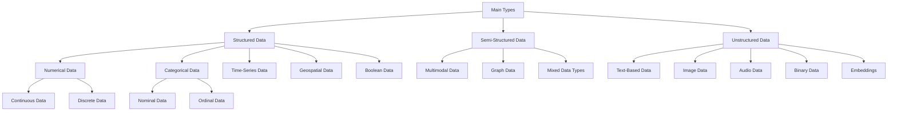

---
jupytext:
    cell_metadata_filter: -all
    formats: md:myst
    text_representation:
        extension: .md
        format_name: myst
        format_version: 0.13
        jupytext_version: 1.11.5
mystnb:
    number_source_lines: true
kernelspec:
    display_name: Python 3
    language: python
    name: python3
---

# Stage 3. Data Source and Formats

[](https://twitter.com/gaohongnan)
[](https://linkedin.com/in/gao-hongnan)
[](https://github.com/gao-hongnan)


```{contents}
:local:
```

## Identify and Scope the Data Source

### Intuition (What comes before Data Extraction?)

As we have seen in the pipeline and subsequently, the ELT/ETL framework, the
first step is data extraction. However, before we can extract data, we need to
first identify the data source and scope it. This is a critical step in the
pipeline, as it lays the foundation for the rest of the pipeline. If the data
source is not correctly identified and scoped, it could lead to a lot of wasted
time and effort down the line.

In what follows, we will discuss the steps involved in identifying and scoping
the data source, as well as the tools and methods for extracting data from the
source.

Consequently, the correct identification and meticulous scoping of the data
source form the bedrock of the entire pipeline.

In what follows, we will discuss the steps involved in identifying and scoping
the data source.

### Steps to Identify and Scope the Data Source

#### A. Define the Type of Data

-   **Action**: Determine whether the data is numerical, categorical,
    time-series, text-based, images, or audio.
-   **Rationale**: Facilitates the formulation of the appropriate strategy for
    data collection.

#### B. Locate the Data

-   **Action**: Identify the location, such as databases (SQL or NoSQL), APIs,
    log files, Excel or CSV files, etc.
-   **Rationale**: Enables the selection of the suitable tools and methods for
    extraction.

#### C. Assess Accessibility and Compliance

-   **Action**: Understand permissions, authentication, privacy concerns, and
    restrictions on data extraction.
-   **Rationale**: Ensures adherence to legal and organizational policies.

#### D. Gauge the Data Volume

-   **Action**: Determine the size of the dataset.
-   **Rationale**: Influences the choice of tools for extraction and impacts the
    entire ML model design process.

#### E. Understand Data Characteristics

-   **Action**: Recognize and address special characteristics, including
    potential malformatting, privacy regulations, etc.
-   **Rationale**: Facilitates proper processing, validation, and utilization of
    the data.

### Data Types in Machine Learning Systems

Before we scope the data source, a logical question to first ask is, what
_types_ of data are we dealing with? Knowing the data types will help us
**understand the nature and structure of information that we need to obtain.**
This understanding, in turn, informs our choice of **data sources** that are
best suited to provide this specific type of data.

For example, if we are working with time-series data, our data sources might be
sensors, logs, or financial market feeds. If we are dealing with textual data,
the sources might be documents, websites, or social media platforms. By first
defining the data types, we align our subsequent exploration and selection of
data sources with the inherent characteristics of the data we aim to analyze.
This helps in ensuring compatibility and efficiency in the entire data
acquisition and preparation process, forming a cohesive link between what type
of data we need (data types) and where we can find it (data source).

Here's a brief overview of the different types of data in the form of a
graph/tree diagram:



and the corresponding table:

| Main Type                | Subtype          | Specific Types       | Description                                                                    |
| ------------------------ | ---------------- | -------------------- | ------------------------------------------------------------------------------ |
| **Structured Data**      | Numerical        | Continuous, Discrete | Continuous data can take any value, while Discrete data takes specific values. |
|                          | Categorical      | Nominal, Ordinal     | Nominal data has no inherent order; Ordinal data has a meaningful order.       |
|                          | Time-Series Data |                      | Data collected at specific time intervals.                                     |
|                          | Geospatial Data  |                      | Information that includes geographical attributes.                             |
|                          | Boolean Data     |                      | True/false or yes/no values.                                                   |
| **Semi-Structured Data** | Multimodal       |                      | Combines data from multiple sources or types.                                  |
|                          | Graph Data       |                      | Represents relationships using nodes and edges.                                |
|                          | Mixed Data Types |                      | A combination of various data types.                                           |
| **Unstructured Data**    | Text-Based Data  |                      | Unstructured textual information.                                              |
|                          | Image Data       |                      | Visual information in a grid of pixels.                                        |
|                          | Audio Data       |                      | Sound or speech data.                                                          |
|                          | Binary Data      |                      | Data represented in a binary format.                                           |
|                          | Embeddings       |                      | Representations of categorical, text, or complex data as continuous vectors    |

### Data Sources in Machine Learning Systems

Having identified the _types_ of data that our machine learning system will
handle, we now turn our attention to the various **sources** from which this
data can be obtained. Different data types require specific sources, both in
terms of format compatibility and functional alignment. Here's an overview of
various data sources, categorized by their characteristics and aligned with the
types of data they typically provide:

| **Category**                     | **Type**                    | **Examples/Details**                                                                                                                     |
| -------------------------------- | --------------------------- | ---------------------------------------------------------------------------------------------------------------------------------------- |
| **Databases**                    | Relational Databases (SQL)  | [MySQL](https://www.mysql.com/), [PostgreSQL](https://www.postgresql.org/), [MS SQL Server](https://www.microsoft.com/en-us/sql-server/) |
|                                  | NoSQL Databases             | [MongoDB](https://www.mongodb.com/), [Cassandra](https://cassandra.apache.org/), [Redis](https://redis.io/)                              |
| **File-Based Sources**           | Flat Files                  | CSV, Excel, TSV                                                                                                                          |
|                                  | Binary Files                | Parquet, Avro                                                                                                                            |
|                                  | Image and Video Files       | JPEG, PNG, MP4                                                                                                                           |
|                                  | Text Files                  | TXT, PDF, DOC                                                                                                                            |
| **Web Sources**                  | Web APIs                    | RESTful APIs, SOAP, [GraphQL](https://graphql.org/)                                                                                      |
|                                  | Web Scraping                | HTML, XML                                                                                                                                |
|                                  | Social Media                | Twitter, Facebook, Reddit                                                                                                                |
| **Streaming Data Sources**       | Message Brokers             | [Kafka](https://kafka.apache.org/), [RabbitMQ](https://www.rabbitmq.com/)                                                                |
|                                  | Real-Time Feeds             | Stock prices, sensor data                                                                                                                |
| **Sensor Data**                  | IoT Devices                 | Smart devices, wearable tech                                                                                                             |
|                                  | Industrial Sensors          | Temperature, pressure, humidity sensors                                                                                                  |
| **Scientific Sources**           | Genomic Data                | DNA sequences, proteomics                                                                                                                |
|                                  | Meteorological Data         | Weather stations, satellites                                                                                                             |
| **Financial Data Sources**       | Stock Market Data           | Exchanges, trading platforms                                                                                                             |
|                                  | Banking Transactions        | Credit card swipes, ATM transactions                                                                                                     |
| **Healthcare Data Sources**      | Electronic Health Records   | Patient medical records                                                                                                                  |
|                                  | Medical Imaging             | MRI, CT scans, X-rays                                                                                                                    |
| **Government and Public Data**   | Census Data                 | Demographics, economics                                                                                                                  |
|                                  | Legislation and Regulations | Law documents, policy papers                                                                                                             |
| **Educational Data Sources**     | Academic Databases          | Research papers, thesis documents                                                                                                        |
|                                  | Learning Management Systems | Student grades, course content                                                                                                           |
| **Human-Generated Data Sources** | Surveys and Questionnaires  | Market research, feedback forms                                                                                                          |
|                                  | Crowdsourcing Platforms     | [Amazon Mechanical Turk](https://www.mturk.com/)                                                                                         |
| **Third-Party Data Providers**   | Commercial Data Providers   | Market trends, consumer habits                                                                                                           |
|                                  | Open Data Repositories      | [Kaggle](https://www.kaggle.com/), [UCI Machine Learning Repository](https://archive.ics.uci.edu/ml/index.php)                           |

This categorization of data sources resonates with our prior discussion on data
types. By recognizing the intricate relationships between **databases**,
**file-based sources**, **web sources**, **streaming data sources**, and others,
with the data types we're interested in, we are better positioned to select the
optimal sources for our machine learning system. Whether it's time-series data
from real-time feeds, textual data from web scraping, or image data from
specific file formats, our data source selection now aligns with the strategic
goals and technical requirements of the system.

## Data Formats in Machine Learning Systems

### Intuition

After understanding the various data types within the machine learning system,
we arrive at the crucial aspect of data formats. Data formats play a vital role
in determining how data is stored, processed, and communicated within the
system. They also influence the efficiency of data retrieval and the ease of
interoperability between different parts of the pipeline. Depending on the
nature of the data, the chosen format can have a substantial impact on the
performance and scalability of data-driven applications. In the following
section, we'll delve into various data formats and their relevance to machine
learning systems, highlighting the importance of selecting appropriate formats
in alignment with specific requirements and constraints.

In other words, once you scope the data source and data types, and manage to
extract them, you need to store it in a format that is easy to work with.
Storing data isn't straightforward because data can be of different types.

Some questions to ask when choosing a data format:

-   Where do you store the data? In a database? In a file system? In a key-value
    store? We want it to be ideally cheap and fast to retrieve the data.
-   How to store complex models so they can be loaded and run on different
    devices (e.g. mobile phones, web browsers, etc.). In ML, it can be GPU, CPU,
    etc.

### Example: Sharding in Hugging Face

**Sharding** refers to dividing a large dataset into smaller, more manageable
parts or "shards." Each shard can be processed independently, allowing for
parallelism and more efficient utilization of resources. Sharding is
particularly relevant when working with large-scale models that require
extensive training data.

For instance, if you were to train a model using Hugging Face's Transformers
library on a vast corpus of text data, you might encounter challenges in loading
and processing the entire dataset at once. By employing sharding, you could
break down the corpus into smaller shards, each stored in a specific data format
like TensorFlow's TFRecord or PyTorch's data loader format.

Here's how sharding might be implemented in this scenario:

1. **Divide the Data**: Split the entire corpus into smaller parts, each
   representing a shard. The division could be based on logical segments like
   chapters, documents, or fixed-size chunks.

2. **Choose a Data Format**: Select an appropriate data format for the shards.
   TFRecord is a common choice for TensorFlow, while PyTorch users might prefer
   its native data handling.

3. **Process Shards Independently**: Each shard can be loaded and processed
   independently, allowing for parallel processing. This enables efficient data
   handling, especially when using distributed computing resources.

4. **Assemble Results**: After processing the individual shards, the results can
   be assembled to form the complete dataset or model parameters.

This approach leverages data sharding and specific data formats to provide a
scalable and flexible method for working with extensive datasets in Hugging
Face. It's an illustrative example of how data formats, coupled with effective
data engineering practices, can profoundly impact the efficiency and scalability
of machine learning workflows.

Moral of the story is, you cannot just store data in any format. You need to
think you multiple aspects of the data and the system before choosing a data
format. Most of the times, we want **efficient** and **scalable** data formats.

Certainly! While the initial example provided is a straightforward way to store
multimodal data (images and text), it may lack some rigor and scalability. In a
real-world setting, particularly for large-scale e-commerce platforms, a more
robust approach would be necessary.

### Example: Multimodal Data Storage for E-Commerce

In e-commerce platforms, product pages often contain rich multimedia
information, including images and corresponding textual descriptions. Storing
and retrieving this information efficiently requires careful design.

One robust approach might involve:

1. **Storing Images in a Binary Format**: Rather than embedding the raw image
   tensor within a data structure, it's often more efficient to store the image
   in a binary format (e.g., JPEG, PNG) and keep a reference to its location
   (e.g., file path or URL).

2. **Utilizing a Database for Textual Information**: The textual information,
   including descriptions and metadata, can be stored in a relational database.
   This approach provides scalable storage and efficient query capabilities.

3. **Creating a Unified Schema**: A unified schema or data model could
   encapsulate both the image references and the corresponding textual data.
   This schema acts as a bridge between the two data types, allowing them to be
   treated as a cohesive unit.

Here's an example code snippet that reflects this design:

```python title="Sample Data Schema Encoding Image and Text"
sample_data_schema = {
    "product_id": 123,
    "image_url": "https://path/to/image.jpg",
    "description": "This is a picture of a cat.",
    "additional_metadata": { ... }  # Additional textual or numerical information.
}
```

and in tabular form:

| Field Name            | Data Type       | Description                                                                               |
| --------------------- | --------------- | ----------------------------------------------------------------------------------------- |
| `product_id`          | Integer         | A unique identifier for the product.                                                      |
| `image_url`           | String (URL)    | The URL or file path to the product's image.                                              |
| `description`         | String (Text)   | The textual description of the product.                                                   |
| `additional_metadata` | Dictionary/JSON | Additional textual or numerical information, such as categories, tags, or specifications. |

In this approach, the `"image_url"` field stores a reference to the location of
the image, and the `"description"` field contains the textual description. The
additional metadata can encapsulate other relevant information, such as
categories, tags, or product specifications.

This design offers several advantages:

-   **Scalability**: By storing images in a binary format and using database
    storage for text, this approach can scale to handle large product catalogs.
-   **Efficiency**: Leveraging specialized storage mechanisms for different data
    types ensures that retrieval and updates are efficient.
-   **Flexibility**: A unified schema provides a consistent way to represent and
    manipulate text-image pairs, while still allowing for customization and
    extension as needed.

Overall, this example demonstrates a more rigorous and practical approach to
storing and managing multimodal data in a context such as an e-commerce
platform. It illustrates the interplay between data formats, storage mechanisms,
and data modeling in handling complex, multifaceted information.

### Data Formats

We will describe a few choices of data formats below.

#### Data Serialization vs Data Deserialization

The process of transforming data structures or object states into a format that
can be saved (e.g., in a file like JSON) and later rebuilt in the same or a
different computing environment is known as serialization. The opposite process,
called deserialization, involves retrieving data from the stored formats. In
simpler terms, serialization refers to storing data, while deserialization
refers to accessing data from the saved formats.

In other words, **storing data** is called **serialization**, and **retrieving
data from the stored formats** is called **deserialization**.

#### JSON

[**JSON**](https://www.json.org/json-en.html), which stands for JavaScript
Object Notation, is a lightweight data-interchange format that uses a key-value
pair paradigm. It is human-readable, easy to parse, and simple to generate,
making it an ideal choice for data exchange between a server and a client in
machine learning applications. JSON's structure allows for easy storage in
databases and can represent a wide variety of data types, including strings,
numbers, booleans, objects, and arrays.

```json title="example.json"
{
    "name": "John",
    "age": 30,
    "cars": [
        { "name": "Ford", "models": ["Fiesta", "Focus", "Mustang"] },
        { "name": "BMW", "models": ["320", "X3", "X5"] },
        { "name": "Fiat", "models": ["500", "Panda"] }
    ]
}
```

While JSON has many advantages, it does have some drawbacks, such as increased
storage requirements due to its text-based nature. However, its simplicity and
ease of use have made it one of the most popular data formats in machine
learning and other applications.

In addition to the key-value pair structure, JSON also supports nesting of
objects and arrays, which allows for more complex data representation. This
makes JSON a versatile choice for a variety of use cases, from simple
configuration files to complex machine learning model inputs and outputs.

Furthermore, JSON has extensive support in many programming languages, with
built-in libraries or third-party packages available for parsing and generating
JSON data. This widespread support makes it a convenient choice for developers
working with machine learning systems and data pipelines.

In summary, JSON's human-readable format, easy parsing, support for complex data
structures, and widespread language support make it an excellent choice for data
exchange and storage in machine learning applications, despite its increased
storage requirements compared to binary formats.

#### Row and Columnar Formats

##### Concept of Row-major vs Column-major order

Row-major and column-major order describe two ways to store multi-dimensional
arrays in linear memory. In row-major order, the elements of a multi-dimensional
array are stored row by row, whereas in column-major order, the elements are
stored column by column.

##### Examples of Row-major vs Column-major order

In row-major order, the elements of each row of a matrix are stored together in
contiguous memory locations, with the elements of successive rows appearing
consecutively in memory. For example, consider a 3x2 matrix:

$$
\boldsymbol{A} = \begin{bmatrix}
    1 & 2 \\
    3 & 4 \\
    5 & 6
\end{bmatrix}
$$

In row-major order, the elements are stored in memory as:

```python
[1, 2, 3, 4, 5, 6]
```

In contrast, in column-major order, the elements of each column are stored
together in contiguous memory locations, with the elements of successive columns
appearing consecutively in memory. For the same matrix, the column-major order
would be:

```python
[1, 3, 5, 2, 4, 6]
```

Row-major and column-major order can make a difference in performance when
accessing multi-dimensional arrays, especially for large arrays. For example,
when accessing elements of a row in row-major order, consecutive elements are
likely to be cached together, which can improve access time. Similarly, when
accessing elements of a column in column-major order, consecutive elements are
likely to be cached together, which can improve performance.

#### Pros and cons of Row-major vs Column-major order

##### Row-major order

**Pros:**

-   It is the default order used in many programming languages, including C and
    C++.
-   It can be more intuitive for humans to understand, as rows are typically
    used to represent entities (e.g., students, observations) and columns are
    used to represent attributes (e.g., grades, measurements).
-   When iterating over the elements of a matrix row-by-row, row-major order
    ensures that the elements accessed are contiguous in memory, which can
    improve cache locality and reduce the number of cache misses.
-   Many linear algebra libraries, such as BLAS and LAPACK, use row-major order
    by default.

**Cons:**

-   When iterating over the elements of a matrix column-by-column, row-major
    order can lead to poor cache locality and a higher number of cache misses.
    This is because consecutive elements in the same column are not necessarily
    contiguous in memory.
-   When transposing a matrix, row-major order requires copying the entire
    matrix into a new block of memory in column-major order, which can be costly
    for large matrices.
-   Some hardware architectures may be optimized for column-major order, leading
    to lower performance for row-major order.

##### Column-major order

**Pros:**

-   Column-major order is used by default in some programming languages, such as
    Fortran.
-   When iterating over the elements of a matrix column-by-column, column-major
    order ensures that the elements accessed are contiguous in memory, which can
    improve cache locality and reduce the number of cache misses.
-   Some hardware architectures, such as GPUs, are optimized for column-major
    order, leading to potentially better performance.

**Cons:**

-   Column-major order can be less intuitive for humans to understand, as it is
    not the standard representation used in many fields.
-   When iterating over the elements of a matrix row-by-row, column-major order
    can lead to poor cache locality and a higher number of cache misses. This is
    because consecutive elements in the same row are not necessarily contiguous
    in memory.
-   Many linear algebra libraries, such as BLAS and LAPACK, use row-major order
    by default, so using column-major order may require additional memory copies
    or transpositions.

Overall, the choice between row-major and column-major order depends on the
specific use case and hardware architecture. For performance-critical
applications, it may be worth experimenting with both orders to see which yields
better results.

#### Modern Row and Columnar Formats

| Library | Order for Multidimensional Arrays              |
| ------- | ---------------------------------------------- |
| NumPy   | Row-Major Order                                |
| MATLAB  | Column-Major Order                             |
| OpenGL  | Column-Major Order                             |
| CUDA    | Column-Major Order                             |
| OpenCV  | Row-Major Order                                |
| Eigen   | Supports both Row-Major and Column-Major Order |
| CSV     | Row-Major Order                                |
| Parquet | Column-Major Order                             |

Column-major formats are better for accessing specific columns of large datasets
with many features, while row-major formats are better for faster data writes
when adding new individual examples to data. Row-major formats are better for a
lot of writes, while column-major formats are better for a lot of column-based
reads.

When you have a dataset with many features, storing the data in a column-major
format is more efficient because it allows for direct access to individual
columns without having to scan through all the other data in the rows. This
means that when you need to extract a specific subset of columns from the
dataset, you can do so more efficiently because the system doesn't need to read
through all the other data in the rows to access the desired columns.

In contrast, with a row-major format, the data for each row is stored together
in memory, meaning that to access a specific column, you have to read through
all the other columns in the row before you get to the desired column. This can
be especially inefficient when dealing with large datasets with many features,
as the system has to read through a lot of data to extract the desired subset of
columns.

For example, consider a dataset of ride-sharing transactions with 1,000
features, but you only need to extract four specific columns: time, location,
distance, and price. With a column-major format, you can directly access these
columns, whereas with a row-major format, you have to read through all the other
996 columns in each row before getting to the desired four columns. This can be
slow and inefficient, especially if you need to access the subset of columns
frequently or if the dataset is very large.

In summary, storing data in a column-major format is more efficient for datasets
with many features because it allows for direct access to individual columns,
which can significantly speed up data retrieval and processing.

#### Examples in code (Python) of Row-major vs Column-major order and its effect on performance

```python
import numpy as np
import time

import pandas as pd

from typing import Callable, TypeVar, Any

F = TypeVar("F", bound=Callable[..., Any])


def timer(func: F) -> F:
    """Timer decorator."""

    def wrapper(*args: Any, **kwargs: Any) -> Any:
        start_time = time.time()
        result = func(*args, **kwargs)
        end_time = time.time()
        elapsed_time = end_time - start_time
        print(f"{func.__name__} took {elapsed_time:.4f} seconds to execute.")
        # print(f"{func.__name__} took {elapsed_time / 60:.4f} minutes to execute.")
        # print(f"{func.__name__} took {elapsed_time / 60 / 60:.4f} hours to execute.")
        return result

    return wrapper


@timer
def traverse_dataframe_by_row(df: pd.DataFrame) -> None:
    for col in df.columns:
        for _ in df[col]:
            pass


@timer
def traverse_dataframe_by_column(df: pd.DataFrame) -> None:
    num_rows = df.shape[0]
    for row_idx in range(num_rows):
        for _ in df.iloc[row_idx]:
            pass


df = pd.DataFrame(np.random.rand(5000, 5000))
print(df.shape)

traverse_dataframe_by_row(df)
traverse_dataframe_by_column(df)


# Row-major traversal (C-like order)
df_np = df.to_numpy()
df_np = np.array(df_np, order="C")  # Row-major traversal (C-like order)
n_rows, n_cols = df_np.shape


@timer
def traverse_numpy_by_row(array: np.ndarray) -> None:
    for row_idx in range(n_rows):
        for col_idx in range(n_cols):
            _ = array[row_idx, col_idx]


@timer
def traverse_numpy_by_column(array: np.ndarray) -> None:
    for col_idx in range(n_cols):
        for row_idx in range(n_rows):
            _ = array[row_idx, col_idx]


traverse_numpy_by_row(df_np)
traverse_numpy_by_column(df_np)

df_np_col = np.array(df_np, order="F")  # Column-major traversal (Fortran-like order)

traverse_numpy_by_row(df_np_col)
traverse_numpy_by_column(df_np_col)
```

### Text vs Binary Formats

CSV and JSON are text files, while Parquet files are binary files. Text files
are human-readable, while binary files are only readable by programs that can
interpret the raw bytes. Binary files contain only 0s and 1s and are more
compact than text files. Binary files can save space compared to text files; for
example, storing the number 1000000 requires 7 bytes in a text file and only 4
bytes in a binary file as int32. Parquet files are more efficient than text
files in terms of storage and processing speed. For example, AWS recommends
using the Parquet format because it consumes up to 6x less storage and is up to
2x faster to unload in Amazon S3 compared to text formats.

!!! example "Text vs Binary" For example, if you want to store the number
$1000000$, and if you store it in text file it takes 7 characters (1, 0, 0, 0,
0, 0, 0), taking up 7 bytes of storage if 1 character is 1 byte. But if you
store it in binary format as `int32`, then it takes 32 bits, which is 4 bytes.

## Data Storage in Machine Learning Systems

Once the data source is scoped and well-defined, before we even start extracting
the data, we need to know what kind of data we are dealing with and **how** and
**where** we are going to store the extracted data.

Determining the **storage format** is critical. Will the data be stored in its
raw form, or does it need to be processed and converted into a different format
like CSV, JSON, or Parquet? The chosen data format can have significant
implications on storage costs, access speed, and compatibility with your data
processing tools.

The **storage location** is equally important. Depending on the volume of the
data, your budget, and security requirements, you might opt for on-premises
servers, cloud storage, or even a hybrid solution. Cloud storage, like Google
Cloud Storage, Amazon S3, or Azure Blob Storage, offer scalable and secure
solutions. However, you need to consider data privacy regulations and compliance
requirements when deciding where to store the data.

You should also consider how the data will be organized. Will it be stored in a
structured database like MySQL, a NoSQL database like MongoDB, or a distributed
file system like Hadoop HDFS? The data's nature, the need for scalability, and
the types of queries you'll be running, all factor into this decision.

Finally, the choice of **storage technology** also depends on the **data
operations** you anticipate. For instance, if your data needs frequent updates,
a database might be more suitable. If your data is largely static but needs to
be read frequently, a file system might be a better choice.

Your data storage decisions can greatly impact the efficiency of your data
operations and the overall success of your machine learning project. Hence,
careful planning and consideration are required in this stage.
