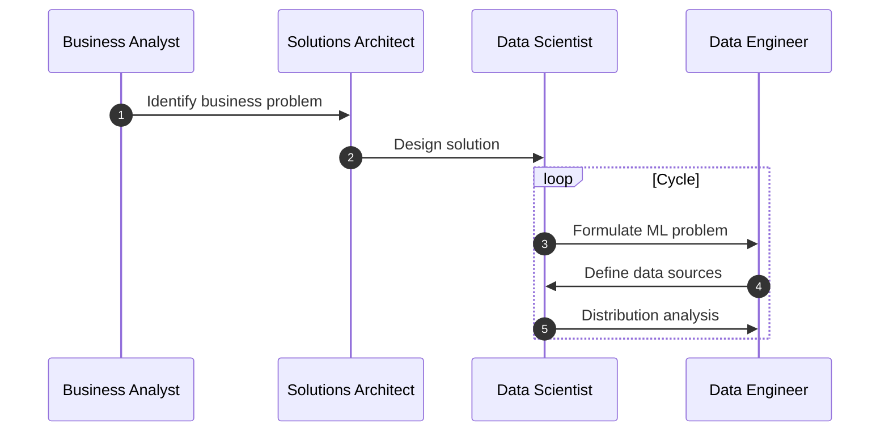
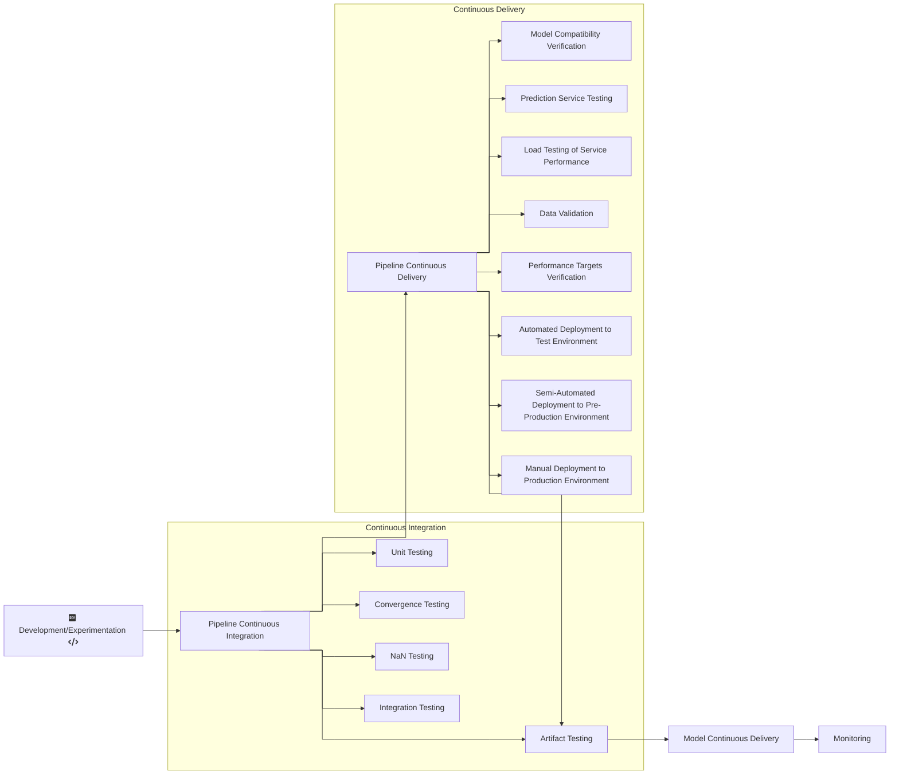
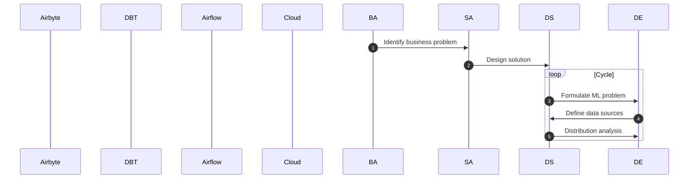
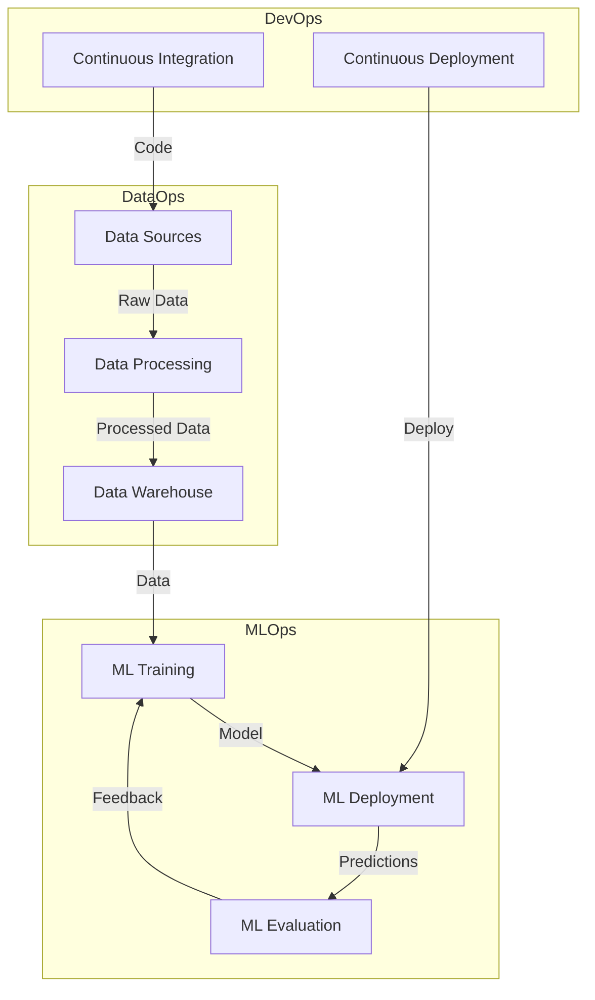

# Components Diagram (TO BE REVAMPED AND INSERTED TO THE MAIN PAGE?)

<figure markdown>
  { width="1000" }
  <figcaption>Common ML tasks. Image Credit: Huyen, Chip. Designing Machine Learning Systems: An Iterative Process for Production-Ready Applications, O'Reilly Media, Inc., 2022. </figcaption>
</figure>

-   **DataOps**:
    -   Project Scoping
        -   Identify the business problem (Business Analyst)
        -   Designing Solution (Solutions Architect)
        -   Formulate ML Problem (Data Scientist)
        -   Define Data Sources (Data Engineer)
        -   Distribution Analysis (Data Scientist)
    -   Data Extraction, Loading, and Transformation (Data Engineer)
    -   Data Extraction from Data Sources using tools like Airbyte, Fivetran,
        etc.
    -   Data Loading
        -   Staging Area for raw and immutable data (Data Lake)
        -   Data Warehouse
    -   Data Transformation
        -   Transform and load back to Data Warehouse using tools like dbt, etc.
        -   There should be loading, malformed, interim, and final tables.
    -   All the above can be orchestrated using tools like Airflow, Prefect,
        Dagster, etc.

[](https://mermaid.live/edit#pako:eNp9VE1vozAU_CtPlqJcEu09h5UiyKFSiNBCc1jTgwPPiSWwkTG0UZT_vs-EJN0WKi7Gb2Y8b_xxYbkpkK3YbHYBpZVbwQXmsjTv-UlYN-9_89Z2SMN547BeS4d2Dlf_zWaZzvQDDds_mQYIN1yKw0qKZYEdhNhhaeoKtfu1-ajRKj8UThkNUniUdwBvsFz-hjjgsaqxVBohMNop3Zq2gRft8Gh7zptfIQ4GdDgKD2mmQ3sesGEPXqd83TpTCYcFpFYdj2RFH3vMOu0hEelFZKacFIsGsYhwFJYZFHypaQ9ksT5BxsadZ8zDHuZfU_5KEpBi4-4-HsUg5SRCyx5R5ziO2aV8J3bjNd-sdUqKfGKBl5R_svYfBnXxU0f3PJ7tDJEEj-yqmlQPqlTuDHtKWar8uXdPRpzw2GKh8t5CgrZTI73esNsk5lsjinsZjHwwYrTS2EpQUl9Y4Z6HwgnYi1IVoxZS_okNqaDAXfOT6TWd7uc5CrEuzdkfaHCm9wYb3SlrtJ_7Qk2ImmClllN8SmMZW1O0t0SmlSJSioRuRflNYZI9bCtbsAqpXVXQpb_4QsbcCSvM2IqGBUrRls5v7pWggpwmZ52zlbMtLlhbU4wYKkEHo7pP0hbSTYhu70j_nCxYLfRfYwgiRdng9R_R6njE)

