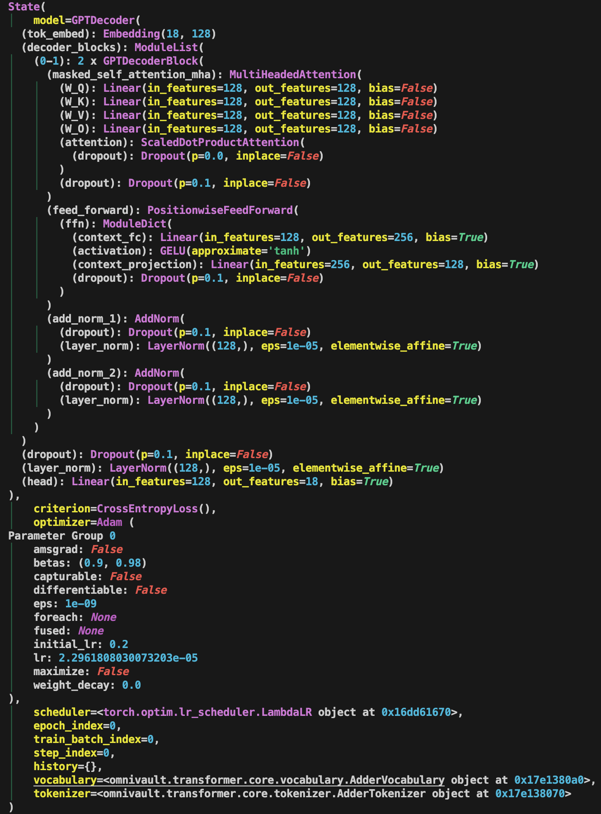

---
jupytext:
    cell_metadata_filter: -all
    formats: md:myst
    text_representation:
        extension: .md
        format_name: myst
        format_version: 0.13
        jupytext_version: 1.11.5
mystnb:
    number_source_lines: true
kernelspec:
    display_name: Python 3
    language: python
    name: python3
---

# State And Metadata Management

[](https://twitter.com/gaohongnan)
[](https://linkedin.com/in/gao-hongnan)
[](https://github.com/gao-hongnan)


[](https://github.com/gao-hongnan/omniverse/blob/c18e2a338c2cc39a7862c329c2f4cd04d87eae40/omnivault/transformer/core/state.py)

```{contents}
:local:
```

Besides the configuration that drives the whole machine learning pipeline, be it
in training or inference, we would also have something called the metadata or
state object which encapsulates the current state of the process. This is
especially useful when we want to save the state of the training process and
resume training from a checkpoint. If you are not convinced, have a look at
[MosaicML's Composer](https://docs.mosaicml.com/projects/composer/en/latest/api_reference/generated/composer.State.html)
for some insights.

## Metadata Management

In the context of a machine learning pipeline, having a mutable `Metadata` class
can be beneficial. This is because the pipeline is a dynamic process, and
different stages of the pipeline may need to update different parts of the
metadata.

For example:

-   At the start of the pipeline, you might set the `start_time` and `run_id`.
-   When loading the data, you might update the `dataset_version`.
-   During training, you might update the `history` with the training loss and
    metrics at the end of each epoch.
-   When the pipeline finishes, you might set the `end_time` and upload the
    final metadata as an artifact.

This kind of incremental updating is easier with a mutable object. However, it's
important to manage the mutable state carefully to avoid bugs. For example, if
two parts of your code are both updating the metadata at the same time, they
might interfere with each other. To avoid this, you might want to:

-   Make sure that different parts of your code are responsible for updating
    different parts of the metadata, and that they don't interfere with each
    other.
-   Use locks or other synchronization mechanisms if you're updating the
    metadata from multiple threads or processes.
-   Create a new copy of the metadata before making changes, if you need to keep
    the old state around for some reason.

An example below.

```python
@dataclass(frozen=False)
class Metadata:
    # pipeline run time and usage
    start_time: str
    end_time: str
    time_taken: str
    memory_usage: str
    gpu_usage: str

    # inside load.py
    raw_file_size: int = None
    raw_file_format: str = None
    raw_filepath: str = None
    raw_dvc_metadata: Dict[str, Any] = None

    # inside train.py
    model_artifacts: Dict[str, Any] = None
    run_id: str = None
    model_version: str = None
    experiment_id: str = None
    experiment_name: str = None
    artifact_uri: str = None

    # inside evaluate.py
    holdout_performance: Dict[str, float] = None
    avg_expected_loss: float = None
    avg_bias: float = None
    avg_variance: float = None
```

## State Management

The `State` object represents the current state of the training process. It
encapsulates key components such as the model, optimizer, criterion, scheduler,
and additional metadata. The inspiration for `State` comes from
[MosaicML's Composer](https://github.com/mosaicml/composer), a library that has
been beneficial in the context of pretraining Language Models (LLMs) and is also
the library that me and my team adopted for our LLM pretraining project.



Here is a snippet of the `State` object when I was training a GPT model for fun.
Note this is a very naive and bare version and does not include many features
that Composer's `State` object has.

```python
State(
│   model=GPTDecoder(
  (tok_embed): Embedding(18, 128)
  (decoder_blocks): ModuleList(
│   (0-1): 2 x GPTDecoderBlock(
│     (masked_self_attention_mha): MultiHeadedAttention(
│   │   (W_Q): Linear(in_features=128, out_features=128, bias=False)
│   │   (W_K): Linear(in_features=128, out_features=128, bias=False)
│   │   (W_V): Linear(in_features=128, out_features=128, bias=False)
│   │   (W_O): Linear(in_features=128, out_features=128, bias=False)
│   │   (attention): ScaledDotProductAttention(
│   │     (dropout): Dropout(p=0.0, inplace=False)
│   │   )
│   │   (dropout): Dropout(p=0.1, inplace=False)
│     )
│     (feed_forward): PositionwiseFeedForward(
│   │   (ffn): ModuleDict(
│   │     (context_fc): Linear(in_features=128, out_features=256, bias=True)
│   │     (activation): GELU(approximate='tanh')
│   │     (context_projection): Linear(in_features=256, out_features=128, bias=True)
│   │     (dropout): Dropout(p=0.1, inplace=False)
│   │   )
│     )
│     (add_norm_1): AddNorm(
│   │   (dropout): Dropout(p=0.1, inplace=False)
│   │   (layer_norm): LayerNorm((128,), eps=1e-05, elementwise_affine=True)
│     )
│     (add_norm_2): AddNorm(
│   │   (dropout): Dropout(p=0.1, inplace=False)
│   │   (layer_norm): LayerNorm((128,), eps=1e-05, elementwise_affine=True)
│     )
│   )
  )
  (dropout): Dropout(p=0.1, inplace=False)
  (layer_norm): LayerNorm((128,), eps=1e-05, elementwise_affine=True)
  (head): Linear(in_features=128, out_features=18, bias=True)
),
│   criterion=CrossEntropyLoss(),
│   optimizer=Adam (
Parameter Group 0
│   amsgrad: False
│   betas: (0.9, 0.98)
│   capturable: False
│   differentiable: False
│   eps: 1e-09
│   foreach: None
│   fused: None
│   initial_lr: 0.2
│   lr: 1.0497284228847895e-06
│   maximize: False
│   weight_decay: 0.0
),
│   scheduler=<torch.optim.lr_scheduler.LambdaLR object at 0x1652552e0>,
│   epoch_index=0,
│   train_batch_index=0,
│   step_index=0,
│   history={},
│   vocabulary=<omnivault.transformer.core.vocabulary.AdderVocabulary object at 0x16522ea00>,
│   tokenizer=<omnivault.transformer.core.tokenizer.AdderTokenizer object at 0x16522ea60>
)
```

Why is `State` useful? It allows me to easily access the model, optimizer,
criterion, scheduler, and other metadata from any part of the codebase. I can
also serialize the `State` object and save it to disk, allowing me to resume
training from a checkpoint.

Perhaps not the best design pattern, but I added a `history` attribute to the
`State` object, which is a dictionary that stores the training history. This is
to mimic what could be a separate `History` object, which is a common component
in many deep learning libraries.

A sample implementation of the `State` object is shown below.

```python
from __future__ import annotations

from typing import Any, Dict, List, Type, Union

import torch
from pydantic import BaseModel, Field
from rich.pretty import pprint
from torch import nn


def compare_models(model_a: nn.Module, model_b: nn.Module) -> bool:
    return all(
        torch.equal(param_a[1], param_b[1])
        for param_a, param_b in zip(model_a.state_dict().items(), model_b.state_dict().items())
    )


class State(BaseModel):
    model: nn.Module = Field(default=None, description="Model.")

    criterion: nn.Module = Field(default=None, description="Loss function.")
    optimizer: torch.optim.Optimizer = Field(default=None, description="Optimizer.")
    scheduler: Union[torch.optim.lr_scheduler.LRScheduler, None] = Field(default=None, description="Scheduler.")

    epoch_index: int = Field(default=0, description="Current epoch index.")
    train_batch_index: int = Field(
        default=0, description="Current batch index and is only referring to the training batch index."
    )
    step_index: int = Field(
        default=0,
        description="We do not add prefix train because it is understood and implied that the step number is the train due to how many gradients been stepped. Current step index and is only referring to the training step index. What is the difference between step and batch? In general, they coincide for when the epoch number is 1, but after the first epoch, we usually reset the batch index to 0, while the step index keeps increasing to the next epoch.",
    )
    history: Dict[str, List[float]] = Field(default={}, description="History of metrics.")

    # FIXME: loosen `Vocabularies` and `Tokenizers` to `Any` for now as it is too strict.
    vocabulary: Any = Field(default=None, description="Vocabulary.")
    tokenizer: Any = Field(default=None, description="Tokenizer.")

    def __eq__(self, other: object) -> bool:
        """Check if two State instances are equal."""
        assert isinstance(other, State), "Can only compare State instances."

        models_equal = compare_models(self.model, other.model)
        return models_equal

    class Config:
        """Pydantic config."""

        arbitrary_types_allowed = True

    def pretty_print(self) -> None:
        """Pretty print the config."""
        pprint(self)

    def save_snapshots(self, filepath: str) -> None:
        """Save the state dictionaries of the components to a file."""
        state = {
            "model": self.model.state_dict() if self.model else None,
            "criterion": self.criterion.state_dict() if self.criterion else None,
            "optimizer": self.optimizer.state_dict() if self.optimizer else None,
            "scheduler": self.scheduler.state_dict() if self.scheduler else None,
            "epoch_index": self.epoch_index,
            "train_batch_index": self.train_batch_index,
            "step_index": self.step_index,
            "history": self.history,
            "vocabulary": self.vocabulary,
            "tokenizer": self.tokenizer,
        }
        torch.save(state, filepath)

    @classmethod
    def load_snapshots(
        cls: Type[State],
        filepath: str,
        device: torch.device,
        *,
        model: nn.Module,
        criterion: nn.Module,
        optimizer: torch.optim.Optimizer,
        scheduler: torch.optim.lr_scheduler.LRScheduler,
    ) -> State:
        """Load state dictionaries from a file and return a new State instance."""
        state = torch.load(filepath, map_location=device)

        epoch_index = state["epoch_index"]
        train_batch_index = state["train_batch_index"]
        step_index = state["step_index"]
        history = state["history"]
        vocabulary = state["vocabulary"]
        tokenizer = state["tokenizer"]

        # Create a new instance of State with loaded state
        new_state = cls(
            model=model,
            criterion=criterion,
            optimizer=optimizer,
            scheduler=scheduler,
            epoch_index=epoch_index,
            train_batch_index=train_batch_index,
            step_index=step_index,
            history=history,
            vocabulary=vocabulary,
            tokenizer=tokenizer,
        )

        # Load state dicts into the model, criterion, etc., if they exist
        if new_state.model and "model" in state:
            new_state.model.load_state_dict(state["model"])
        if new_state.criterion and "criterion" in state:
            new_state.criterion.load_state_dict(state["criterion"])
        if new_state.optimizer and "optimizer" in state:
            new_state.optimizer.load_state_dict(state["optimizer"])
        if new_state.scheduler and "scheduler" in state:
            new_state.scheduler.load_state_dict(state["scheduler"])

        return new_state
```

## References and Further Readings

-   [MosaicML's Composer](https://docs.mosaicml.com/projects/composer/en/latest/api_reference/generated/composer.State.html)
